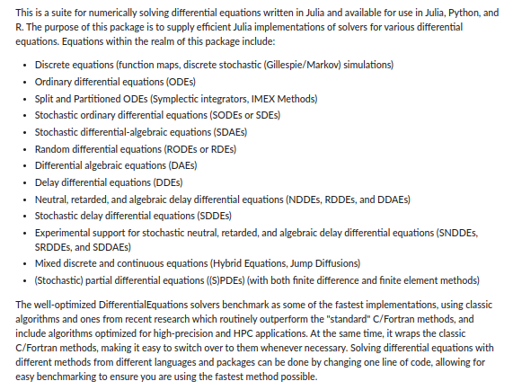
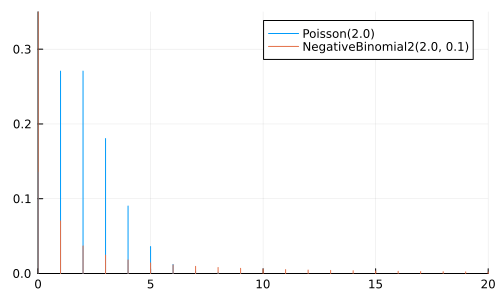
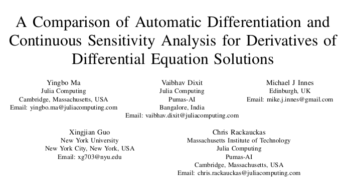

# Before we begin

Make sure you're in the correct directory

```julia
pwd()
```

    "/home/tor/Projects/public/Turing-Workshop/2023-Geilo-Winter-School/Part-2-Turing-and-other-things"

Then run something like (depending on which OS you are on)

```sh
julia --project
```

or if you're already in a REPL, do

```julia
]activate .
```

    Activating project at `~/Projects/public/Turing-Workshop/2023-Geilo-Winter-School/Part-2-Turing-and-other-things`

to activate the project

And just to check that you're in the correct one

```julia
]status
```

    Project GeiloWinterSchool2023Part2 v0.1.0
    Status `~/Projects/public/Turing-Workshop/2023-Geilo-Winter-School/Part-2-Turing-and-other-things/Project.toml`
      [6e4b80f9] BenchmarkTools v1.3.2
      [336ed68f] CSV v0.10.9
      [a93c6f00] DataFrames v1.4.4
    ⌃ [2b5f629d] DiffEqBase v6.114.1
      [0c46a032] DifferentialEquations v7.6.0
      [31c24e10] Distributions v0.25.80
      [f6369f11] ForwardDiff v0.10.34
      [6fdf6af0] LogDensityProblems v2.1.0
      [996a588d] LogDensityProblemsAD v1.1.1
      [429524aa] Optim v1.7.4
      [c46f51b8] ProfileView v1.5.2
      [37e2e3b7] ReverseDiff v1.14.4 `https://github.com/torfjelde/ReverseDiff.jl#torfjelde/sort-of-support-non-linear-indexing`
      [0bca4576] SciMLBase v1.81.0
    ⌃ [1ed8b502] SciMLSensitivity v7.17.1
      [f3b207a7] StatsPlots v0.15.4
      [fce5fe82] Turing v0.24.0
      [0db1332d] TuringBenchmarking v0.1.1
      [e88e6eb3] Zygote v0.6.55
    Info Packages marked with ⌃ have new versions available and may be upgradable.

Download and install dependencies

```julia
]instantiate
```

And finally, do

```julia
using GeiloWinterSchool2023Part2
```

to get some functionality I've implemented for the occasion


# The story of a little Norwegian boy

There once was a little Norwegian boy


When this little boy was 20 years old, he was working as a parking guard near Preikestolen/Pulpit rock


One day it was raining and there was nobody hiking, and so there was no cars in sight for the little boy to point

<div class="fragment (appear)">

When his boss wasn't looking, the little 20 year-old boy had an amazing idea

> Maybe I can use this method of Mr. Bayes I learned a bit about yesteday to model football / Premier League?

</div>

The little boy got very excited and started looking for stuff on the big interwebs

The little boy came across this


And got <span class="underline">very</span> excited

But at the time, the little boy knew next to <span class="underline">nothing</span> about programming

The little boy couldn't write the code to do the inference

Whence the little boy became a <span class="underline">sad</span> little boy :(

But time heals all wounds, and at some point the little boy learned Python

And in Python, the boy found the *probabilistic programming language* `pymc3`

<div class="fragment (appear)">

> Maybe I can use `pymc3` to perform inference in that football / Premier League model?

And so the sad boy once more became an <span class="underline">excited</span> little boy :)

</div>

But there was a problem

The boy wanted to write a for-loop in his model, but the model didn't want it to be so and complained!

The boy got frustrated and gave up, once more becoming a <span class="underline">sad</span> little boy :(

<div class="small-text">

The boy should have known that the computational backend `theano` that was used by `pymc3` at the time couldn't handle a for-loop, and instead he should have used `scan`. But the boy was only 20-something years old; he didn't know.

</div>

Some years later the boy discovers a programming language called <span class="underline">Julia</span>

<div class="fragment (appear)">

Julia makes a few promises

1.  It's fast. Like *really* fast.
2.  It's interactive; doesn't require full compilation for you to play with it.
3.  You don't have to specify types everywhere.

</div>

<div class="fragment (appear)">

The boy thinks

> Wait, but this sounds like Python but the only difference is that&#x2026;I CAN WRITE FOR-LOOPS WITHOUT FEELING BAD ABOUT IT?!

Yes, yes he could

And 3.5 years later, he's still writing for-loops. Well, sort of.

</div>


# Why Turing.jl?

Duh, you should use Turing.jl <span class="underline">so you get to use Julia</span>

<div class="fragment (appear)">

But even in Julia, other PPLS exist

But Turing.jl is very similar to Julia in "philosophy":

-   Flexiblility
-   Ease-of-use
-   Speed (potentially with a bit of effort)

So it's a pretty good candidate

</div>


# Running example

We'll work with an outbreak of influenza A (H1N1) in 1978 at a British boarding school

-   763 male students -> 512 of which became ill
-   Reported that one infected boy started the epidemic
-   Observations are number of boys in bed over 14 days

Data are freely available in the R package `outbreaks`, maintained as part of the [R Epidemics Consortium](http://www.repidemicsconsortium.org/)

<div class="fragment (appear)">

Data + part of the analysis is *heavily* inspired by <https://mc-stan.org/users/documentation/case-studies/boarding_school_case_study.html>

Stan definitively beats Turing.jl when it comes to great write-ups like these

</div>


## Loading into Julia

```julia
# Load the dataframe.
using Dates
using DataFrames, CSV

N = 763
data = DataFrame(CSV.File(joinpath("data", "influenza_england_1978_school.csv")));
print(data)
```

    14×4 DataFrame
     Row │ Column1  date        in_bed  convalescent 
         │ Int64    Date        Int64   Int64        
    ─────┼───────────────────────────────────────────
       1 │       1  1978-01-22       3             0
       2 │       2  1978-01-23       8             0
       3 │       3  1978-01-24      26             0
       4 │       4  1978-01-25      76             0
       5 │       5  1978-01-26     225             9
       6 │       6  1978-01-27     298            17
       7 │       7  1978-01-28     258           105
       8 │       8  1978-01-29     233           162
       9 │       9  1978-01-30     189           176
      10 │      10  1978-01-31     128           166
      11 │      11  1978-02-01      68           150
      12 │      12  1978-02-02      29            85
      13 │      13  1978-02-03      14            47
      14 │      14  1978-02-04       4            20

Notice that each of the columns have associated types

Let's visualize the samples:

```julia
using StatsPlots
```

```julia
# StatsPlots.jl provides this convenient macro `@df` for plotting a `DataFrame`.
@df data scatter(:date, :in_bed, label=nothing, ylabel="Number of students in bed")
```


# Differential equations

Suppose we have some function \(f\) which describes how a state \(x\) evolves wrt. \(t\)

\begin{equation*}
\frac{\mathrm{d} x}{\mathrm{d} t} = f(x, t)
\end{equation*}

which we then need to integrate to obtain the actual state at some time \(t\)

\begin{equation*}
x(t) = \int_{0}^{t} \frac{\mathrm{d} x}{\mathrm{d} t} \mathrm{d} t = \int_{0}^{t} f(x, t) \mathrm{d} t
\end{equation*}

In many interesting scenarios numerical methods are required to obtain \(x(t)\)


## In Julia

Everything related to differential equations is provided by [`DifferentialEquations.jl`](https://docs.sciml.ai/DiffEqDocs/stable/)

And I really do mean [*everything*](https://docs.sciml.ai/DiffEqDocs/stable/)

<div class="side-by-side">




</div>


## Example: SIR model

One particular example of an (ordinary) differential equation that you might have seen recently is the **SIR model** used in epidemiology

")

The temporal dynamics of the sizes of each of the compartments are governed by the following system of ODEs:

\begin{equation*}
\begin{split}
  \frac{\mathrm{d} S}{\mathrm{d} t} &= - \beta S \frac{I}{N} \\
  \frac{\mathrm{d} I}{\mathrm{d} t} &= \beta S \frac{I}{N} - \gamma I \\
  \frac{\mathrm{d} R}{\mathrm{d} t} &= \gamma I
\end{split}
\end{equation*}

where

-   \(S(t)\) is the number of people susceptible to becoming infected,
-   \(I(t)\) is the number of people currently infected,
-   \(R(t)\) is the number of recovered people,
-   \(β\) is the constant rate of infectious contact between people,
-   \(\gamma\) the constant recovery rate of infected individuals

Converting this ODE into code is just

```julia
using DifferentialEquations

function SIR!(
    du,  # buffer for the updated differential equation
    u,   # current state
    p,   # parameters
    t    # current time
)
    N = 763  # population
    S, I, R = u
    β, γ = p

    du[1] = dS = -β * I * S / N
    du[2] = dI = β * I * S / N - γ * I
    du[3] = dR = γ * I
end
```

    SIR! (generic function with 1 method)

Not too bad!

Initial conditions are then

\begin{equation*}
\begin{split}
  S(0) &= N - 1 \\
  I(0) &= 1 \\
  R(0) &= 0
\end{split}
\end{equation*}

and we want to integrate from \(t = 0\) to \(t = 14\)

```julia
# Include 0 because that's the initial condition before any observations.
tspan = (0.0, 14.0)

# Initial conditions are:
#   S(0) = N - 1; I(0) = 1; R(0) = 0
u0 = [N - 1, 1, 0.0]
```

    3-element Vector{Float64}:
     762.0
       1.0
       0.0

Now we just need to define the overall problem and we can solve:

```julia
# Just to check that everything works, we'll just use some "totally random" values for β and γ:
problem_sir = let β = 2.0, γ = 0.6
    ODEProblem(SIR!, u0, tspan, (β, γ))
end
```

    ODEProblem with uType Vector{Float64} and tType Float64. In-place: true
    timespan: (0.0, 14.0)
    u0: 3-element Vector{Float64}:
     762.0
       1.0
       0.0

Aaaand

```julia
sol = solve(problem_sir)
```

    retcode: Success
    Interpolation: specialized 4th order "free" interpolation, specialized 2nd order "free" stiffness-aware interpolation
    t: 23-element Vector{Float64}:
      0.0
      0.0023558376404244326
      0.025914214044668756
      0.11176872871946908
      0.26714420676761075
      0.47653584778586056
      0.7436981238065388
      1.0701182881347182
      1.4556696154809898
      1.8994815718103506
      2.4015425820305163
      2.9657488203418048
      3.6046024613854746
      4.325611232479916
      5.234036476235002
      6.073132270491685
      7.323851265223563
      8.23100744184026
      9.66046960467715
     11.027717843180652
     12.506967592177675
     13.98890399536329
     14.0
    u: 23-element Vector{Vector{Float64}}:
     [762.0, 1.0, 0.0]
     [761.9952867607622, 1.003297407481751, 0.001415831756055325]
     [761.9472927630898, 1.036873767352754, 0.015833469557440357]
     [761.7584189579304, 1.1690001128296739, 0.0725809292398516]
     [761.353498610305, 1.4522140137552049, 0.19428737593979384]
     [760.6490369821046, 1.9447820690728455, 0.4061809488225752]
     [759.3950815454128, 2.8210768113583082, 0.7838416432288186]
     [757.0795798160242, 4.437564277195732, 1.4828559067800167]
     [752.6094742865345, 7.552145919430467, 2.8383797940350495]
     [743.573784947305, 13.823077731564027, 5.603137321131049]
     [724.5575481927715, 26.909267078762316, 11.533184728466205]
     [683.6474029897502, 54.51612001957392, 24.836476990675976]
     [598.1841629858786, 109.41164143668018, 55.40419557744127]
     [450.08652743810205, 192.396449154863, 120.51702340703504]
     [259.11626253270623, 256.9925778114915, 246.89115965580237]
     [148.3573731526537, 240.10301213899098, 374.53961470835543]
     [76.52998017846475, 160.6373332952353, 525.8326865263001]
     [55.70519994004921, 108.7634182279299, 598.531381832021]
     [41.39587834423381, 55.09512088924873, 666.5090007665176]
     [35.87067243374374, 27.821838135708532, 699.3074894305479]
     [33.252184333490774, 13.087185981359177, 716.6606296851502]
     [32.08996839417716, 6.105264616193066, 724.8047669896299]
     [32.08428686823946, 6.070415830241046, 724.8452973015196]

We didn't specify a solver

DifferentialEquations.jl uses `AutoTsit5(Rosenbrock32())` by default

Which is a composition between

-   `Tsit5` (4th order Runge-Kutta), and
-   `Rosenbrock32` (3rd order stiff solver)

with automatic switching between the two

`AutoTsit5(Rosenbrock32())` covers many use-cases well, but see

-   <https://docs.sciml.ai/DiffEqDocs/stable/solvers/ode_solve/>
-   <https://www.stochasticlifestyle.com/comparison-differential-equation-solver-suites-matlab-r-julia-python-c-fortran/>

for more info on choosing a solver

This is the resulting solution

```julia
plot(
    sol,
    linewidth=2, xaxis="Time in days", label=["Suspectible" "Infected" "Recovered"],
    alpha=0.5, size=(500, 300)
)
scatter!(1:14, data.in_bed, label="Data", color="black")
```


This doesn't really match the data though; let's do better

Approach #1: find optimal values of \(\beta\) and \(\gamma\) by minimizing some loss, e.g. sum-of-squares

\begin{equation*}
\ell(\beta, \gamma) = \sum_{i = 1}^{14} \bigg( F(u_0, t_i;\ \beta, \gamma) - y_i \bigg)^2
\end{equation*}

where \(\big( y_i \big)_{i = 1}^{14}\) are the observations, \(F\) is the integrated system

<div class="fragment (appear)">

First we define the loss

```julia
# Define the loss function.
function loss_sir(problem_orig, p)
    # `remake` just, well, remakes the `problem` with `p` replaced.
    problem = remake(problem_orig, p=p)
    # To ensure we get solutions _exactly_ at the timesteps of interest,
    # i.e. every day we have observations, we use `saveat=1` to tell `solve`
    # to save at every timestep (which is one day).
    sol = solve(problem, saveat=1)
    # Extract the 2nd state, the (I)infected, for the dates with observations.
    sol_for_observed = sol[2, 2:15]
    # Compute the sum-of-squares of the infected vs. data.
    sum(abs2.(sol_for_observed - data.in_bed))
end
```

    loss_sir (generic function with 1 method)

</div>

And the go-to for optimization in Julia is [Optim.jl](https://julianlsolvers.github.io/Optim.jl/stable/)

```julia
using Optim
# An alternative to writing `y -> f(x, y)` is `Base.Fix1(f, x)` which
# avoids potential performance issues with global variables (as our `problem` here).
opt = optimize(
    p -> loss_sir(problem_sir, p), # function to minimize
    [0, 0],                # lower bounds on variables
    [Inf, Inf],            # upper bounds on variables
    [2.0, 0.5],            # initial values
    Fminbox(NelderMead())  # optimization alg
) 
```

    * Status: success
    
    * Candidate solution
       Final objective value:     4.116433e+03
    
    * Found with
       Algorithm:     Fminbox with Nelder-Mead
    
    * Convergence measures
       |x - x'|               = 0.00e+00 ≤ 0.0e+00
       |x - x'|/|x'|          = 0.00e+00 ≤ 0.0e+00
       |f(x) - f(x')|         = 0.00e+00 ≤ 0.0e+00
       |f(x) - f(x')|/|f(x')| = 0.00e+00 ≤ 0.0e+00
       |g(x)|                 = 7.86e+04 ≰ 1.0e-08
    
    * Work counters
       Seconds run:   4  (vs limit Inf)
       Iterations:    4
       f(x) calls:    565
       ∇f(x) calls:   1

We can extract the minimizers of the loss

```julia
β, λ = Optim.minimizer(opt)
β, λ
```

|                   |                    |
|------------------ |------------------- |
| 1.6692320164955483 | 0.44348639177622445 |

```julia
# Solve for the obtained parameters.
problem = remake(problem_sir, p=(β, λ))
sol = solve(problem_sir)

# Plot the solution.
plot(sol, linewidth=2, xaxis="Time in days", label=["Suspectible" "Infected" "Recovered"], alpha=0.5)
# And the data.
scatter!(1:14, data.in_bed, label="Data", color="black")
```


That's better than our *totally* "random" guess from earlier!


## Example: SEIR model

Adding another compartment to our SIR model: the <span class="underline">(E)xposed</span> state

\begin{equation*}
\begin{split}
  \frac{\mathrm{d} S}{\mathrm{d} t} &= - \beta S \frac{I}{N} \\
  \frac{\mathrm{d} {\color{blue} E}}{\mathrm{d} t} &= \beta S \frac{I}{N} - {\color{orange} \sigma} {\color{blue} E} \\
  \frac{\mathrm{d} I}{\mathrm{d} t} &= {\color{orange} \sigma} {\color{blue} E} - \gamma I \\
  \frac{\mathrm{d} R}{\mathrm{d} t} &= \gamma I
\end{split}
\end{equation*}

where we've added a new parameter \({\color{orange} \sigma}\) describing the fraction of people who develop observable symptoms in this time


## TASK Solve the SEIR model using Julia

```julia
function SEIR!(
    du,  # buffer for the updated differential equation
    u,   # current state
    p,   # parameters
    t    # current time
)
    N = 763  # population

    S, E, I, R = u  # have ourselves an additional state!
    β, γ, σ = p     # and an additional parameter!

    # TODO: Implement yah fool!
    du[1] = nothing
    du[2] = nothing
    du[3] = nothing
    du[4] = nothing
end
```

**BONUS:** Use `Optim.jl` to find minimizers of sum-of-squares


## SOLUTION Solve the SEIR model using Julia

```julia
function SEIR!(
    du,  # buffer for the updated differential equation
    u,   # current state
    p,   # parameters
    t    # current time
)
    N = 763  # population
    S, E, I, R = u  # have ourselves an additional state!
    β, γ, σ = p     # and an additional parameter!

    # Might as well cache these computations.
    βSI = β * S * I / N
    σE = σ * E
    γI = γ * I

    du[1] = -βSI
    du[2] = βSI - σE
    du[3] = σE - γI
    du[4] = γI
end
```

    SEIR! (generic function with 1 method)

```julia
problem_seir = let u0 = [N - 1, 0, 1, 0], β = 2.0, γ = 0.6, σ = 0.8
    ODEProblem(SEIR!, u0, tspan, (β, γ, σ))
end
```

    ODEProblem with uType Vector{Int64} and tType Float64. In-place: true
    timespan: (0.0, 14.0)
    u0: 4-element Vector{Int64}:
     762
       0
       1
       0

```julia
sol_seir = solve(problem_seir, saveat=1)
```

    retcode: Success
    Interpolation: 1st order linear
    t: 15-element Vector{Float64}:
      0.0
      1.0
      2.0
      3.0
      4.0
      5.0
      6.0
      7.0
      8.0
      9.0
     10.0
     11.0
     12.0
     13.0
     14.0
    u: 15-element Vector{Vector{Float64}}:
     [762.0, 0.0, 1.0, 0.0]
     [760.1497035901518, 1.277915971753478, 1.0158871356490553, 0.5564933024456415]
     [757.5476928906271, 2.425869618233348, 1.6850698824327135, 1.341367608706787]
     [753.081189706403, 4.277014534677882, 2.9468385687120784, 2.6949571902067637]
     [745.3234082630842, 7.455598293492679, 5.155811621098981, 5.065181822323938]
     [731.9851682751213, 12.855816151849933, 8.960337047554939, 9.198678525473571]
     [709.5042941973462, 21.77178343781762, 15.384985521594787, 16.338936843241182]
     [672.8733895183619, 35.77263271085456, 25.88133104438007, 28.472646726403138]
     [616.390571176038, 55.97177756967422, 42.09614416178476, 48.54150709250279]
     [536.453596476594, 81.2428045994271, 64.9673325777641, 80.33626634621449]
     [436.43708330634297, 106.04037246704702, 92.9550757379631, 127.56746848864664]
     [329.60092931771436, 121.08020372279418, 120.48402926084937, 191.83483769864185]
     [233.8471941518982, 119.43669383157659, 139.3233304893263, 270.3927815271987]
     [160.88805352426687, 102.7399386960996, 143.3826208089892, 355.9893869706441]
     [111.72261866282292, 79.02493776169311, 132.78384886713565, 439.46859470834806]

```julia
plot(sol_seir, linewidth=2, xaxis="Time in days", label=["Suspectible" "Exposed" "Infected" "Recovered"], alpha=0.5)
scatter!(1:14, data.in_bed, label="Data")
```


Don't look so good. Let's try Optim.jl again.

```julia
function loss_seir(problem, p)
    problem = remake(problem, p=p)
    sol = solve(problem, saveat=1)
    # NOTE: 3rd state is now the (I)nfectious compartment!!!
    sol_for_observed = sol[3, 2:15]
    return sum(abs2.(sol_for_observed - data.in_bed))
end
```

    loss_seir (generic function with 1 method)

```julia
opt = optimize(Base.Fix1(loss_seir, problem_seir), [0, 0, 0], [Inf, Inf, Inf], [2.0, 0.5, 0.9], Fminbox(NelderMead()))
```

    * Status: success (reached maximum number of iterations)
    
    * Candidate solution
       Final objective value:     3.115978e+03
    
    * Found with
       Algorithm:     Fminbox with Nelder-Mead
    
    * Convergence measures
       |x - x'|               = 0.00e+00 ≤ 0.0e+00
       |x - x'|/|x'|          = 0.00e+00 ≤ 0.0e+00
       |f(x) - f(x')|         = 0.00e+00 ≤ 0.0e+00
       |f(x) - f(x')|/|f(x')| = 0.00e+00 ≤ 0.0e+00
       |g(x)|                 = 1.77e+05 ≰ 1.0e-08
    
    * Work counters
       Seconds run:   2  (vs limit Inf)
       Iterations:    3
       f(x) calls:    13259
       ∇f(x) calls:   1

```julia
β, γ, σ = Optim.minimizer(opt)
```

    3-element Vector{Float64}:
     4.853872993924619
     0.4671485850111774
     0.8150294098438762

```julia
sol_seir = solve(remake(problem_seir, p=(β, γ, σ)), saveat=1)
plot(sol_seir, linewidth=2, xaxis="Time in days", label=["Suspectible" "Exposed" "Infected" "Recovered"], alpha=0.5)
scatter!(1:14, data.in_bed, label="Data", color="black")
```


> But&#x2026;but these are <span class="underline">point estimates</span>! What about distributions? WHAT ABOUT UNCERTAINTY?!

No, no that's fair.

Let's do some Bayesian inference then.

BUT FIRST!


## Making our future selves less annoyed

It's annoying to have all these different loss-functions for *both* `SIR!` and `SEIR!`

<div class="fragment (appear)">

```julia
# Abstract type which we can use to dispatch on.
abstract type AbstractEpidemicProblem end

struct SIRProblem{P} <: AbstractEpidemicProblem
    problem::P
    N::Int
end

function SIRProblem(N::Int; u0 = [N - 1, 1, 0.], tspan = (0, 14), p = [2.0, 0.6])
    return SIRProblem(ODEProblem(SIR!, u0, tspan, p), N)
end
```

    SIRProblem

Then we can just construct the problem as

```julia
sir = SIRProblem(N);
```

</div>

And to make it a bit easier to work with, we add some utility functions

```julia
# General.
parameters(prob::AbstractEpidemicProblem) = prob.problem.p
initial_state(prob::AbstractEpidemicProblem) = prob.problem.u0
population(prob::AbstractEpidemicProblem) = prob.N

# Specializations.
susceptible(::SIRProblem, u::AbstractMatrix) = u[1, :]
infected(::SIRProblem, u::AbstractMatrix) = u[2, :]
recovered(::SIRProblem, u::AbstractMatrix) = u[3, :]
```

    recovered (generic function with 1 method)

So that once we've solved the problem, we can easily extract the compartment we want, e.g.

```julia
sol = solve(sir.problem, saveat=1)
infected(sir, sol)
```

    15-element Vector{Float64}:
       1.0
       4.026799533924021
      15.824575905720002
      56.779007685250534
     154.4310579906169
     248.98982384839158
     243.67838619968524
     181.93939659551987
     120.64627375763271
      75.92085282572398
      46.58644927641269
      28.214678599716418
      16.96318676577873
      10.158687874394722
       6.070415830241046


## TASK Implement `SEIRProblem`

```julia
struct SEIRProblem <: AbstractEpidemicProblem
    # ...
end

function SEIRProblem end

susceptible
exposed
infected
recovered
```


## SOLUTION Implement `SEIRProblem`

```julia
struct SEIRProblem{P} <: AbstractEpidemicProblem
    problem::P
    N::Int
end

function SEIRProblem(N::Int; u0 = [N - 1, 0, 1, 0.], tspan = (0, 14), p = [4.5, 0.45, 0.8])
    return SEIRProblem(ODEProblem(SEIR!, u0, tspan, p), N)
end

susceptible(::SEIRProblem, u::AbstractMatrix) = u[1, :]
exposed(::SEIRProblem, u::AbstractMatrix) = u[2, :]
infected(::SEIRProblem, u::AbstractMatrix) = u[3, :]
recovered(::SEIRProblem, u::AbstractMatrix) = u[4, :]
```

    recovered (generic function with 2 methods)

Now, given a `problem` and a `sol`, we can query the `sol` for the `infected` state without explicit handling of which `problem` we're working with

```julia
seir = SEIRProblem(N);
sol = solve(seir.problem, saveat=1)
infected(seir, sol)
```

    15-element Vector{Float64}:
       1.0
       1.9941817088874336
       6.958582307202902
      23.9262335176065
      74.23638542794971
     176.98368495653585
     276.06126059898344
     293.92632518571605
     249.92836195453708
     189.07578975511504
     134.2373192679034
      91.82578430804273
      61.38108478932363
      40.42264366743211
      26.357816296754425


## Same `loss` for both!

```julia
function loss(problem_wrapper::AbstractEpidemicProblem, p)
    # NOTE: Extract the `problem` from `problem_wrapper`.
    problem = remake(problem_wrapper.problem, p=p)
    sol = solve(problem, saveat=1)
    # NOTE: Now this is completely general!
    sol_for_observed = infected(problem_wrapper, sol)[2:end]
    return sum(abs2.(sol_for_observed - data.in_bed))
end
```

    loss (generic function with 1 method)

Now we can call the same `loss` for both `SIR` and `SEIR`

```julia
loss(SIRProblem(N), [2.0, 0.6])
```

    50257.83978134881

```julia
loss(SEIRProblem(N), [2.0, 0.6, 0.8])
```

    287325.105532706


# Bayesian inference

First off

```julia
using Turing
```

This dataset really doesn't have too many observations

```julia
nrow(data)
```

    14

So reporting a single number for parameters is maybe being a *bit* too confident

We'll use the following model

\begin{equation*}
\begin{split}
  \beta &\sim \mathcal{N}_{ + }(2, 1) \\
  \gamma &\sim \mathcal{N}_{ + }(0.4, 0.5) \\
  \phi^{-1} &\sim \mathrm{Exponential}(1/5) \\
   y_i &\sim \mathrm{NegativeBinomial2}\big(F(u_0, t_i;\ \beta, \gamma), \phi \big)
\end{split}
\end{equation*}

where

-   \(\big( y_i \big)_{i = 1}^{14}\) are the observations,
-   \(F\) is the integrated system, and
-   \(\phi\) is the over-dispersion parameter.

```julia
plot(
    plot(truncated(Normal(2, 1); lower=0), label=nothing, title="β"),
    plot(truncated(Normal(0.4, 0.5); lower=0), label=nothing, title="γ"),
    plot(Exponential(1/5), label=nothing, title="ϕ⁻¹"),
    layout=(3, 1)
)
```


A `NegativeBinomial(r, p)` represents the number of trials to achieve \(r\) successes, where each trial has a probability \(p\) of success

A `NegativeBinomial2(μ, ϕ)` is the same, but parameterized using the mean \(μ\) and *dispersion* \(\phi\)

```julia
# `NegativeBinomial` already exists, so let's just make an alternative constructor instead.
function NegativeBinomial2(μ, ϕ)
    p = 1/(1 + μ/ϕ)
    r = ϕ
    return NegativeBinomial(r, p)
end
```

    NegativeBinomial2 (generic function with 1 method)

```julia
# Let's just make sure we didn't do something stupid.
μ = 2; ϕ = 3;
dist = NegativeBinomial2(μ, ϕ)
# Source: https://mc-stan.org/docs/2_20/functions-reference/nbalt.html
mean(dist) ≈ μ && var(dist) ≈ μ + μ^2 / ϕ
```

    true

Can be considered a generalization of `Poisson`

```julia
μ = 2.0
anim = @animate for ϕ ∈ [0.1, 0.5, 1.0, 2.0, 5.0, 10.0, 25.0, 100.0]
    p = plot(size=(500, 300))
    plot!(p, Poisson(μ); label="Poisson($μ)")
    plot!(p, NegativeBinomial2(μ, ϕ), label="NegativeBinomial2($μ, $ϕ)")
    xlims!(0, 20); ylims!(0, 0.35);
    p
end
gif(anim, "negative_binomial.gif", fps=2);
```

    [ Info: Saved animation to /home/tor/Projects/public/Turing-Workshop/2023-Geilo-Winter-School/Part-2-Turing-and-other-things/negative_binomial.gif



```julia
@model function sir_model(
    num_days;                                  # Number of days to model
    tspan = (0.0, float(num_days)),            # Timespan to model
    u0 = [N - 1, 1, 0.0],                      # Initial state
    p0 = [2.0, 0.6],                           # Placeholder parameters
    problem = ODEProblem(SIR!, u0, tspan, p0)  # Create problem once so we can `remake`.
)
    β ~ truncated(Normal(2, 1); lower=0)
    γ ~ truncated(Normal(0.4, 0.5); lower=0)
    ϕ⁻¹ ~ Exponential(1/5)
    ϕ = inv(ϕ⁻¹)

    problem_new = remake(problem, p=[β, γ])  # Replace parameters `p`.
    sol = solve(problem_new, saveat=1)       # Solve!

    sol_for_observed = sol[2, 2:num_days + 1]  # Timesteps we have observations for.
    in_bed = Vector{Int}(undef, num_days)
    for i = 1:length(sol_for_observed)
        # Add a small constant to `sol_for_observed` to make things more stable.
        in_bed[i] ~ NegativeBinomial2(sol_for_observed[i] + 1e-5, ϕ)
    end

    # Some quantities we might be interested in.
    return (R0 = β / γ, recovery_time = 1 / γ, infected = sol_for_observed)
end
```

    sir_model (generic function with 2 methods)

Let's break it down

```julia
β ~ truncated(Normal(2, 1); lower=0)
γ ~ truncated(Normal(0.4, 0.5); lower=0)
ϕ⁻¹ ~ Exponential(1/5)
ϕ = inv(ϕ⁻¹)
```

defines our prior

`truncated` is just a way of restricting the domain of the distribution you pass it

```julia
problem_new = remake(problem, p=[β, γ])  # Replace parameters `p`.
sol = solve(problem_new, saveat=1)       # Solve!
```

We then remake the problem, now with the parameters `[β, γ]` sampled above

`saveat = 1` gets us the solution at the timesteps `[0, 1, 2, ..., 14]`

Then we extract the timesteps we have observations for

```julia
sol_for_observed = sol[2, 2:num_days + 1]  # Timesteps we have observations for.
```

and define what's going to be a likelihood (once we add observations)

```julia
in_bed = Vector{Int}(undef, num_days)
for i = 1:length(sol_for_observed)
    # Add a small constant to `sol_for_observed` to make things more stable.
    in_bed[i] ~ NegativeBinomial2(sol_for_observed[i] + 1e-5, ϕ)
end
```

Finally we return some values that might be of interest to

```julia
# Some quantities we might be interested in.
return (R0 = β / γ, recovery_time = 1 / γ, infected = sol_for_observed)
```

This is useful for a post-sampling diagnostics, debugging, etc.

```julia
model = sir_model(length(data.in_bed))
```

    Model(
      args = (:num_days, :tspan, :u0, :p0, :problem)
      defaults = (:tspan, :u0, :p0, :problem)
      context = DynamicPPL.DefaultContext()
    )

The model is just another function, so we can call it to check that it works

<div class="fragment (appear)">

```julia
model().infected
```

    14-element Vector{Float64}:
       3.2501452711810925
      10.455893319084339
      32.571431669526035
      92.36503270365371
     209.26158360881826
     330.35154814029784
     370.73847609010966
     339.6516880058519
     282.666942413407
     225.17897188954973
     175.61406211173988
     135.44339750539046
     103.79994367641493
      79.2451661386156

Hey, it does!

</div>


## Is the prior reasonable?

Before we do any inference, we should check if the prior is reasonable

From domain knowledge we know that (for influenza at least)

-   \(R_0\) is typically between 1 and 2
-   `recovery_time` (\(1 / \gamma\)) is usually ~1 week

<div class="fragment (appear)">

We want to make sure that your prior belief reflects this knowledge while still being flexible enough to accommodate the observations

</div>

To check this we'll just simulate some draws from our prior model, i.e. the model *without* conditioning on `in_bed`

There are two ways to sample form the prior

<div class="fragment (appear)">

```julia
# 1. By just calling the `model`, which returns a `NamedTuple` containing the quantities of interest
print(model())
```

    (R0 = 5.562476995767097, recovery_time = 1.6670393200262643, infected = [15.029702782985455, 162.2310059867884, 390.229443134878, 294.3259866370429, 175.49637212007642, 99.93026648954434, 56.13849136636166, 31.372688143530105, 17.490416296503806, 9.739782488346645, 5.420708326260716, 3.0160667830132084, 1.67756217950019, 0.9331202806381096])

</div>

<div class="fragment (appear)">

Or by just calling `sample` using `Prior`

```julia
# Sample from prior.
chain_prior = sample(model, Prior(), 10_000);
```

    
Sampling:  10%|███▉                                     |  ETA: 0:00:01
Sampling: 100%|█████████████████████████████████████████| Time: 0:00:01

</div>

Let's have a look at the prior predictive

```julia
p = plot(legend=false, size=(600, 300))
plot_trajectories!(p, group(chain_prior, :in_bed); n = 1000)
hline!([N], color="red")
```


For certain values we get number of infected *larger* than the actual population

But this is includes the randomness from `NegativeBinomial2` likelihood

Maybe more useful to inspect the (I)nfected state from the ODE solution?

We can also look at the `generated_quantities`, i.e. the values from the `return` statement in our model

Our `return` looked like this

```julia
# Some quantities we might be interested in.
return (R0 = β / γ, recovery_time = 1 / γ, infected = sol_for_observed)
```

and so `generated_quantities` (conditioned on `chain_prior`) gives us

```julia
quantities_prior = generated_quantities(
    model,
    MCMCChains.get_sections(chain_prior, :parameters)
)
print(quantities_prior[1])
```

    (R0 = 2.9458726205843213, recovery_time = 2.134609053594171, infected = [2.4794748712200407, 6.107429460529428, 14.804391188885294, 34.55267666860773, 74.21684509444948, 136.17598788230885, 197.96647215192334, 224.3844616799282, 209.18994484659507, 172.14663235222972, 131.60271611451893, 96.3923921630688, 68.83231677462278, 48.39088768484993])

We can convert it into a `Chains` using a utility function of mine

```julia
# Convert to `Chains`.
chain_quantities_prior = to_chains(quantities_prior);

# Plot.
p = plot(legend=false, size=(600, 300))
plot_trajectories!(p, group(chain_quantities_prior, :infected); n = 1000)
hline!([N], color="red")
```


<div class="x-small-text">

**NOTE:** `to_chains` is not part of "official" Turing.jl because the `return` can contain *whatever* you want, and so it's not always possible to convert into a `Chains`

</div>

And the quantiles for the trajectories

```julia
p = plot(legend=false, size=(600, 300))
plot_trajectory_quantiles!(p, group(chain_quantities_prior, :infected))
hline!(p, [N], color="red")
```


```julia
DataFrame(quantile(chain_quantities_prior[:, [:R0, :recovery_time], :]))
```

    2×6 DataFrame
     Row │ parameters     2.5%      25.0%    50.0%    75.0%    97.5%   
         │ Symbol         Float64   Float64  Float64  Float64  Float64 
    ─────┼─────────────────────────────────────────────────────────────
       1 │ R0             0.538606  2.09862  3.64561  7.05169  56.6921
       2 │ recovery_time  0.705198  1.20171  1.85285  3.4475   27.4865

Compare to our prior knowledge of \(R_0 \in [1, 2]\) and \((1/\gamma) \approx 1\) for influenza

Do we really need probability mass on \(R_0 \ge 10\)?


## TASK What's wrong with the current prior?

<div class="side-by-side">

<div style="margin: auto;">

The SIR model

\begin{equation*}
\begin{split}
  \frac{\mathrm{d} S}{\mathrm{d} t} &= - \beta S \frac{I}{N} \\
  \frac{\mathrm{d} I}{\mathrm{d} t} &= \beta S \frac{I}{N} - \gamma I \\
  \frac{\mathrm{d} R}{\mathrm{d} t} &= \gamma I
\end{split}
\end{equation*}

</div>

<div>

And here's the current priors

<div class="x-small-text">

```julia
plot(
    plot(truncated(Normal(2, 1); lower=0), label=nothing, title="β"),
    plot(truncated(Normal(0.4, 0.5); lower=0), label=nothing, title="γ"),
    plot(Exponential(1/5), label=nothing, title="ϕ⁻¹"),
    layout=(3, 1)
)
```


</div>

</div>

</div>


## SOLUTION Recovery time shouldn't be several years

We mentioned that `recovery_time`, which is expressed as \(1 / \gamma\), is ~1 week

We're clearly putting high probability on regions near 0, i.e. *long* recovery times

```julia
plot(truncated(Normal(0.4, 0.5); lower=0), label=nothing, title="γ", size=(500, 300))
```


<span class="underline">Should probably be putting less probability mass near 0</span>


## SOLUTION \({\color{red} \gamma}\) should not be larger than 1

\begin{equation*}
\begin{split}
  \frac{\mathrm{d} S}{\mathrm{d} t} &= - \beta S \frac{I}{N} \\
  \frac{\mathrm{d} I}{\mathrm{d} t} &= \beta S \frac{I}{N} - {\color{red} \gamma I} \\
  \frac{\mathrm{d} R}{\mathrm{d} t} &= {\color{red} \gamma I}
\end{split}
\end{equation*}

If \({\color{red} \gamma} > 1\) ⟹ (R)ecovered increase by *more* than the (I)nfected

⟹ <span class="underline">healthy people are recovering</span>

Now, I'm no epidemiologist, but that doesn't seem right

Maybe something like

```julia
plot(Beta(2, 5), label="new", size=(500, 300))
plot!(truncated(Normal(0.4, 0.5); lower=0), label="old", color="red")
```


-   [X] Bounded at 1
-   [X] Allows smaller values (i.e. longer recovery time) but rapidly decreases near zero


## SOLUTION What if \({\color{red} \beta} > N\)?

Then for \(t = 0\) we have

\begin{equation*}
\frac{\mathrm{d} S}{\mathrm{d} t} \bigg|_{t = 0} = - {\color{red} \beta} S \frac{I}{N} > - N (N - 1) \frac{1}{N} = - (N - 1)
\end{equation*}

i.e. we *immediately* infect everyone on the very first time-step

Also doesn't seem very realistic

*But* under our current prior does this matter?

```julia
# ℙ(β > N) = 1 - ℙ(β ≤ N)
1 - cdf(truncated(Normal(2, 1); lower=0), N)
```

    0.0

Better yet

```julia
quantile(truncated(Normal(2, 1); lower=0), 0.95)
```

    3.6559843567138275

i.e. 95% of the probability mass falls below ~3.65

⟹ <span class="underline">Current prior for \(\beta\) seems fine (✓)</span>

Before we change the prior, let's also make it a bit easier to change the prior using `@submodel`

<div class="fragment (appear)">

`@submodel` allows you call models within models, e.g.

```julia
@model function A()
    x_hidden_from_B ~ Normal()
    x = x_hidden_from_B + 100
    return x
end

@model function B()
    @submodel x = A()
    y ~ Normal(x, 1)

    return (; x, y)
end
```

    B (generic function with 2 methods)

</div>

<div class="fragment (appear)">

```julia
# So if we call `B` we only see `x` and `y`
println(B()())
```

    (x = 100.45479956794702, y = 101.24168726053745)

</div>

<div class="fragment (appear)">

```julia
# While if we sample from `B` we get the latent variables
println(rand(B()))
```

    (x_hidden_from_B = 1.0042833461744456, y = 99.45592488832759)

</div>

To avoid clashes of variable-names, we can specify a `prefix`

```julia
@model A() = (x ~ Normal(); return x + 100)

@model function B()
    # Given it a prefix to use for the variables in `A`.
    @submodel prefix=:inner x_inner = A()
    x ~ Normal(x_inner, 1)

    return (; x_inner, x)
end
```

    B (generic function with 2 methods)

```julia
print(rand(B()))
```

    (var"inner.x" = 0.8886628454453581, x = 100.58952461485181)

`@submodel` is useful as it allows you to:

1.  Easy to swap out certain parts of your model.
2.  Can re-use models across projects and packages.

When working on larger projects, this really shines

Equipped with `@submodel` we can replace

```julia
β ~ truncated(Normal(2, 1); lower=0)
γ ~ truncated(Normal(0.4, 0.5); lower=0)
```

with

```julia
@submodel p = prior(problem_wrapper)
```

<div class="fragment (appear)">

where `prior` can be something like

```julia
@model function prior_original(problem_wrapper::SIRProblem)
    β ~ truncated(Normal(2, 1); lower=0)
    γ ~ truncated(Normal(0.4, 0.5); lower=0)

    return [β, γ]
end

@model function prior_improved(problem_wrapper::SIRProblem)
    # NOTE: Should probably also lower mean for `β` since
    # more probability mass on small `γ` ⟹ `R0 =  β / γ` grows.
    β ~ truncated(Normal(1, 1); lower=0)
    # NOTE: New prior for `γ`.
    γ ~ Beta(2, 5)

    return [β, γ]
end
```

    prior_improved (generic function with 2 methods)

</div>

```julia
@model function epidemic_model(
    problem_wrapper::AbstractEpidemicProblem,
    prior  # NOTE: now we just pass the prior as an argument
)
    # NOTE: And use `@submodel` to embed the `prior` in our model.
    @submodel p = prior(problem_wrapper)

    ϕ⁻¹ ~ Exponential(1/5)
    ϕ = inv(ϕ⁻¹)

    problem_new = remake(problem_wrapper.problem, p=p)  # Replace parameters `p`.
    sol = solve(problem_new, saveat=1)                  # Solve!

    # Extract the `infected`.
    sol_for_observed = infected(problem_wrapper, sol)[2:end]

    # NOTE: `arraydist` is faster for larger dimensional problems,
    # and it does not require explicit allocation of the vector.
    in_bed ~ arraydist(NegativeBinomial2.(sol_for_observed .+ 1e-5, ϕ))

    β, γ = p[1:2]
    return (R0 = β / γ, recovery_time = 1 / γ, infected = sol_for_observed)
end
```

    epidemic_model (generic function with 2 methods)

<div class="x-small-text">

Another neat trick is to return early if integration fail

</div>

```julia
@model function epidemic_model(
    problem_wrapper::AbstractEpidemicProblem,
    prior  # now we just pass the prior as an argument
)
    # And use `@submodel` to embed the `prior` in our model.
    @submodel p = prior(problem_wrapper)

    ϕ⁻¹ ~ Exponential(1/5)
    ϕ = inv(ϕ⁻¹)

    problem_new = remake(problem_wrapper.problem, p=p)  # Replace parameters `p`.
    sol = solve(problem_new, saveat=1)                  # Solve!

    # NOTE: Return early if integration failed.
    if !issuccess(sol)
        Turing.@addlogprob! -Inf  # NOTE: Causes automatic rejection.
        return nothing
    end

    # Extract the `infected`.
    sol_for_observed = infected(problem_wrapper, sol)[2:end]

    # `arraydist` is faster for larger dimensional problems,
    # and it does not require explicit allocation of the vector.
    in_bed ~ arraydist(NegativeBinomial2.(sol_for_observed .+ 1e-5, ϕ))

    β, γ = p[1:2]
    return (R0 = β / γ, recovery_time = 1 / γ, infected = sol_for_observed)
end
```

    epidemic_model (generic function with 2 methods)

Equipped with this we can now easily construct *two* models using different priors

```julia
sir = SIRProblem(N);
model_original = epidemic_model(sir, prior_original);
model_improved = epidemic_model(sir, prior_improved);
```

but using the same underlying `epidemic_model`

```julia
chain_prior_original = sample(model_original, Prior(), 10_000; progress=false);
chain_prior_improved = sample(model_improved, Prior(), 10_000; progress=false);
```

Let's compare the resulting priors over some of the quantities of interest

Let's compare the `generated_quantities`, e.g. \(R_0\)

<div class="small-text">

```julia
chain_quantities_original = to_chains(
    generated_quantities(
        model_original,
        MCMCChains.get_sections(chain_prior_original, :parameters)
    );
);

chain_quantities_improved = to_chains(
    generated_quantities(
        model_improved,
        MCMCChains.get_sections(chain_prior_improved, :parameters)
    );
);
```

```julia
p = plot(; legend=false, size=(500, 200))
plot_trajectories!(p, group(chain_quantities_original, :infected); n = 100, trajectory_color="red")
plot_trajectories!(p, group(chain_quantities_improved, :infected); n = 100, trajectory_color="blue")
hline!([N], color="red", linestyle=:dash)
```


</div>

<div class="small-text">

```julia
plt1 = plot(legend=false)
plot_trajectory_quantiles!(plt1, group(chain_quantities_original, :infected))
hline!(plt1, [N], color="red", linestyle=:dash)

plt2 = plot(legend=false)
plot_trajectory_quantiles!(plt2, group(chain_quantities_improved, :infected))
hline!(plt2, [N], color="red", linestyle=:dash)

plot(plt1, plt2, layout=(2, 1))
```


</div>

This makes sense: if half of the population is immediately infected ⟹ number of infected tapers wrt. time as they recover

For `model_improved` we then have

```julia
DataFrame(quantile(chain_quantities_improved[:, [:R0, :recovery_time], :]))
```

    2×6 DataFrame
     Row │ parameters     2.5%      25.0%    50.0%    75.0%    97.5%   
         │ Symbol         Float64   Float64  Float64  Float64  Float64 
    ─────┼─────────────────────────────────────────────────────────────
       1 │ R0             0.275864  2.28468  4.54819  8.4219   32.2905
       2 │ recovery_time  1.55451   2.58601  3.81071  6.23257  22.6117

Compare to `model_original`

```julia
DataFrame(quantile(chain_quantities_original[:, [:R0, :recovery_time], :]))
```

    2×6 DataFrame
     Row │ parameters     2.5%      25.0%    50.0%    75.0%    97.5%   
         │ Symbol         Float64   Float64  Float64  Float64  Float64 
    ─────┼─────────────────────────────────────────────────────────────
       1 │ R0             0.474029  2.05722  3.6595   7.07962  58.7499
       2 │ recovery_time  0.702591  1.19806  1.84327  3.38522  29.1268


## TASK Make `epidemic_model` work for `SEIRProblem`

1.  [ ] Implement a prior which also includes \(\sigma\) and execute `epidemic_model` with it
2.  [ ] Can we make a better prior for \(\sigma\)? Do we even need one?

```julia
@model function prior_original(problem_wrapper::SEIRProblem)
    # TODO: Implement
end
```


## SOLUTION

```julia
@model function prior_original(problem_wrapper::SEIRProblem)
    β ~ truncated(Normal(2, 1); lower=0)
    γ ~ truncated(Normal(0.4, 0.5); lower=0)
    σ ~ truncated(Normal(0.8, 0.5); lower=0)

    return [β, γ, σ]
end
```

    prior_original (generic function with 4 methods)

```julia
model_seir = epidemic_model(SEIRProblem(N), prior_original)
print(model_seir())
```

    (R0 = 0.6700501295944913, recovery_time = 1.0901942371566566, infected = [0.5213444916656381, 0.3810290084639285, 0.31054137255091063, 0.25978493734698727, 0.21857189599956686, 0.18411486190485007, 0.15512301438524617, 0.13069594477644395, 0.11011048983304582, 0.09276634476231031, 0.07814805610294369, 0.06583444725522701, 0.05546230986389766, 0.04671938554390765])


## WARNING Consult with domain experts

This guy should <span class="underline">not</span> be the one setting your priors!


Get an actual scientist to do that&#x2026;


## Condition

Now let's actually involve the data

<div class="fragment (appear)">

We can condition a `Model` as so

```julia
# Condition on the observations.
model = epidemic_model(SIRProblem(N), prior_improved)
model_conditioned = model | (in_bed = data.in_bed,)
```

    Model(
      args = (:problem_wrapper, :prior)
      defaults = ()
      context = ConditionContext((in_bed = [3, 8, 26, 76, 225, 298, 258, 233, 189, 128, 68, 29, 14, 4],), DynamicPPL.DefaultContext())
    )

</div>

<div class="fragment (appear)">

You know what time it is: *inference time*!

</div>


## Metropolis-Hastings (MH)

```julia
chain_mh = sample(model_conditioned, MH(), MCMCThreads(), 10_000, 4; discard_initial=5_000);
```

Rhat is *okay-ish* but not great, and ESS is pretty low innit?

```julia
plot(chain_mh; size=(800, 500))
```


Eeehh doesn't look the greatest

Difficult to trust these results, but let's check if it at least did *something* useful

```julia
# We're using the unconditioned model!
predictions_mh = predict(model, chain_mh)
```

    Chains MCMC chain (10000×14×4 Array{Float64, 3}):
    
    Iterations        = 1:1:10000
    Number of chains  = 4
    Samples per chain = 10000
    parameters        = in_bed[1], in_bed[2], in_bed[3], in_bed[4], in_bed[5], in_bed[6], in_bed[7], in_bed[8], in_bed[9], in_bed[10], in_bed[11], in_bed[12], in_bed[13], in_bed[14]
    internals         = 
    
    Summary Statistics
      parameters       mean       std   naive_se      mcse          ess      rhat 
          Symbol    Float64   Float64    Float64   Float64      Float64   Float64 
    
       in_bed[1]     3.2990    2.2187     0.0111    0.0154   32852.3435    1.0003
       in_bed[2]    10.7475    5.4398     0.0272    0.0703    5041.9920    1.0013
       in_bed[3]    33.4392   15.4385     0.0772    0.3076    1683.5019    1.0024
       in_bed[4]    91.2122   40.6445     0.2032    0.9281    1164.8701    1.0045
       in_bed[5]   183.8851   78.3475     0.3917    1.6154    1480.7767    1.0028
       in_bed[6]   245.7439   97.5276     0.4876    1.3333    3867.4724    1.0013
       in_bed[7]   234.9157   92.3874     0.4619    1.0007    8341.8076    1.0008
       in_bed[8]   183.6337   73.2085     0.3660    0.8712    5995.5836    1.0011
       in_bed[9]   130.5828   53.1825     0.2659    0.7635    3522.4780    1.0019
      in_bed[10]    88.8337   37.3017     0.1865    0.6316    2168.6193    1.0031
      in_bed[11]    58.4622   25.0851     0.1254    0.4625    1728.2776    1.0030
      in_bed[12]    37.9201   16.9006     0.0845    0.3315    1585.8829    1.0038
      in_bed[13]    24.6013   11.6250     0.0581    0.2498    1263.5764    1.0042
      in_bed[14]    15.7370    7.9250     0.0396    0.1736    1228.7318    1.0049
    
    Quantiles
      parameters      2.5%      25.0%      50.0%      75.0%      97.5% 
          Symbol   Float64    Float64    Float64    Float64    Float64 
    
       in_bed[1]    0.0000     2.0000     3.0000     5.0000     8.0000
       in_bed[2]    2.0000     7.0000    10.0000    14.0000    23.0000
       in_bed[3]   10.0000    23.0000    31.0000    41.0000    70.0000
       in_bed[4]   30.0000    64.0000    86.0000   112.0000   186.0000
       in_bed[5]   63.0000   131.0000   174.0000   224.0000   368.0000
       in_bed[6]   88.0000   180.0000   235.0000   298.0000   474.0000
       in_bed[7]   83.9750   172.0000   226.0000   286.0000   443.0000
       in_bed[8]   65.0000   134.0000   176.0000   223.0000   352.0000
       in_bed[9]   46.0000    94.0000   125.0000   159.0000   252.0000
      in_bed[10]   30.0000    63.0000    84.0000   109.0000   176.0250
      in_bed[11]   19.0000    41.0000    55.0000    72.0000   117.0000
      in_bed[12]   12.0000    26.0000    36.0000    47.0000    77.0000
      in_bed[13]    7.0000    16.0000    23.0000    31.0000    52.0000
      in_bed[14]    4.0000    10.0000    15.0000    20.0000    34.0000

```julia
plot_trajectories!(plot(legend=false, size=(600, 300)), predictions_mh; data=data)
```


```julia
plot_trajectory_quantiles!(plot(legend=false, size=(600, 300)), predictions_mh; data=data)
```


Okay, it's not *completely* useless, but my trust-issues are still present.

Metropolis-Hastings have disappointed me one too many times before.


## So instead, let's go `NUTS`

That's right, we're reaching to the **No U-Turn sampler (NUTS)**


### 

[https://chi-feng.github.io/mcmc-demo/app.html](https://chi-feng.github.io/mcmc-demo/app.html)


## 

> Wooaah there! `NUTS` requires gradient information!
> 
> How are you going to get that through that `solve`?

Good question, voice in my head

I'm obviously not going to it myself


## Automatic differentiation (AD) in Julia

-   [ForwardDiff.jl](https://github.com/JuliaDiff/ForwardDiff.jl): forward-mode AD *(default in Turing.jl)*
-   [ReverseDiff.jl](https://github.com/JuliaDiff/ReverseDiff.jl): tape-based reverse-mode AD
-   [Zygote.jl](https://github.com/FluxML/Zygote.jl): source-to-source reverse-mode AD
-   And more&#x2026;

<div class="fragment (appear)">

Up-and-coming

-   [Enzyme.jl](https://github.com/EnzymeAD/Enzyme.jl): Julia bindings for [Enzyme](https://github.com/EnzymeAD/Enzyme.jl) which ADs LLVM (low-level)
-   [Diffractor.jl](https://github.com/JuliaDiff/Diffractor.jl): experimental mixed-mode AD meant to replace Zygote.jl

</div>

<div class="fragment (appear)">

Of importance

-   [ChainRulesCore.jl](https://github.com/JuliaDiff/ChainRulesCore.jl): light-weight package for defining rules, compatible with many of the above

</div>

**Important**

> When you write code, you don't have to make a choice which one you want to use!

All the (stable) ones, will (mostly) work

*But* how you write code will affect performance characteristics

Takes a bit of know-how + a bit of digging to go properly "vroom!"


## Differentiating through `solve`

With that being said, differentiating through numerical `solve` is not necessarily trivial to do efficiently

There are numerous ways of approaching this problem



[https://arxiv.org/abs/1812.01892](https://arxiv.org/abs/1812.01892) is *great* resource

<div class="fragment (appear)">

But this is why we have [`SciMLSensitivity.jl`](https://github.com/SciML/SciMLSensitivity.jl)

[SciMLSensitivity.jl docs](https://docs.sciml.ai/SciMLSensitivity/stable/manual/differential_equation_sensitivities/#Choosing-a-Sensitivity-Algorithm) also provides a great overview of different approaches

</div>

```julia
using SciMLSensitivity
```

It offers

1.  *Discrete sensitivity analysis* or the *"Direct" method*: just use `ForwardDiff.Dual` in the `solve`.
2.  *Continuous local sensitivity analysis (CSA)*: extends the original system such that the `solve` gives you both the solution and the the gradient simultaenously.
3.  *Adjoint methods*: construct a backwards system whose solution gives us the gradient.

Just do `solve(problem, solver, sensealg = ...)`


## Back to being `NUTS`

```julia
chain = sample(model_conditioned, NUTS(0.8), MCMCThreads(), 1000, 4);
```

    ┌ Info: Found initial step size
    └   ϵ = 0.05
    ┌ Info: Found initial step size
    └   ϵ = 0.4
    ┌ Info: Found initial step size
    └   ϵ = 0.05
    ┌ Info: Found initial step size
    └   ϵ = 0.025
    ┌ Warning: The current proposal will be rejected due to numerical error(s).
    │   isfinite.((θ, r, ℓπ, ℓκ)) = (true, false, false, false)
    └ @ AdvancedHMC ~/.julia/packages/AdvancedHMC/4fByY/src/hamiltonian.jl:49
    ┌ Warning: The current proposal will be rejected due to numerical error(s).
    │   isfinite.((θ, r, ℓπ, ℓκ)) = (true, false, false, false)
    └ @ AdvancedHMC ~/.julia/packages/AdvancedHMC/4fByY/src/hamiltonian.jl:49
    ┌ Warning: The current proposal will be rejected due to numerical error(s).
    │   isfinite.((θ, r, ℓπ, ℓκ)) = (true, false, false, false)
    └ @ AdvancedHMC ~/.julia/packages/AdvancedHMC/4fByY/src/hamiltonian.jl:49

```julia
chain
```

    Chains MCMC chain (1000×15×4 Array{Float64, 3}):
    
    Iterations        = 501:1:1500
    Number of chains  = 4
    Samples per chain = 1000
    Wall duration     = 28.36 seconds
    Compute duration  = 111.68 seconds
    parameters        = β, γ, ϕ⁻¹
    internals         = lp, n_steps, is_accept, acceptance_rate, log_density, hamiltonian_energy, hamiltonian_energy_error, max_hamiltonian_energy_error, tree_depth, numerical_error, step_size, nom_step_size
    
    Summary Statistics
      parameters      mean       std   naive_se      mcse         ess      rhat    ⋯
          Symbol   Float64   Float64    Float64   Float64     Float64   Float64    ⋯
    
               β    1.7309    0.0564     0.0009    0.0012   2182.5882    1.0020    ⋯
               γ    0.5283    0.0435     0.0007    0.0009   2780.8101    1.0013    ⋯
             ϕ⁻¹    0.1402    0.0760     0.0012    0.0017   2360.8255    1.0014    ⋯
                                                                    1 column omitted
    
    Quantiles
      parameters      2.5%     25.0%     50.0%     75.0%     97.5% 
          Symbol   Float64   Float64   Float64   Float64   Float64 
    
               β    1.6255    1.6944    1.7287    1.7653    1.8521
               γ    0.4423    0.5004    0.5279    0.5553    0.6149
             ϕ⁻¹    0.0448    0.0858    0.1232    0.1750    0.3330

Muuuch better! Both ESS and Rhat is looking good

```julia
plot(chain; size=(800, 500))
```


```julia
# Predict using the results from NUTS.
predictions = predict(model, chain)
```

    Chains MCMC chain (1000×14×4 Array{Float64, 3}):
    
    Iterations        = 1:1:1000
    Number of chains  = 4
    Samples per chain = 1000
    parameters        = in_bed[1], in_bed[2], in_bed[3], in_bed[4], in_bed[5], in_bed[6], in_bed[7], in_bed[8], in_bed[9], in_bed[10], in_bed[11], in_bed[12], in_bed[13], in_bed[14]
    internals         = 
    
    Summary Statistics
      parameters       mean        std   naive_se      mcse         ess      rhat 
          Symbol    Float64    Float64    Float64   Float64     Float64   Float64 
    
       in_bed[1]     3.3418     2.2426     0.0355    0.0362   3830.2084    1.0001
       in_bed[2]    10.9663     5.5453     0.0877    0.0983   3907.2285    1.0000
       in_bed[3]    34.6763    15.9992     0.2530    0.2653   3416.4090    0.9995
       in_bed[4]    93.4123    43.0313     0.6804    0.7287   3019.1782    0.9994
       in_bed[5]   186.5725    78.7630     1.2454    1.2187   3450.5851    1.0001
       in_bed[6]   249.2475   100.0565     1.5820    1.3922   4153.9680    0.9996
       in_bed[7]   236.4625    90.7187     1.4344    1.3282   4008.6157    0.9997
       in_bed[8]   185.0895    72.7277     1.1499    1.2999   3312.6661    1.0004
       in_bed[9]   131.9975    53.6638     0.8485    0.8638   3096.3136    0.9998
      in_bed[10]    89.1760    37.1940     0.5881    0.5062   3619.9705    0.9996
      in_bed[11]    59.0603    25.8026     0.4080    0.3705   3883.1772    0.9995
      in_bed[12]    38.9195    17.5534     0.2775    0.2742   3711.4720    0.9993
      in_bed[13]    24.8420    11.7549     0.1859    0.2195   3638.4219    1.0005
      in_bed[14]    15.8900     8.0498     0.1273    0.1206   3803.7421    0.9994
    
    Quantiles
      parameters      2.5%      25.0%      50.0%      75.0%      97.5% 
          Symbol   Float64    Float64    Float64    Float64    Float64 
    
       in_bed[1]    0.0000     2.0000     3.0000     5.0000     9.0000
       in_bed[2]    3.0000     7.0000    10.0000    14.0000    24.0000
       in_bed[3]   11.0000    24.0000    32.0000    43.0000    73.0250
       in_bed[4]   31.0000    65.0000    87.0000   113.0000   201.0500
       in_bed[5]   66.0000   133.0000   176.0000   225.2500   375.0250
       in_bed[6]   91.9750   181.0000   239.0000   300.0000   482.0500
       in_bed[7]   88.0000   176.0000   226.0000   284.0000   442.0000
       in_bed[8]   67.0000   136.0000   178.0000   223.0000   347.0250
       in_bed[9]   46.0000    97.0000   126.0000   159.0000   262.0000
      in_bed[10]   30.9750    64.0000    85.0000   108.0000   175.0250
      in_bed[11]   21.0000    41.0000    55.0000    72.0000   119.0250
      in_bed[12]   12.0000    27.0000    37.0000    48.0000    80.0000
      in_bed[13]    7.0000    17.0000    23.0000    31.0000    54.0000
      in_bed[14]    4.0000    10.0000    15.0000    20.0000    35.0000

```julia
plot_trajectories!(plot(legend=false, size=(600, 300)), predictions; n = 1000, data=data)
```


```julia
plot_trajectory_quantiles!(plot(legend=false, size=(600, 300)), predictions; data=data)
```


## Simulation-based calibration (SBC) [Talts et. al. (2018)](https://arxiv.org/abs/1804.06788)

1.  Sample from prior \(\theta_1, \dots, \theta_n \sim p(\theta)\).
2.  Sample datasets \(\mathcal{D}_i \sim p(\cdot \mid \theta_i)\) for \(i = 1, \dots, n\).
3.  Obtain (approximate) \(p(\theta \mid \mathcal{D}_i)\) for \(i = 1, \dots, n\).

For large enough (n), the "combination" of the posteriors should recover the prior!

"Combination" here usually means computing some statistic and comparing against what it should be


That's very expensive → in practice we just do this once or twice

```julia
# Sample from the conditioned model so we don't get the `in_bed` variables too
using Random  # Just making usre the numbers of somewhat interesting
rng = MersenneTwister(43);
test_values = rand(rng, NamedTuple, model_conditioned)
```

|    |    |                   |    |    |                    |    |    |                    |
|--- |--- |------------------ |--- |--- |------------------- |--- |--- |------------------- |
| β | = | 1.2254566808077714 | γ | = | 0.27594266205681933 | ϕ⁻¹ | = | 0.13984179162984164 |

Now we condition on those values and run once to generate data

```julia
model_test = model | test_values
```

    Model(
      args = (:problem_wrapper, :prior)
      defaults = ()
      context = ConditionContext((β = 1.2254566808077714, γ = 0.27594266205681933, ϕ⁻¹ = 0.13984179162984164), DynamicPPL.DefaultContext())
    )

```julia
in_best_test = rand(rng, model_test).in_bed;
```

Next, inference!

```julia
model_test_conditioned = model | (in_bed = in_best_test,)
```

    Model(
      args = (:problem_wrapper, :prior)
      defaults = ()
      context = ConditionContext((in_bed = [1, 9, 11, 45, 159, 136, 270, 123, 463, 376, 231, 148, 99, 162],), DynamicPPL.DefaultContext())
    )

```julia
# Let's just do a single chain here.
chain_test = sample(model_test_conditioned, NUTS(0.8), 1000);
```

    ┌ Info: Found initial step size
    └   ϵ = 0.05
    
Sampling:   3%|█▏                                       |  ETA: 0:00:03
Sampling:   6%|██▌                                      |  ETA: 0:00:03
Sampling:  12%|████▊                                    |  ETA: 0:00:02
Sampling:  19%|███████▉                                 |  ETA: 0:00:02
Sampling:  28%|███████████▌                             |  ETA: 0:00:01
Sampling:  36%|██████████████▉                          |  ETA: 0:00:01
Sampling:  45%|██████████████████▍                      |  ETA: 0:00:01
Sampling:  54%|██████████████████████                   |  ETA: 0:00:01
Sampling:  63%|█████████████████████████▉               |  ETA: 0:00:01
Sampling:  72%|█████████████████████████████▌           |  ETA: 0:00:00
Sampling:  81%|█████████████████████████████████▎       |  ETA: 0:00:00
Sampling:  90%|█████████████████████████████████████▏   |  ETA: 0:00:00
Sampling:  99%|████████████████████████████████████████▊|  ETA: 0:00:00
Sampling: 100%|█████████████████████████████████████████| Time: 0:00:01

Did we recover the parameters?

<div class="small-text">

```julia
ps = []
for sym in [:β, :γ, :ϕ⁻¹]
    p = density(chain_test[:, [sym], :])
    vline!([test_values[sym]])
    push!(ps, p)
end
plot(ps..., layout=(3, 1), size=(600, 400))
```


</div>

Yay!


## Samplers in Turing.jl

-   Metropolis-Hastings, emcee, SGLD ([AdvancedMH.jl](https://github.com/TuringLang/AdvancedMH.jl))
-   Hamiltonian Monte Carlo, NUTS ([AdvancedHMC.jl](https://github.com/TuringLang/AdvancedMH.jl))
-   SMC ([AdvancedPS.jl](https://github.com/TuringLang/AdvancedPS.jl))
-   Elliptical Slice Sampling ([EllipticalSliceSampling.jl](https://github.com/TuringLang/EllipticalSliceSampling.jl))
-   Nested sampling ([NestedSamplers.jl](https://github.com/TuringLang/NestedSamplers.jl))

You can also combine some of these in Turing.jl

<div class="small-text">

```julia
using LinearAlgebra: I

@model function linear_regression(X)
    num_params = size(X, 1)
    β ~ MvNormal(ones(num_params))
    σ² ~ InverseGamma(2, 3)
    y ~ MvNormal(vec(β' * X), σ² * I)
end

# Generate some dummy data.
X = randn(2, 1_000); lin_reg = linear_regression(X); true_vals = rand(lin_reg)

# Condition.
lin_reg_conditioned = lin_reg | (y = true_vals.y,);
```

</div>

We can then do `Gibbs` but sampling \(β\) using `ESS` and \(\sigma^2\) using `HMC`

```julia
chain_ess_hmc = sample(lin_reg_conditioned, Gibbs(ESS(:β), HMC(1e-3, 16, :σ²)), 1_000)
```

    
Sampling:  62%|█████████████████████████▎               |  ETA: 0:00:00
Sampling: 100%|█████████████████████████████████████████| Time: 0:00:00

    Chains MCMC chain (1000×4×1 Array{Float64, 3}):
    
    Iterations        = 1:1:1000
    Number of chains  = 1
    Samples per chain = 1000
    Wall duration     = 8.28 seconds
    Compute duration  = 8.28 seconds
    parameters        = β[1], β[2], σ²
    internals         = lp
    
    Summary Statistics
      parameters      mean       std   naive_se      mcse        ess      rhat   e ⋯
          Symbol   Float64   Float64    Float64   Float64    Float64   Float64     ⋯
    
            β[1]   -0.7419    0.0715     0.0023    0.0031   639.5590    1.0019     ⋯
            β[2]   -0.8169    0.1099     0.0035    0.0079   214.9170    1.0006     ⋯
              σ²    2.4829    0.1352     0.0043    0.0172    44.9962    1.0031     ⋯
                                                                    1 column omitted
    
    Quantiles
      parameters      2.5%     25.0%     50.0%     75.0%     97.5% 
          Symbol   Float64   Float64   Float64   Float64   Float64 
    
            β[1]   -0.8420   -0.7733   -0.7409   -0.7109   -0.6400
            β[2]   -0.9161   -0.8559   -0.8252   -0.7914   -0.7150
              σ²    2.2621    2.3988    2.4778    2.5482    2.7134

Could potentially lead to improvements

**NOTE:** Usually *very* difficult to choose sampler parameters in this case

Means one can also mix discrete and continuous

<div class="small-text">

```julia
@model function mixture(n)
    cluster ~ filldist(Categorical([0.25, 0.75]), n)
    μ ~ MvNormal([-10.0, 10.0], I)
    x ~ arraydist(Normal.(μ[cluster], 1))
end

model_mixture = mixture(10)
fake_values_mixture = rand(model_mixture)
model_mixture_conditioned = model_mixture | (x = fake_values_mixture.x, )
chain_discrete = sample(
    model_mixture_conditioned, Gibbs(PG(10, :cluster), HMC(1e-3, 16, :μ)), MCMCThreads(), 1_000, 4
)
```

    Chains MCMC chain (1000×13×4 Array{Float64, 3}):
    
    Iterations        = 1:1:1000
    Number of chains  = 4
    Samples per chain = 1000
    Wall duration     = 23.74 seconds
    Compute duration  = 93.67 seconds
    parameters        = cluster[1], cluster[2], cluster[3], cluster[4], cluster[5], cluster[6], cluster[7], cluster[8], cluster[9], cluster[10], μ[1], μ[2]
    internals         = lp
    
    Summary Statistics
       parameters       mean       std   naive_se      mcse         ess      rhat  ⋯
           Symbol    Float64   Float64    Float64   Float64     Float64   Float64  ⋯
    
       cluster[1]     2.0000    0.0000     0.0000    0.0000         NaN       NaN  ⋯
       cluster[2]     1.2575    0.4373     0.0069    0.0529     10.0242    2.1231  ⋯
       cluster[3]     2.0000    0.0000     0.0000    0.0000         NaN       NaN  ⋯
       cluster[4]     1.0010    0.0316     0.0005    0.0006   2673.9440    1.0001  ⋯
       cluster[5]     1.0163    0.1265     0.0020    0.0093     67.6485    1.0458  ⋯
       cluster[6]     1.9990    0.0316     0.0005    0.0008   1268.6067    1.0013  ⋯
       cluster[7]     1.9990    0.0316     0.0005    0.0007   1003.0392    1.0030  ⋯
       cluster[8]     1.9995    0.0224     0.0004    0.0005   1602.5641    1.0010  ⋯
       cluster[9]     1.0017    0.0418     0.0007    0.0013    727.4519    1.0028  ⋯
      cluster[10]     1.0413    0.1989     0.0031    0.0212     39.5203    1.0645  ⋯
             μ[1]   -10.2066    0.8357     0.0132    0.1051      8.1822    6.1168  ⋯
             μ[2]     9.9259    1.2519     0.0198    0.1577      8.2192    5.2214  ⋯
                                                                    1 column omitted
    
    Quantiles
       parameters       2.5%      25.0%      50.0%     75.0%     97.5% 
           Symbol    Float64    Float64    Float64   Float64   Float64 
    
       cluster[1]     2.0000     2.0000     2.0000    2.0000    2.0000
       cluster[2]     1.0000     1.0000     1.0000    2.0000    2.0000
       cluster[3]     2.0000     2.0000     2.0000    2.0000    2.0000
       cluster[4]     1.0000     1.0000     1.0000    1.0000    1.0000
       cluster[5]     1.0000     1.0000     1.0000    1.0000    1.0000
       cluster[6]     2.0000     2.0000     2.0000    2.0000    2.0000
       cluster[7]     2.0000     2.0000     2.0000    2.0000    2.0000
       cluster[8]     2.0000     2.0000     2.0000    2.0000    2.0000
       cluster[9]     1.0000     1.0000     1.0000    1.0000    1.0000
      cluster[10]     1.0000     1.0000     1.0000    1.0000    2.0000
             μ[1]   -11.4340   -10.8574   -10.3972   -9.5975   -8.7305
             μ[2]     8.7176     9.0552     9.3299   10.4724   12.5237

</div>

<div class="x-small-text">

```julia
ps = []
for (i, realizations) in enumerate(eachcol(Array(group(chain_discrete, :cluster))))
    p = density(realizations, legend=false, ticks=false); vline!(p, [fake_values_mixture.cluster[i]])
    push!(ps, p)
end
plot(ps..., layout=(length(ps) ÷ 2, 2), size=(600, 40 * length(ps)))
```


</div>

Again, this is difficult to get to work properly on non-trivial examples

<span class="underline">But</span> it is possible


## Other utilities for Turing.jl

-   [TuringGLM.jl](https://github.com/TuringLang/TuringGLM.jl): GLMs using the formula-syntax from R but using Turing.jl under the hood
-   [TuringBenchmarking.jl](https://github.com/TuringLang/TuringBenchmarking.jl): useful for benchmarking Turing.jl models
-   [TuringCallbacks.jl](https://github.com/TuringLang/TuringCallbacks.jl): on-the-fly visualizations using `tensorboard`


## Downsides of using Turing.jl

-   Don't do any depedency-extraction of the model ⟹ can't do things like automatic marginalization
    -   *But* it's not impossible; just a matter of development effort
    -   Ongoing work in `TuringLang` to make a [BUGS](https://www.mrc-bsu.cam.ac.uk/software/bugs/) compatible model "compiler" / parser (in colab with Andrew Thomas & others)
-   NUTS performance is at the mercy of AD in Julia
-   You <span class="underline">can</span> put anything in your model, but whether you <span class="underline">should</span> is a another matter


# Benchmarking

```julia
using SciMLSensitivity
using BenchmarkTools
using TuringBenchmarking
```

```julia
using ReverseDiff, Zygote
```

```julia
suite = TuringBenchmarking.make_turing_suite(
    model_conditioned;
    adbackends=[
        TuringBenchmarking.ForwardDiffAD{40,true}(),
        TuringBenchmarking.ReverseDiffAD{false}(),
        TuringBenchmarking.ZygoteAD()
    ]
);
run(suite)
```

    2-element BenchmarkTools.BenchmarkGroup:
      tags: []
      "linked" => 4-element BenchmarkTools.BenchmarkGroup:
    	  tags: []
    	  "Turing.Essential.ReverseDiffAD{false}()" => Trial(356.923 μs)
    	  "evaluation" => Trial(24.673 μs)
    	  "Turing.Essential.ForwardDiffAD{40, true}()" => Trial(113.188 μs)
    	  "Turing.Essential.ZygoteAD()" => Trial(2.003 ms)
      "not_linked" => 4-element BenchmarkTools.BenchmarkGroup:
    	  tags: []
    	  "Turing.Essential.ReverseDiffAD{false}()" => Trial(393.649 μs)
    	  "evaluation" => Trial(25.355 μs)
    	  "Turing.Essential.ForwardDiffAD{40, true}()" => Trial(135.424 μs)
    	  "Turing.Essential.ZygoteAD()" => Trial(2.042 ms)


## More data

```julia
# NOTE: We now use 10 000 days instead of just 14.
model_fake = epidemic_model(SIRProblem(N; tspan=(0, 10_000)), prior_improved);
```

```julia
res = rand(model_fake)
model_fake_conditioned = model_fake | (in_bed = res.in_bed,);
```

```julia
model_fake_conditioned().infected
```

    10000-element Vector{Float64}:
       2.689857328681779
       7.192885249170802
      18.93778911198292
      47.9207523624666
     110.48565402384146
     212.25730828303838
     313.99502232842093
     360.80690953040556
     349.2563152565911
     307.5321751212898
     257.7537210831753
     210.53136214611402
     169.50260736383447
       ⋮
      -6.625317900285437e-16
      -6.188489641030978e-16
      -5.7514852846908935e-16
      -5.314304831265556e-16
      -4.876948280754131e-16
      -4.4394156331569873e-16
      -4.001706888474591e-16
      -3.5638220467061994e-16
      -3.1257611078519976e-16
      -2.6875240719122637e-16
      -2.2491109388870915e-16
      -1.8105217087760165e-16

```julia
suite = TuringBenchmarking.make_turing_suite(
    model_fake_conditioned;
    adbackends=[
        TuringBenchmarking.ForwardDiffAD{40,true}(),
        TuringBenchmarking.ReverseDiffAD{false}(),
        TuringBenchmarking.ZygoteAD()
    ]
);
run(suite)
```

    2-element BenchmarkTools.BenchmarkGroup:
      tags: []
      "linked" => 4-element BenchmarkTools.BenchmarkGroup:
    	  tags: []
    	  "Turing.Essential.ReverseDiffAD{false}()" => Trial(31.573 ms)
    	  "evaluation" => Trial(1.691 ms)
    	  "Turing.Essential.ForwardDiffAD{40, true}()" => Trial(3.170 ms)
    	  "Turing.Essential.ZygoteAD()" => Trial(23.770 ms)
      "not_linked" => 4-element BenchmarkTools.BenchmarkGroup:
    	  tags: []
    	  "Turing.Essential.ReverseDiffAD{false}()" => Trial(31.622 ms)
    	  "evaluation" => Trial(1.694 ms)
    	  "Turing.Essential.ForwardDiffAD{40, true}()" => Trial(3.098 ms)
    	  "Turing.Essential.ZygoteAD()" => Trial(23.542 ms)


# Julia: The Good, the Bad, and the Ugly

An honest take from a little 27-year old Norwegian boy


### The Good

-   Speed
-   Composability (thank you multiple dispatch)
-   No need to tie yourself to an underlying computational framework
-   Interactive
-   Transparency
-   Very easy to call into other languages


### Speed

I think you got this already&#x2026;


### Composability

We've seen some of that

Defining `infected(problem_wrapper, u)` allowed us to abstract away how to extract the compartment of interest


### Transparency

For starters, almost all the code you'll end up using is pure Julia

Hence, you can always look at the code

You can find the implementation by using `@which`

```julia
# Without arguments
@which sum
```

    Base

```julia
# With arguments
@which sum([1.0])
```

    sum(a::AbstractArray; dims, kw...) in Base at reducedim.jl:994

And yeah, you can even look into the macros

<div class="small-text">

```julia
@macroexpand @model f() = x ~ Normal()
```

    quote
        function f(__model__::DynamicPPL.Model, __varinfo__::DynamicPPL.AbstractVarInfo, __context__::AbstractPPL.AbstractContext; )
            #= In[105]:1 =#
            begin
                var"##dist#1212" = Normal()
                var"##vn#1209" = (DynamicPPL.resolve_varnames)((AbstractPPL.VarName){:x}(), var"##dist#1212")
                var"##isassumption#1210" = begin
                        if (DynamicPPL.contextual_isassumption)(__context__, var"##vn#1209")
                            if !((DynamicPPL.inargnames)(var"##vn#1209", __model__)) || (DynamicPPL.inmissings)(var"##vn#1209", __model__)
                                true
                            else
                                x === missing
                            end
                        else
                            false
                        end
                    end
                begin
                    #= /home/tor/.julia/packages/DynamicPPL/WBmMU/src/compiler.jl:539 =#
                    var"##retval#1214" = if var"##isassumption#1210"
                            begin
                                (var"##value#1213", __varinfo__) = (DynamicPPL.tilde_assume!!)(__context__, (DynamicPPL.unwrap_right_vn)((DynamicPPL.check_tilde_rhs)(var"##dist#1212"), var"##vn#1209")..., __varinfo__)
                                x = var"##value#1213"
                                var"##value#1213"
                            end
                        else
                            if !((DynamicPPL.inargnames)(var"##vn#1209", __model__))
                                x = (DynamicPPL.getvalue_nested)(__context__, var"##vn#1209")
                            end
                            (var"##value#1211", __varinfo__) = (DynamicPPL.tilde_observe!!)(__context__, (DynamicPPL.check_tilde_rhs)(var"##dist#1212"), x, var"##vn#1209", __varinfo__)
                            var"##value#1211"
                        end
                    #= /home/tor/.julia/packages/DynamicPPL/WBmMU/src/compiler.jl:540 =#
                    return (var"##retval#1214", __varinfo__)
                end
            end
        end
        begin
            $(Expr(:meta, :doc))
            function f(; )
                #= In[105]:1 =#
                return (DynamicPPL.Model)(f, NamedTuple(), NamedTuple())
            end
        end
    end

</div>

I told you didn't want to see that.

Can make it *a bit* cleaner by removing linenums:

<div class="x-small-text">

```julia
@macroexpand(@model f() = x ~ Normal()) |> Base.remove_linenums!
```

    quote
        function f(__model__::DynamicPPL.Model, __varinfo__::DynamicPPL.AbstractVarInfo, __context__::AbstractPPL.AbstractContext; )
            begin
                var"##dist#1218" = Normal()
                var"##vn#1215" = (DynamicPPL.resolve_varnames)((AbstractPPL.VarName){:x}(), var"##dist#1218")
                var"##isassumption#1216" = begin
                        if (DynamicPPL.contextual_isassumption)(__context__, var"##vn#1215")
                            if !((DynamicPPL.inargnames)(var"##vn#1215", __model__)) || (DynamicPPL.inmissings)(var"##vn#1215", __model__)
                                true
                            else
                                x === missing
                            end
                        else
                            false
                        end
                    end
                begin
                    var"##retval#1220" = if var"##isassumption#1216"
                            begin
                                (var"##value#1219", __varinfo__) = (DynamicPPL.tilde_assume!!)(__context__, (DynamicPPL.unwrap_right_vn)((DynamicPPL.check_tilde_rhs)(var"##dist#1218"), var"##vn#1215")..., __varinfo__)
                                x = var"##value#1219"
                                var"##value#1219"
                            end
                        else
                            if !((DynamicPPL.inargnames)(var"##vn#1215", __model__))
                                x = (DynamicPPL.getvalue_nested)(__context__, var"##vn#1215")
                            end
                            (var"##value#1217", __varinfo__) = (DynamicPPL.tilde_observe!!)(__context__, (DynamicPPL.check_tilde_rhs)(var"##dist#1218"), x, var"##vn#1215", __varinfo__)
                            var"##value#1217"
                        end
                    return (var"##retval#1220", __varinfo__)
                end
            end
        end
        begin
            $(Expr(:meta, :doc))
            function f(; )
                return (DynamicPPL.Model)(f, NamedTuple(), NamedTuple())
            end
        end
    end

</div>

```julia
f(x) = 2x
```

    f (generic function with 1 method)

You can inspect the type-inferred and lowered code

```julia
@code_typed f(1)
```

    CodeInfo(
    1 ─ %1 = Base.mul_int(2, x)::Int64
    └──      return %1
    ) => Int64

You can inspect the LLVM code

```julia
@code_llvm f(1)
```

    ;  @ In[107]:1 within `f`
    define i64 @julia_f_46850(i64 signext %0) #0 {
    top:
    ; ┌ @ int.jl:88 within `*`
       %1 = shl i64 %0, 1
    ; └
      ret i64 %1
    }

And even the resulting machine code

```julia
@code_native f(1)
```

    	.text
    	.file	"f"
    	.globl	julia_f_46887                   # -- Begin function julia_f_46887
    	.p2align	4, 0x90
    	.type	julia_f_46887,@function
    julia_f_46887:                          # @julia_f_46887
    ; ┌ @ In[107]:1 within `f`
    	.cfi_startproc
    # %bb.0:                                # %top
    ; │┌ @ int.jl:88 within `*`
    	leaq	(%rdi,%rdi), %rax
    ; │└
    	retq
    .Lfunc_end0:
    	.size	julia_f_46887, .Lfunc_end0-julia_f_46887
    	.cfi_endproc
    ; └
                                            # -- End function
    	.section	".note.GNU-stack","",@progbits

It really just depends on which level of "I hate my life" you're currently at


### Calling into other languages

-   [C and Fortran comes built-in stdlib](https://docs.julialang.org/en/v1/manual/calling-c-and-fortran-code/)
-   [RCall.jl](https://juliainterop.github.io/RCall.jl/stable/): call into `R`
-   [PyCall.jl](https://github.com/JuliaPy/PyCall.jl): call into `python`
-   Etc.

When working with `Array`, etc. memory is usually shared ⟹ fairly low overhead


### C and Fortran

```julia
# Define the Julia function
function mycompare(a, b)::Cint
    println("mycompare($a, $b)")  # NOTE: Let's look at the comparisons made.
    return (a < b) ? -1 : ((a > b) ? +1 : 0)
end

# Get the corresponding C function pointer.
mycompare_c = @cfunction(mycompare, Cint, (Ref{Cdouble}, Ref{Cdouble}))

# Array to sort.
A = [1.3, -2.7, 4.4, 3.1];

# Call in-place quicksort.
ccall(:qsort, Cvoid, (Ptr{Cdouble}, Csize_t, Csize_t, Ptr{Cvoid}),
      A, length(A), sizeof(eltype(A)), mycompare_c)
```

    invalid redefinition of constant A
    
    Stacktrace:
     [1] top-level scope
       @ In[111]:11

```julia
# All sorted!
A
```

    A (generic function with 2 methods)

[Example is from Julia docs](https://docs.julialang.org/en/v1/manual/calling-c-and-fortran-code/#Creating-C-Compatible-Julia-Function-Pointers)


### The Bad

Sometimes

-   your code might just slow down without a seemingly good reason,
-   someone did bad, and Julia can't tell which method to call, or
-   someone forces the Julia compiler to compile insane amounts of code


### "Why is my code suddenly slow?"

One word: **type-instability**

Sometimes the Julia compiler can't quite infer what types fully

<div class="fragment (appear)">

**Result:** python-like performance (for those particular function calls)

```julia
# NOTE: this is NOT `const`, and so it could become some other type
# at any given point without `my_func` knowing about it!
global_variable = 1
my_func_unstable(x) = global_variable * x
```

    my_func_unstable (generic function with 1 method)

```julia
@btime my_func_unstable(2.0);
```

    25.260 ns (2 allocations: 32 bytes)

</div>

Luckily there are tools for inspecting this

```julia
@code_warntype my_func_unstable(2.0)
```

    MethodInstance for my_func_unstable(::Float64)
      from my_func_unstable(x) in Main at In[113]:4
    Arguments
      #self#::Core.Const(my_func_unstable)
      x::Float64
    Body::Any
    1 ─ %1 = (Main.global_variable * x)::Any
    └──      return %1

See that `Any` there? <span class="underline">'tis a big no-no!</span>

Once discovered, it can be fixed

```julia
const constant_global_variable = 1
my_func_fixed(x) = constant_global_variable * x
@code_warntype my_func_fixed(2.0)
```

    MethodInstance for my_func_fixed(::Float64)
      from my_func_fixed(x) in Main at In[116]:2
    Arguments
      #self#::Core.Const(my_func_fixed)
      x::Float64
    Body::Float64
    1 ─ %1 = (Main.constant_global_variable * x)::Float64
    └──      return %1

So long Python performance!

```julia
@btime my_func_fixed(2.0);
```

    1.493 ns (0 allocations: 0 bytes)

*But* this is not always so easy to discover (though this is generally rare)

```julia
# HACK: Here we explicitly tell Julia what type `my_func_unstable`
# returns. This is _very_ rarely a good idea because it just hides
# the underlying problem from `@code_warntype`!
my_func_forced(x) = my_func_unstable(x)::typeof(x)
@code_warntype my_func_forced(2.0)
```

    MethodInstance for my_func_forced(::Float64)
      from my_func_forced(x) in Main at In[118]:4
    Arguments
      #self#::Core.Const(my_func_forced)
      x::Float64
    Body::Float64
    1 ─ %1 = Main.my_func_unstable(x)::Any
    │   %2 = Main.typeof(x)::Core.Const(Float64)
    │   %3 = Core.typeassert(%1, %2)::Float64
    └──      return %3

We can still see the `Any` in there, but on a first glance it looks like `my_func_forced` is type-stable

There are more natural cases where this might occur, e.g. unfortunate closures deep in your callstack

To discovery these there are a couple of more advanced tools:

-   [Cthulhu.jl](https://github.com/JuliaDebug/Cthulhu.jl): Allows you to step through your code like a debugger and perform `@code_warntype`
-   [JET.jl](https://github.com/aviatesk/JET.jl): Experimental package which attempts to automate the process

And even simpler: profile using [ProfileView.jl](https://github.com/timholy/ProfileView.jl) and look for code-paths that *should* be fast but take up a lot of the runtime

```julia
using ProfileView
```

```julia
@profview foreach(_ -> my_func_unstable(2.0), 1_000_000)
```


Note that there's no sign of multiplication here

But most of the runtime is the `./reflection.jl` at the top there

That's Julia looking up the type at runtime


### Method ambiguity

```julia
ambiguous_function(x, y::Int) = y
ambiguous_function(x::Int, y) = x

# NOTE: Here we have `ambiguous_function(x::Int, y::Int)`
# Which one should we hit?!
ambiguous_function(1, 2)
```

    MethodError: ambiguous_function(::Int64, ::Int64) is ambiguous. Candidates:
      ambiguous_function(x, y::Int64) in Main at In[120]:1
      ambiguous_function(x::Int64, y) in Main at In[120]:2
    Possible fix, define
      ambiguous_function(::Int64, ::Int64)
    
    Stacktrace:
     [1] top-level scope
       @ In[120]:6

But here Julia warns us, and so we can fix this by just doing as it says: define `ambiguous_function(::Int64, ::Int64)`

```julia
ambiguous_function(::Int64, ::Int64) = "neato"
ambiguous_function(1, 2)
```

    "neato"


### Long compilation times

In Julia, for better or worse, we can generate code

**Problem:** it can be *lots* of code of we really want to

**Result:** first execution can be *slow*

<div class="fragment (appear)">

**Time to first plot (TTFP)** is Julia's worst enemy

But things are always improving


</div>


### Another example: mis-use of `@generated`

```julia
# NOTE: `@generated` only has access to static information, e.g. types of arguments.
# Here I'm using the special type `Val` to make a number `N` static.
@generated function unrolled_addition(::Val{N}) where {N}
    expr = Expr(:block)
    push!(expr.args, :(x = 0))
    for i = 1:N
        push!(expr.args, :(x += $(3.14 * i)))
    end

    return expr
end
```

    unrolled_addition (generic function with 1 method)

When I call this with some `Val(N)`, Julia will execute this *at compile-time*!

```julia
# NOTE: At runtime, it then just returns the result immediately
@code_typed unrolled_addition(Val(10))
```

    CodeInfo(
    1 ─     return 172.70000000000002
    ) => Float64

But if I just change the value `10` to `11`, it's a *completely* different type!

So Julia has to compile `unrolled_addition` from scratch

```julia
@time @eval unrolled_addition(Val(11));
```

    0.007295 seconds (11.61 k allocations: 654.885 KiB, 21.24% compilation time)

Or a bit crazier

```julia
@time @eval unrolled_addition(Val(10_001));
```

    0.259412 seconds (1.19 M allocations: 48.946 MiB, 99.93% compilation time)

Here it took ~0.4s, of which 99.95% was compilation time

I think you get the idea

But boy is it fast to run!

```julia
@btime unrolled_addition(Val(10_001));
```

    1.538 ns (0 allocations: 0 bytes)

```julia
function not_unrolled_addition(N)
    x = 0
    for i = 1:N
        x += 3.14 * i
    end

    return x
end
```

    not_unrolled_addition (generic function with 1 method)

```julia
@btime not_unrolled_addition(10_001);
```

    10.280 μs (0 allocations: 0 bytes)

**Funny side-note:** at first I did the following

```julia
@generated function unrolled_addition_old(::Val{N}) where {N}
    expr = Expr(:block)
    push!(expr.args, :(x = 0))
    for i = 1:N
        push!(expr.args, :(x += $i))  # NOTE: No 3.14!
    end
    return expr
end
function not_unrolled_addition_old(N)
    x = 0
    for i = 1:N
        x += i  # NOTE: No 3.14!
    end
    return x
end
```

    not_unrolled_addition_old (generic function with 1 method)

```julia
@btime unrolled_addition_old(Val(10_001));
@btime not_unrolled_addition_old(10_001);
```

    1.507 ns (0 allocations: 0 bytes)
    2.521 ns (0 allocations: 0 bytes)

LLVM probably recognized the pattern of `not_unrolled_addition_old` and unrolls it for us

Let's check!

```julia
# NOTE: The one LLVM failed to unroll
@code_llvm not_unrolled_addition(10_001)
```

    ;  @ In[127]:1 within `not_unrolled_addition`
    define { {}*, i8 } @julia_not_unrolled_addition_48122([8 x i8]* noalias nocapture align 8 dereferenceable(8) %0, i64 signext %1) #0 {
    top:
    ;  @ In[127]:3 within `not_unrolled_addition`
    ; ┌ @ range.jl:5 within `Colon`
    ; │┌ @ range.jl:393 within `UnitRange`
    ; ││┌ @ range.jl:400 within `unitrange_last`
         %.inv = icmp sgt i64 %1, 0
         %. = select i1 %.inv, i64 %1, i64 0
    ; └└└
      br i1 %.inv, label %L18.preheader, label %union_move16
    
    L18.preheader:                                    ; preds = %top
    ;  @ In[127]:5 within `not_unrolled_addition`
    ; ┌ @ range.jl:883 within `iterate`
    ; │┌ @ promotion.jl:477 within `==`
        %.not30 = icmp eq i64 %., 1
    ; └└
      br i1 %.not30, label %union_move, label %L51
    
    L51:                                              ; preds = %L51, %L18.preheader
      %value_phi1032 = phi double [ %value_phi10, %L51 ], [ 3.140000e+00, %L18.preheader ]
      %value_phi431 = phi i64 [ %2, %L51 ], [ 1, %L18.preheader ]
    ; ┌ @ range.jl:883 within `iterate`
       %2 = add i64 %value_phi431, 1
    ; └
    ;  @ In[127]:4 within `not_unrolled_addition`
    ; ┌ @ promotion.jl:389 within `*`
    ; │┌ @ promotion.jl:359 within `promote`
    ; ││┌ @ promotion.jl:336 within `_promote`
    ; │││┌ @ number.jl:7 within `convert`
    ; ││││┌ @ float.jl:146 within `Float64`
           %3 = sitofp i64 %2 to double
    ; │└└└└
    ; │ @ promotion.jl:389 within `*` @ float.jl:385
       %4 = fmul double %3, 3.140000e+00
    ; └
    ;  @ In[127] within `not_unrolled_addition`
      %value_phi10 = fadd double %value_phi1032, %4
    ;  @ In[127]:5 within `not_unrolled_addition`
    ; ┌ @ range.jl:883 within `iterate`
    ; │┌ @ promotion.jl:477 within `==`
        %.not = icmp eq i64 %2, %.
    ; └└
      br i1 %.not, label %L18.union_move_crit_edge, label %L51
    
    post_union_move:                                  ; preds = %union_move16, %union_move
      %tindex_phi1429 = phi i8 [ 2, %union_move16 ], [ 1, %union_move ]
    ;  @ In[127]:7 within `not_unrolled_addition`
      %5 = insertvalue { {}*, i8 } { {}* null, i8 undef }, i8 %tindex_phi1429, 1
      ret { {}*, i8 } %5
    
    L18.union_move_crit_edge:                         ; preds = %L51
    ;  @ In[127]:5 within `not_unrolled_addition`
      %phi.cast = bitcast double %value_phi10 to i64
      br label %union_move
    
    union_move:                                       ; preds = %L18.union_move_crit_edge, %L18.preheader
      %value_phi10.lcssa = phi i64 [ %phi.cast, %L18.union_move_crit_edge ], [ 4614253070214989087, %L18.preheader ]
    ;  @ In[127]:7 within `not_unrolled_addition`
      %6 = bitcast [8 x i8]* %0 to i64*
      store i64 %value_phi10.lcssa, i64* %6, align 8
      br label %post_union_move
    
    union_move16:                                     ; preds = %top
      %7 = bitcast [8 x i8]* %0 to i64*
      store i64 0, i64* %7, align 8
      br label %post_union_move
    }

```julia
# NOTE: The one LLVM seems to have unrolled.
@code_llvm not_unrolled_addition_old(10_001)
```

    ;  @ In[129]:9 within `not_unrolled_addition_old`
    define i64 @julia_not_unrolled_addition_old_48124(i64 signext %0) #0 {
    top:
    ;  @ In[129]:11 within `not_unrolled_addition_old`
    ; ┌ @ range.jl:5 within `Colon`
    ; │┌ @ range.jl:393 within `UnitRange`
    ; ││┌ @ range.jl:400 within `unitrange_last`
         %.inv = icmp sgt i64 %0, 0
         %. = select i1 %.inv, i64 %0, i64 0
    ; └└└
      br i1 %.inv, label %L18.preheader, label %L35
    
    L18.preheader:                                    ; preds = %top
    ;  @ In[129]:13 within `not_unrolled_addition_old`
      %1 = shl nuw i64 %., 1
      %2 = add nsw i64 %., -1
      %3 = zext i64 %2 to i65
      %4 = add nsw i64 %., -2
      %5 = zext i64 %4 to i65
      %6 = mul i65 %3, %5
      %7 = lshr i65 %6, 1
      %8 = trunc i65 %7 to i64
      %9 = add i64 %1, %8
      %10 = add i64 %9, -1
    ;  @ In[129]:14 within `not_unrolled_addition_old`
      br label %L35
    
    L35:                                              ; preds = %L18.preheader, %top
      %value_phi10 = phi i64 [ 0, %top ], [ %10, %L18.preheader ]
      ret i64 %value_phi10
    }


### The Ugly

<span class="underline">**Reverse-mode automatic differentiation**</span>

ForwardDiff.jl is a pure joy, but slows down as dimensionality grows

Then one should reach for ReverseDiff.jl or Zygote.jl

<div class="fragment (appear)">

Most of the time it works really well, but sometimes you hit a real sharp edge

And sharp edges cut; they cut *deep*

Like <span class="underline">"16X slower when the function is implemented more efficiently"-deep</span>


</div>

<div class="fragment (appear)">

If you want to see a man in pain, you can find the full issue [here](https://github.com/TuringLang/Turing.jl/issues/1934)

On the flip-side, once addressed (a type-instability), it's [3X faster than before](https://github.com/TuringLang/DistributionsAD.jl/pull/231)

</div>


### Overall

Julia is pretty darn awesome

Easy to get going, and you can always make it faster by just optimizing your Julia code

No need to drop down to C++

Buuuut it can't beat Python at deep learning

Otherwise, it's worth a try

Godspeed to you

Fin.
