# Aim of these two days

*Ideally*, you walk away from this workshop with the ability to <span class="underline">solve whatever research problem you have with Julia and Turing.jl</span>  

<div class="fragment (appear)>"

*Likely*, you walk away from this workshop with <span class="underline">slightly</span> better understanding of how to solve your research problems with Julia and Turing.jl + <span class="underline">a whole lot of questions</span>.  

</div>

<div class="fragment (appear)>"

But we will do our best  

</div>


# The story of a little Norwegian boy

There once was a little Norwegian boy  

  

When this little boy was 20 years old, he was working as a parking guard near Preikestolen/Pulpit rock  

  

One day it was raining and there was nobody hiking, and so there was no cars in sight for the little boy to point  

<div class="fragment (appear)">

When his boss wasn't looking, the little 20 year-old boy had an amazing idea  

> Maybe I can use this method of Mr. Bayes I learned a bit about yesterday to model football / Premier League?  

</div>

The little boy got very excited and started looking for stuff on the big interwebs  

The little boy came across this  

  

And got <span class="underline">very</span> excited  

But at the time, the little boy knew next to <span class="underline">nothing</span> about programming  

The little boy couldn't write the code to do the inference  

Whence the little boy became a <span class="underline">sad</span> little boy :(  

But time heals all wounds, and at some point the little boy learned Python  

And in Python, the boy found the *probabilistic programming language* `pymc3`  

<div class="fragment (appear)">

> Maybe I can use `pymc3` to perform inference in that football / Premier League model?  

And so the sad boy once more became an <span class="underline">excited</span> little boy :)  

</div>

But there was a problem  

The boy wanted to write a for-loop in his model, but the model didn't want it to be so and complained!  

The boy got frustrated and gave up, once more becoming a <span class="underline">sad</span> little boy :(  

<div class="small-text">

The boy should have known that the computational backend `theano` that was used by `pymc3` at the time couldn't handle a for-loop, and instead he should have used `scan`. But the boy was only 20-something years old; he didn't know.  

</div>

Some years later the boy discovers a programming language called <span class="underline">Julia</span>  

<div class="fragment (appear)">

Julia makes a few promises  

1.  It's fast. Like *really* fast.
2.  It's interactive; doesn't require full compilation for you to play with it.
3.  You don't have to specify types everywhere.

</div>

<div class="fragment (appear)">

The boy thinks  

> Wait, but this sounds like Python but the only difference is that&#x2026;I CAN WRITE FOR-LOOPS WITHOUT FEELING BAD ABOUT IT?!  

Yes, yes he could  

And 3.5 years later, he's still writing for-loops. Well, sort of.  

</div>


## But it really is fast

")  

And the consequences are  

-   Even a naive implementation will be fairly fast!  
    -   If you want to go faster, you just optimize the code *in Julia*!
    -   No need to drop down to C(++)
-   ⟹ "Every" package is written in Julia!  
    -   Encountered a bug? Have to debug the <span class="underline">Julia</span> code
    -   Same language as you're writing in!
-   ⟹ Same for *extending* packages!  
    -   Can change functions to experiment with code you don't even own!

<div class="fragment (appear)"

So all in all, it can be quite nice  

</div>


# Before we begin

Make sure you're in the correct directory  

```julia
pwd()
```

    "/drive-2/Projects/public/Turing-Workshop/2023-MRC-BSU-and-UKHSA/Part-2-More-Julia-and-some-Bayesian-inference"

Then run something like (depending on which OS you are on)  

```sh
julia --project
```

or if you're already in a REPL, do  

```julia
]activate .
```

    Activating project at `/drive-2/Projects/public/Turing-Workshop/2023-MRC-BSU-and-UKHSA/Part-2-More-Julia-and-some-Bayesian-inference`

to activate the project  

And just to check that you're in the correct one  

```julia
]status
```

```
Project Part2 v0.1.0
Status `/drive-2/Projects/public/Turing-Workshop/2023-MRC-BSU-and-UKHSA/Part-2-More-Julia-and-some-Bayesian-inference/Project.toml`
  [336ed68f] CSV v0.10.11
⌃ [052768ef] CUDA v4.4.1
  [124859b0] DataDeps v0.7.11
  [a93c6f00] DataFrames v1.6.1
  [2b5f629d] DiffEqBase v6.129.0
  [0c46a032] DifferentialEquations v7.9.1
  [31c24e10] Distributions v0.25.100
  [7073ff75] IJulia v1.24.2
  [7f7a1694] Optimization v3.17.0
  [36348300] OptimizationOptimJL v0.1.9
  [91a5bcdd] Plots v1.39.0
  [37e2e3b7] ReverseDiff v1.15.1
  [1ed8b502] SciMLSensitivity v7.39.0
  [4c63d2b9] StatsFuns v1.3.0
  [f3b207a7] StatsPlots v0.15.6
  [fce5fe82] Turing v0.29.1
  [0db1332d] TuringBenchmarking v0.3.2
  [ea0860ee] TuringCallbacks v0.4.0
  [0004c1f4] TuringGLM v2.8.1
  [ade2ca70] Dates
Info Packages marked with ⌃ have new versions available and may be upgradable.
```

Download and install dependencies  

```julia
]instantiate
```

And finally, do  

```julia
using Part2
```

to get some functionality I've implemented for the occasion  


# Base & Standard library

Julia is mainly a programing language for scientific computing  

⟹ Julia comes with tons of useful functionality built-in  


## `Base`

[`Base`](https://docs.julialang.org/en/v1/base/base/) is the only module which is *always* imported  

It contains the most fundamental functionality of the language, e.g.  

```julia
@which map
```

    Base

Relevant modules you'll find in `Base`  

-   [Filesystem](https://docs.julialang.org/en/v1/base/file/)
-   [I/O and Network](https://docs.julialang.org/en/v1/base/io-network/)
-   [Iterators](https://docs.julialang.org/en/v1/base/iterators/)
-   [Threads](https://docs.julialang.org/en/v1/base/multi-threading/)


### Filesystem

```julia
pwd()  # current working directory
```

    "/drive-2/Projects/public/Turing-Workshop/2023-MRC-BSU-and-UKHSA/Part-2-More-Julia-and-some-Bayesian-inference"

```julia
@which pwd
```

    Base.Filesystem

<https://docs.julialang.org/en/v1/base/file/>  

While we're at it, let's make ourselves a directory for the outputs  

```julia
outputdir(args...) = joinpath("assets", "outputs", "more-julia", args...)
```

    outputdir (generic function with 1 method)

```julia
outputdir()
```

    "assets/outputs/more-julia"

```julia
# Create it, if it doesn't exist
mkpath(outputdir())
```

    "assets/outputs/more-julia"


### Multi-threading

```julia
Threads
```

    Base.Threads

```julia
Threads.nthreads()
```

    4

Or we can call `using Threads` so so we don't have to write `Threads.`  

```julia
using Base.Threads
```

```julia
nthreads()
```

    4

Making use of the threads is trivial  

```julia
Threads.@threads for i in 1:10
    println("Thread $(Threads.threadid()): $i")
end
```

    Thread 1: 1
    Thread 4: 2
    Thread 4: 3
    Thread 4: 9
    Thread 4: 10
    Thread 3: 7
    Thread 3: 8
    Thread 2: 4
    Thread 2: 5
    Thread 2: 6

<https://docs.julialang.org/en/v1/base/multi-threading/>  


## Standard library

These are all the packages that come with Julia but you explicitly have to load with `using`  

<div class="side-by-side">

-   [Pkg](https://docs.julialang.org/en/v1/stdlib/Pkg/)
-   [LinearAlgebra](https://docs.julialang.org/en/v1/stdlib/LinearAlgebra/)
-   [SparseArrays](https://docs.julialang.org/en/v1/stdlib/SparseArrays/)
-   [Statistics](https://docs.julialang.org/en/v1/stdlib/Statistics/)
-   [Random](https://docs.julialang.org/en/v1/stdlib/Random/)
-   [Distributed](https://docs.julialang.org/en/v1/stdlib/Distributed/)

</div>

<div class="side-by-side">

-   [Logging](https://docs.julialang.org/en/v1/stdlib/Logging/)
-   [Dates](https://docs.julialang.org/en/v1/stdlib/Dates/)
-   [Serialization](https://docs.julialang.org/en/v1/stdlib/Serialization/)
-   [Downloads](https://docs.julialang.org/en/v1/stdlib/Downloads/)
-   [Unit testing](https://docs.julialang.org/en/v1/stdlib/Test/)

</div>


### `Dates`

```julia
using Dates
before = Dates.now()
```

    2023-09-20T23:59:36.753

```julia
Dates.now() - before
```

    781 milliseconds

```julia
dump(before)
```

    DateTime
      instant: Dates.UTInstant{Millisecond}
        periods: Millisecond
          value: Int64 63830937576753

<https://docs.julialang.org/en/v1/stdlib/Dates/>  


### `Random`

```julia
using Random
```

We can set the "global" seed  

```julia
Random.seed!(1234)
```

    TaskLocalRNG()

```julia
rand()
```

    0.32597672886359486

<div class="fragment (appear)>"

Or provide the RNG explicitly  

```julia
# Xoshiro is what Julia uses by default
rng = Random.Xoshiro(1234)
rand(rng) # <= same as before
```

    0.32597672886359486

</div>

<div class="fragment (appear)>"

Most functions using RNGs follow this pattern of optionally accepting an RNG as the first argument  

</div>

To sample multiple values, we just specify how many we want  

```julia
rand(3)
```

    3-element Vector{Float64}:
     0.5490511363155669
     0.21858665481883066
     0.8942454282009883

```julia
rand(3, 3)
```

    3×3 Matrix{Float64}:
     0.520355  0.967143  0.951162
     0.639562  0.205168  0.0739957
     0.839622  0.527184  0.571586

<div class="fragment (appear)>"

And we can also specify the type of the output  

```julia
rand(Float32)
```

    0.07271612f0

</div>

And of course other standard sampling functions are available  

```julia
randn()
```

    1.724189934074888

```julia
randexp()
```

    0.04221258127478853

```julia
# Sample uniformly from a vector
rand([1, 2, 3])
```

    3

And more: <https://docs.julialang.org/en/v1/stdlib/Random/>  


### `LinearAlgebra`

```julia
A = [1 2 3; 4 1 6; 7 8 1]
```

    3×3 Matrix{Int64}:
     1  2  3
     4  1  6
     7  8  1

```julia
using LinearAlgebra

norm(A), dot(A[:, 1], A[:, 3])
```

    (13.45362404707371, 34)

```julia
@which norm
```

    LinearAlgebra

Other functions are `det`, `dot`, `cholesky`, and much, much more.  

<https://docs.julialang.org/en/v1/stdlib/LinearAlgebra/>  


### `SparseArrays`

```julia
using SparseArrays
A_sparse = sparse([1, 1, 2, 3], [1, 3, 2, 3], [0, 1, 2, 0])
```

    3×3 SparseMatrixCSC{Int64, Int64} with 4 stored entries:
     0  ⋅  1
     ⋅  2  ⋅
     ⋅  ⋅  0

```julia
dropzeros(A_sparse)
```

    3×3 SparseMatrixCSC{Int64, Int64} with 2 stored entries:
     ⋅  ⋅  1
     ⋅  2  ⋅
     ⋅  ⋅  ⋅

And standard array methods are applicable  

```julia
# `A` is the dense array from earlier
A * A_sparse
```

    3×3 Matrix{Int64}:
     0   4  1
     0   2  4
     0  16  7

<https://docs.julialang.org/en/v1/stdlib/SparseArrays/>  


### `Statistics`

```julia
using Statistics
```

```julia
mean(A), std(A)
```

    (3.6666666666666665, 2.7386127875258306)

<https://docs.julialang.org/en/v1/stdlib/Statistics/>  


### `Distributed`

Functionality for parallel computation across workers (either local or remote)  

```julia
using Distributed
nprocs()
```

    1

```julia
# Spawn a local worker
addprocs(1)
```

    1-element Vector{Int64}:
     2

```julia
# Spawn a remote worker (this machine won't work on your computer)
addprocs(["tor@beastly"], tunnel=true, dir="/tmp/")
```

    1-element Vector{Int64}:
     3

```julia
nprocs()
```

    3

```julia
# Define something on all workers
@everywhere function hostname_and_number(i)
    # Execute shell command on worker to get hostname.
    # NOTE: Using `...` syntax for shell commands.
    # This creates a `Cmd`, which is run once we call `read on it.
    hostname = read(`hostname`, String)
    # Return a tuple of worker ID, hostname and the number.
    return (myid(), i, chomp(hostname))
end
```

```julia
# Run the function on all workers
pmap(hostname_and_number, 1:12)
```

```
12-element Vector{Tuple{Int64, Int64, SubString{String}}}:
 (2, 1, "tor-Prestige-15-A10SC")
 (3, 2, "beastly")
 (2, 3, "tor-Prestige-15-A10SC")
 (3, 4, "beastly")
 (2, 5, "tor-Prestige-15-A10SC")
 (2, 6, "tor-Prestige-15-A10SC")
 (2, 7, "tor-Prestige-15-A10SC")
 (2, 8, "tor-Prestige-15-A10SC")
 (2, 9, "tor-Prestige-15-A10SC")
 (2, 10, "tor-Prestige-15-A10SC")
 (2, 11, "tor-Prestige-15-A10SC")
 (2, 12, "tor-Prestige-15-A10SC")
```

<https://docs.julialang.org/en/v1/stdlib/Distributed/>  


### `Logging`

```julia
A = ones(Int, 4, 4)
v = ones(100)
@info "Some variables"  A  s=sum(v)
```

    ┌ Info: Some variables
    │   A =
    │    4×4 Matrix{Int64}:
    │     1  1  1  1
    │     1  1  1  1
    │     1  1  1  1
    │     1  1  1  1
    └   s = 100.0

We can also change the logger for a particular block of code  

```julia
using Logging
with_logger(NullLogger()) do
    @info "Some variables"  A  s=sum(v)
end
```

<https://docs.julialang.org/en/v1/stdlib/Logging/>  


## TASK Estimate $\pi$

  

**Extra:** Parallelize it.  

```julia
# Some space so you don't cheat.


# Are you sure?
```


## SOLUTION Estimate $\pi$

Well, Julia has irrational numbers built-in  

```julia
π
```

    π = 3.1415926535897...

So you could just do  

```julia
Float64(π)
```

    3.141592653589793

But that's not fair.  

```julia
num_within = 0; num_total = 1_000_000
for i in 1:num_total
    x = 2 .* rand(2) .- 1
    if norm(x) < 1
        num_within += 1
    end
end
# Area of a circle = πr^2 = π * (1/2)^2 = π/4
4 * num_within / num_total
```

    3.143988

  


# Scientific computing ecosystem

<div class="side-by-side">

-   [DataFrames.jl](https://dataframes.juliadata.org/stable/), etc.
-   [Plots.jl](https://docs.juliaplots.org/stable/), etc.
-   [Distributions.jl](https://juliastats.org/Distributions.jl/stable/), etc.
-   [Optimization.jl](https://docs.sciml.ai/Optimization/stable/) and all it contains

</div>

<div class="side-by-side">

-   [DifferentialEquations.jl](https://docs.sciml.ai/DiffEqDocs/stable/)
-   Deep learning, e.g. [Flux.jl](https://fluxml.ai/Flux.jl/stable/)
-   Automatic Differentiation
-   BenchmarkTools.jl

</div>

And more, of course  


# Running example

An outbreak of influenza A (H1N1) in 1978 at a British boarding school  

-   763 male students -> 512 of which became ill
-   Reported that one infected boy started the epidemic
-   Observations are number of boys in bed over 14 days

Data are freely available in the R package `outbreaks`, maintained as part of the [R Epidemics Consortium](http://www.repidemicsconsortium.org/)  


# DataFrames.jl

```julia
using DataFrames
```

In Julia, the go-to for working with datasets is `DataFrames.jl`  

<div class="small-text">

If you don't want to let go of the `tidyverse` and you don't mind a bunch of magic, you can use <https://github.com/TidierOrg/Tidier.jl>  

</div>

If you're already familiar with equivalents in R or Python, the following is a great reference: <https://dataframes.juliadata.org/stable/man/comparisons/>  

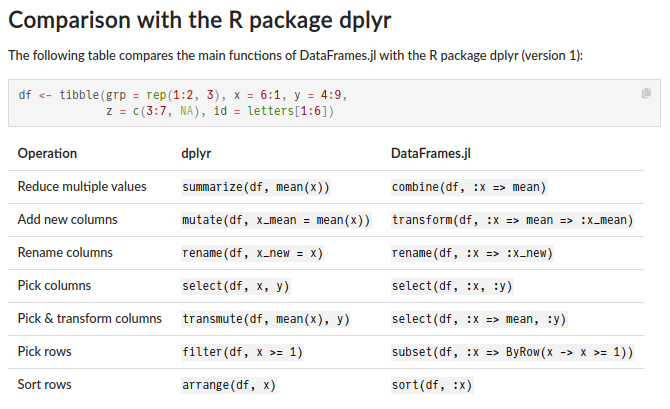  

There are many different ways to construct a `DataFrame`  

```julia
df = DataFrame(A=1:3, B=5:7, fixed=1)
```

    3×3 DataFrame
     Row │ A      B      fixed 
         │ Int64  Int64  Int64 
    ─────┼─────────────────────
       1 │     1      5      1
       2 │     2      6      1
       3 │     3      7      1

```julia
DataFrame(Dict("A" => 1:3, "B" => 5:7, "fixed" => 1))
```

    3×3 DataFrame
     Row │ A      B      fixed 
         │ Int64  Int64  Int64 
    ─────┼─────────────────────
       1 │     1      5      1
       2 │     2      6      1
       3 │     3      7      1

Notice that columns are typed  

Then we can interact with the `DataFrame` in a variety of ways  

For example: indexing  

```julia
df.A
```

    3-element Vector{Int64}:
     1
     2
     3

```julia
df."A"  # useful when column-names aren't valid Julia symbols
```

    3-element Vector{Int64}:
     1
     2
     3

```julia
df[:, "A"]
```

    3-element Vector{Int64}:
     1
     2
     3

```julia
df[:, [:A, :B]]
```

    3×2 DataFrame
     Row │ A      B     
         │ Int64  Int64 
    ─────┼──────────────
       1 │     1      5
       2 │     2      6
       3 │     3      7

```julia
df[:, Not(:fixed)]
```

    3×2 DataFrame
     Row │ A      B     
         │ Int64  Int64 
    ─────┼──────────────
       1 │     1      5
       2 │     2      6
       3 │     3      7

All the standard functions are available, e.g.  

-   `select`
-   `transform`
-   `groupby`
-   Different forms of `join`
-   Etc.

There are too many functions to go through  

See the docs <https://dataframes.juliadata.org/stable/> for a thorough overview  


## Actual data

Let's load the actual data  

Our data is a CSV file  

```julia
readdir("data")
```

    3-element Vector{String}:
     "influenza_england_1978_school.csv"
     "pest_data.csv"
     "time-series.csv"

Functionality for different file formats is usually provided by separate packages:  

-   [CSV.jl](https://github.com/JuliaData/CSV.jl)
-   [Arrow.jl](https://github.com/JuliaData/Arrow.jl) (Apache Arrow)
-   [RData.jl](https://github.com/JuliaData/RData.jl) (R data files)
-   [XLSX.jl](https://felipenoris.github.io/XLSX.jl/stable/) (Excel files)
-   And more.

In our case, we're working with a CSV file, so we'll use `CSV.jl`:  

```julia
using CSV
datafile = CSV.File(joinpath("data", "influenza_england_1978_school.csv"));
```

And then we can convert this `CSV.File` into a `DataFrame`  

```julia
data = DataFrame(datafile)
```

```
14×4 DataFrame
 Row │ Column1  date        in_bed  convalescent 
     │ Int64    Date        Int64   Int64        
─────┼───────────────────────────────────────────
   1 │       1  1978-01-22       3             0
   2 │       2  1978-01-23       8             0
   3 │       3  1978-01-24      26             0
   4 │       4  1978-01-25      76             0
   5 │       5  1978-01-26     225             9
   6 │       6  1978-01-27     298            17
   7 │       7  1978-01-28     258           105
   8 │       8  1978-01-29     233           162
   9 │       9  1978-01-30     189           176
  10 │      10  1978-01-31     128           166
  11 │      11  1978-02-01      68           150
  12 │      12  1978-02-02      29            85
  13 │      13  1978-02-03      14            47
  14 │      14  1978-02-04       4            20
```

> Woah, how does this work? We just passed a `CSV.File` to `DataFrames.DataFrame`, and <span class="underline">it just works</span>?!  

Aye, that's right  

This is thanks to [Tables.jl](https://tables.juliadata.org/stable/), a simple interface for tabular data  

Such light-weight interface packages allow modules to seemlessly interact with each other without explicit dependencies  

This is a very typical pattern in Julia  


# Distributions.jl

```julia
using Distributions
```

In Julia, the go-to for working with distributions is [`Distributions.jl`](https://juliastats.org/Distributions.jl/stable/)  

This package provides a large number of distributions  

Used throughout the Julia community, e.g. `Turing` uses this  

```julia
dist = Normal()
```

    Normal{Float64}(μ=0.0, σ=1.0)

```julia
mean(dist), var(dist)
```

    (0.0, 1.0)

Remeber the `Random.rand` function from earlier? This now also accepts a `Distribution`  

```julia
x = rand(dist)
```

    0.7638013704669433

```julia
logpdf(dist, x)
```

    -1.2106347999682632

```julia
cdf(dist, 0.5)
```

    0.6914624612740131

```julia
quantile.(Normal(), [0.05, 0.5, 0.95])
```

    3-element Vector{Float64}:
     -1.6448536269514724
      0.0
      1.6448536269514717

There is also maximum likelihood estimation (MLE)  

```julia
xs = rand(Normal(1, 2), 100)
fit(Normal, xs)
```

    Normal{Float64}(μ=1.0397121670324303, σ=1.8650444781860653)

But exactly what distributions are there?  

Well, we can just check by inspecting the subtypes of `Distribution`  

```julia
# Filter away abstract types.
nonabstract_dist_subtypes = filter(!isabstracttype, subtypes(Distribution))
# Filter away types which are not found in Distributions.jl.
dist_types_from_distributions = filter(
    Base.Fix1(hasproperty, Distributions) ∘ Symbol,
    nonabstract_dist_subtypes
)
```

```
84-element Vector{Any}:
 Arcsine
 Bernoulli
 BernoulliLogit
 Beta
 BetaBinomial
 BetaPrime
 Binomial
 Biweight
 Cauchy
 Chernoff
 Chi
 Chisq
 Cosine
 ⋮
 Soliton
 StudentizedRange
 SymTriangularDist
 TDist
 TriangularDist
 Triweight
 Truncated
 Uniform
 VonMises
 VonMisesFisher
 Weibull
 Wishart
```

Okay, there are a bit too many  

Let's separate between different variate types  

```julia
filter(x -> x <: UnivariateDistribution, dist_types_from_distributions)
```

```
70-element Vector{Any}:
 Arcsine
 Bernoulli
 BernoulliLogit
 Beta
 BetaBinomial
 BetaPrime
 Binomial
 Biweight
 Cauchy
 Chernoff
 Chi
 Chisq
 Cosine
 ⋮
 SkewNormal
 SkewedExponentialPower
 Soliton
 StudentizedRange
 SymTriangularDist
 TDist
 TriangularDist
 Triweight
 Truncated
 Uniform
 VonMises
 Weibull
```

Too many  

Let's convert it into a `Matrix` and force Julia to show all columns  

```julia
show(
    IOContext(stdout, :limit => false),
    "text/plain",
    reshape(filter(x -> x <: UnivariateDistribution, dist_types_from_distributions), 10, :)
)
```

```
10×7 Matrix{Any}:
 Arcsine         Chi                    Frechet                  KSDist       LogitNormal            PGeneralizedGaussian    Soliton
 Bernoulli       Chisq                  Gamma                    KSOneSided   NegativeBinomial       Pareto                  StudentizedRange
 BernoulliLogit  Cosine                 GeneralizedExtremeValue  Kolmogorov   NoncentralBeta         Poisson                 SymTriangularDist
 Beta            Dirac                  GeneralizedPareto        Kumaraswamy  NoncentralChisq        PoissonBinomial         TDist
 BetaBinomial    DiscreteNonParametric  Geometric                Laplace      NoncentralF            Rayleigh                TriangularDist
 BetaPrime       DiscreteUniform        Gumbel                   Levy         NoncentralT            Rician                  Triweight
 Binomial        Epanechnikov           Hypergeometric           Lindley      Normal                 Semicircle              Truncated
 Biweight        Erlang                 InverseGamma             LogNormal    NormalCanon            Skellam                 Uniform
 Cauchy          Exponential            InverseGaussian          LogUniform   NormalInverseGaussian  SkewNormal              VonMises
 Chernoff        FDist                  JohnsonSU                Logistic     OrderStatistic         SkewedExponentialPower  Weibull
```

Now for multivariate distributions  

```julia
filter(x -> x <: MultivariateDistribution, dist_types_from_distributions)
```

    6-element Vector{Any}:
     Dirichlet
     DirichletMultinomial
     JointOrderStatistics
     Multinomial
     Product
     VonMisesFisher

<div class="fragment (appear)>"

And matrix distributions  

```julia
filter(x -> x <: MatrixDistribution, dist_types_from_distributions)
```

    7-element Vector{Any}:
     InverseWishart
     LKJ
     MatrixBeta
     MatrixFDist
     MatrixNormal
     MatrixTDist
     Wishart

</div>


# Plots.jl

```julia
using Plots
```

The most commonly used plotting library is [Plots.jl](https://docs.juliaplots.org/stable/)  

Has many backends, including:  

-   GR
-   PyPlot
-   Plotly
-   Unicode
-   PGFPlots
-   And more

<span class="underline">But</span> the code is the same for all backends  

```julia
# GR is used by default
Plots.backend()
```

    Plots.GRBackend()

<div class="side-by-side">

<div>

```julia
p1 = plot(1:10, rand(10), size=(450, 200))
```

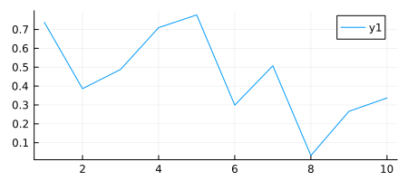  

</div>

<div>

```julia
p2 = scatter(1:10, rand(10), size=(450, 200))
```

  

</div>

</div>

```julia
plot(p1, p2, layout=(1, 2), size=(800, 200))
```

  

A neat example from [the docs](https://docs.juliaplots.org/stable/#simple-is-beautiful)  

```julia
# Define the Lorenz attractor
Base.@kwdef mutable struct Lorenz
    dt::Float64 = 0.02
    σ::Float64 = 10
    ρ::Float64 = 28
    β::Float64 = 8/3
    x::Float64 = 1
    y::Float64 = 1
    z::Float64 = 1
end

function step!(l::Lorenz)
    dx = l.σ * (l.y - l.x)
    dy = l.x * (l.ρ - l.z) - l.y
    dz = l.x * l.y - l.β * l.z
    l.x += l.dt * dx
    l.y += l.dt * dy
    l.z += l.dt * dz
end

attractor = Lorenz()
```

    Lorenz(0.02, 10.0, 28.0, 2.6666666666666665, 1.0, 1.0, 1.0)

```julia
# Initialize a 3D plot with 1 empty series
plt = plot3d(
    1,
    xlim = (-30, 30),
    ylim = (-30, 30),
    zlim = (0, 60),
    title = "Lorenz Attractor",
    legend = false,
    marker = 2,
)

# Build an animated gif by pushing new points to the plot, saving every 10th frame
anim = @animate for i=1:1500
    step!(attractor)
    push!(plt, attractor.x, attractor.y, attractor.z)
end every 10
gif(anim, outputdir("lorenz.gif"));
```

    [ Info: Saved animation to /drive-2/Projects/public/Turing-Workshop/2023-MRC-BSU-and-UKHSA/Part2/assets/outputs/more-julia/lorenz.gif

  


## Ecosystem

Plots.jl also has a very nice recipe-system  

Allows you to define how to plot your own types  

As a result, packages often define customized plotting recipes for their types  

<https://docs.juliaplots.org/latest/ecosystem/#Community-packages>  


## StatsPlots.jl

For us, [StatsPlots.jl](https://github.com/JuliaPlots/StatsPlots.jl) is particularly relevant  

```julia
using StatsPlots
```

It contains custom plotting functionality for dataframes and distibutions  

```julia
plot(Normal())
```

  

It also contains the macro `@df` for working with dataframes  

```julia
@df data scatter(:date, :in_bed, label=nothing, ylabel="Number of students in bed")
```

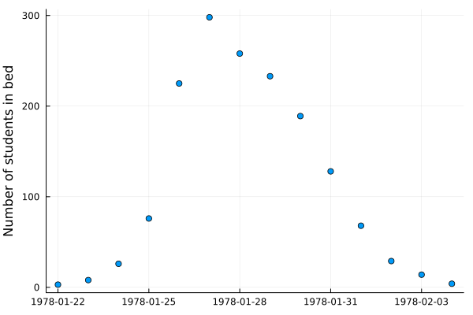  


# DifferentialEquations.jl

```julia
using DifferentialEquations
```

Everything related to differential equations is provided by [`DifferentialEquations.jl`](https://docs.sciml.ai/DiffEqDocs/stable/) and the [SciML ecosystem](https://sciml.ai/)  

And I really do mean [*everything*](https://docs.sciml.ai/DiffEqDocs/stable/)  

<div class="side-by-side">

  

  

</div>


## Differential equations

Suppose we have some function $f$ which describes how a state $x$ evolves wrt. $t$  

\begin{equation*}
\frac{\mathrm{d} x}{\mathrm{d} t} = f(x, t)
\end{equation*}

which we then need to integrate to obtain the actual state at some time $t$  

\begin{equation*}
x(t) = \int_{0}^{t} \frac{\mathrm{d} x}{\mathrm{d} t} \mathrm{d} t = \int_{0}^{t} f(x, t) \mathrm{d} t
\end{equation*}

In many interesting scenarios numerical methods are required to obtain $x(t)$  


## Example: SIR model

One particular example of an (ordinary) differential equation that you might have seen recently is the **SIR model** used in epidemiology  

")  

The temporal dynamics of the sizes of each of the compartments are governed by the following system of ODEs:  

\begin{equation*}
\begin{split}
  \frac{\mathrm{d} S}{\mathrm{d} t} &= - \beta S \frac{I}{N} \\
  \frac{\mathrm{d} I}{\mathrm{d} t} &= \beta S \frac{I}{N} - \gamma I \\
  \frac{\mathrm{d} R}{\mathrm{d} t} &= \gamma I
\end{split}
\end{equation*}

where  

-   $S(t)$ is the number of people susceptible to becoming infected,
-   $I(t)$ is the number of people currently infected,
-   $R(t)$ is the number of recovered people,
-   $β$ is the constant rate of infectious contact between people,
-   $\gamma$ the constant recovery rate of infected individuals

Converting this ODE into code is just  

```julia
const N = 763 # size of population

function SIR!(
    du,  # buffer for the updated differential equation
    u,   # current state
    p,   # parameters
    t    # current time
)
    S, I, R = u
    β, γ = p

    du[1] = dS = -β * I * S / N
    du[2] = dI = β * I * S / N - γ * I
    du[3] = dR = γ * I
end
```

    SIR! (generic function with 1 method)

Not too bad!  

Initial conditions are then  

\begin{equation*}
\begin{split}
  S(0) &= N - 1 \\
  I(0) &= 1 \\
  R(0) &= 0
\end{split}
\end{equation*}

and we want to integrate from $t = 0$ to $t = 14$  

```julia
# Include 0 because that's the initial condition before any observations.
tspan = (0.0, 14.0)

# Initial conditions are:
#   S(0) = N - 1; I(0) = 1; R(0) = 0
u0 = [N - 1, 1, 0.0]
```

    3-element Vector{Float64}:
     762.0
       1.0
       0.0

Now we just need to define the overall problem and we can solve:  

```julia
# Just to check that everything works, we'll just use some "totally random" values for β and γ:
problem_sir = let β = 2.0, γ = 0.6
    ODEProblem(SIR!, u0, tspan, (β, γ))
end
```

    ODEProblem with uType Vector{Float64} and tType Float64. In-place: true
    timespan: (0.0, 14.0)
    u0: 3-element Vector{Float64}:
     762.0
       1.0
       0.0

Aaaand  

```julia
sol = solve(problem_sir)
```

```
retcode: Success
Interpolation: specialized 4th order "free" interpolation, specialized 2nd order "free" stiffness-aware interpolation
t: 23-element Vector{Float64}:
  0.0
  0.0023558376404244326
  0.025914214044668756
  0.11176872871946908
  0.26714420676761075
  0.47653584778586056
  0.7436981238065388
  1.0701182881347182
  1.4556696154809898
  1.8994815718103506
  2.4015425820305163
  2.9657488203418048
  3.6046024613854746
  4.325611232479916
  5.234036476235002
  6.073132270491685
  7.323851265223563
  8.23100744184026
  9.66046960467715
 11.027717843180652
 12.506967592177675
 13.98890399536329
 14.0
u: 23-element Vector{Vector{Float64}}:
 [762.0, 1.0, 0.0]
 [761.9952867607622, 1.003297407481751, 0.001415831756055325]
 [761.9472927630898, 1.036873767352754, 0.015833469557440357]
 [761.7584189579304, 1.1690001128296739, 0.0725809292398516]
 [761.353498610305, 1.4522140137552049, 0.19428737593979384]
 [760.6490369821046, 1.9447820690728455, 0.4061809488225752]
 [759.3950815454128, 2.8210768113583082, 0.7838416432288186]
 [757.0795798160242, 4.437564277195732, 1.4828559067800167]
 [752.6094742865345, 7.552145919430467, 2.8383797940350495]
 [743.573784947305, 13.823077731564027, 5.603137321131049]
 [724.5575481927715, 26.909267078762316, 11.533184728466205]
 [683.6474029897502, 54.51612001957392, 24.836476990675976]
 [598.1841629858786, 109.41164143668018, 55.40419557744127]
 [450.08652743810205, 192.396449154863, 120.51702340703504]
 [259.11626253270623, 256.9925778114915, 246.89115965580237]
 [148.3573731526537, 240.10301213899098, 374.53961470835543]
 [76.52998017846475, 160.6373332952353, 525.8326865263001]
 [55.70519994004921, 108.7634182279299, 598.531381832021]
 [41.39587834423381, 55.09512088924873, 666.5090007665176]
 [35.87067243374374, 27.821838135708532, 699.3074894305479]
 [33.252184333490774, 13.087185981359177, 716.6606296851502]
 [32.08996839417716, 6.105264616193066, 724.8047669896299]
 [32.08428686823946, 6.070415830241046, 724.8452973015196]
```

We didn't specify a solver  

DifferentialEquations.jl uses `AutoTsit5(Rosenbrock32())` by default  

Which is a composition between  

-   `Tsit5` (4th order Runge-Kutta), and
-   `Rosenbrock32` (3rd order stiff solver)

with automatic switching between the two  

`AutoTsit5(Rosenbrock32())` covers many use-cases well, but see  

-   <https://docs.sciml.ai/DiffEqDocs/stable/solvers/ode_solve/>
-   <https://www.stochasticlifestyle.com/comparison-differential-equation-solver-suites-matlab-r-julia-python-c-fortran/>

for more info on choosing a solver  

This is the resulting solution  

```julia
plot(
    sol,
    linewidth=2, xaxis="Time in days", label=["Suspectible" "Infected" "Recovered"],
    alpha=0.5, size=(500, 300)
)
scatter!(1:14, data.in_bed, label="Data", color="black")
```

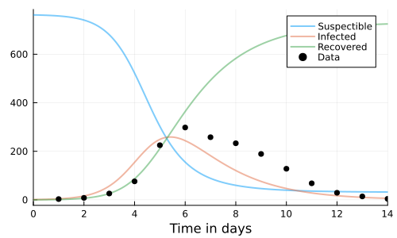  

This doesn't really match the data though; let's do better  

**Approach #1:** find optimal values of $\beta$ and $\gamma$ by minimizing some loss, e.g. sum-of-squares  

\begin{equation*}
\ell(\beta, \gamma) = \sum_{i = 1}^{14} \bigg( F(u_0, t_i;\ \beta, \gamma) - y_i \bigg)^2
\end{equation*}

where $\big( y_i \big)_{i = 1}^{14}$ are the observations, $F$ is the integrated system  


## Optimization.jl

In Julia, there are *tons* of packages for performing all kinds of optimization  

[Optimization.jl](https://docs.sciml.ai/Optimization/stable/) provides a convenient interface to many of them  

```julia
using Optimization
```

")  

<div class="small-text">

Recall we want to solve  

\begin{equation*}
\min_{\beta, \gamma} \sum_{i = 1}^{14} \bigg( F(u_0, t_i;\ \beta, \gamma) - y_i \bigg)^2
\end{equation*}

where $\big( y_i \big)_{i = 1}^{14}$ are the observations, $F$ is the integrated system  

</div>

<div class="fragment (appear)">

First we define the loss  

```julia
# Define the loss function.
function loss_sir(problem_orig, p)
    # `remake` just, well, remakes the `problem` with parameters `p` replaced.
    problem = remake(problem_orig, p=p)
    # To ensure we get solutions _exactly_ at the timesteps of interest,
    # i.e. every day we have observations, we use `saveat=1` to tell `solve`
    # to save at every timestep (which is one day).
    sol = solve(problem, saveat=1)
    # Extract the 2nd state, the (I)infected, for the dates with observations.
    sol_for_observed = sol[2, 2:15]
    # Compute the sum-of-squares of the infected vs. data.
    return sum(abs2.(sol_for_observed - data.in_bed))
end
```

    loss_sir (generic function with 1 method)

</div>

Then we can define our `OptimizationProblem`  

```julia
opt_problem = OptimizationProblem(
    OptimizationFunction(
        (p,_) -> loss_sir(problem_sir, p), # function to minimize
        Optimization.AutoForwardDiff()     # use ForwardDiff for automatic differentiation
    ),
    [2.0, 0.5],                            # initial values
    lb = [0, 0],                           # lower bounds on variables
    ub = [Inf, Inf],                       # upper bounds on variables
) 
```

    OptimizationProblem. In-place: true
    u0: 2-element Vector{Float64}:
     2.0
     0.5

And for general *deterministic* problems, [Optim.jl](https://julianlsolvers.github.io/Optim.jl/stable/) is a good choice  

```julia
using OptimizationOptimJL
opt = solve(opt_problem, NelderMead())
```

    u: 2-element Vector{Float64}:
     1.6692320164955483
     0.44348639177622445

```julia
β, λ = opt
β, λ
```

    (1.6692320164955483, 0.44348639177622445)

```julia
# Solve the problem with the obtained parameters.
problem_sir = remake(problem_sir, p=(β, λ))
sol = solve(problem_sir)

# Plot the solution.
plot(sol, linewidth=2, xaxis="Time in days", label=["Susceptible" "Infected" "Recovered"], alpha=0.5)
# And the data.
scatter!(1:14, data.in_bed, label="Data", color="black")
```

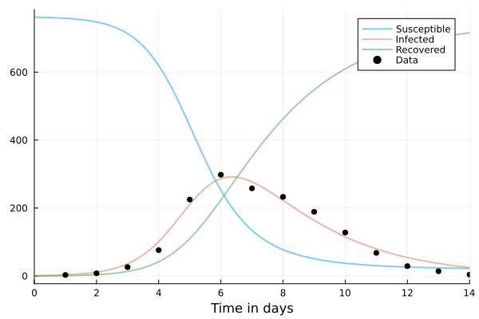  

That's better than our *totally* "random" guess from earlier!  


## Example: SEIR model

Adding another compartment to our SIR model: the <span class="underline">(E)xposed</span> state  

\begin{equation*}
\begin{split}
  \frac{\mathrm{d} S}{\mathrm{d} t} &= - \beta S \frac{I}{N} \\
  \frac{\mathrm{d} {\color{blue} E}}{\mathrm{d} t} &= \beta S \frac{I}{N} - {\color{orange} \sigma} {\color{blue} E} \\
  \frac{\mathrm{d} I}{\mathrm{d} t} &= {\color{orange} \sigma} {\color{blue} E} - \gamma I \\
  \frac{\mathrm{d} R}{\mathrm{d} t} &= \gamma I
\end{split}
\end{equation*}

where we've added a new parameter ${\color{orange} \sigma}$ describing the fraction of people who develop observable symptoms in this time  


## TASK Solve the SEIR model using Julia

```julia
function SEIR!(
    du,  # buffer for the updated differential equation
    u,   # current state
    p,   # parameters
    t    # current time
)
    N = 763  # population

    S, E, I, R = u  # have ourselves an additional state!
    β, γ, σ = p     # and an additional parameter!

    # TODO: Implement yah fool!
    du[1] = nothing
    du[2] = nothing
    du[3] = nothing
    du[4] = nothing
end
```

**BONUS:** find minimizers of sum-of-squares  

```julia
# Some space so you don't cheat.


# Are you sure?
```


## SOLUTION Solve the SEIR model using Julia

```julia
function SEIR!(
    du,  # buffer for the updated differential equation
    u,   # current state
    p,   # parameters
    t    # current time
)
    N = 763  # population
    S, E, I, R = u  # have ourselves an additional state!
    β, γ, σ = p     # and an additional parameter!

    # Might as well cache these computations.
    βSI = β * S * I / N
    σE = σ * E
    γI = γ * I

    du[1] = -βSI
    du[2] = βSI - σE
    du[3] = σE - γI
    du[4] = γI
end
```

    SEIR! (generic function with 1 method)

```julia
problem_seir = let u0 = [N - 1, 0, 1, 0], β = 2.0, γ = 0.6, σ = 0.8
    ODEProblem(SEIR!, u0, tspan, (β, γ, σ))
end
```

    ODEProblem with uType Vector{Int64} and tType Float64. In-place: true
    timespan: (0.0, 14.0)
    u0: 4-element Vector{Int64}:
     762
       0
       1
       0

```julia
sol_seir = solve(problem_seir, saveat=1)
```

```
retcode: Success
Interpolation: 1st order linear
t: 15-element Vector{Float64}:
  0.0
  1.0
  2.0
  3.0
  4.0
  5.0
  6.0
  7.0
  8.0
  9.0
 10.0
 11.0
 12.0
 13.0
 14.0
u: 15-element Vector{Vector{Float64}}:
 [762.0, 0.0, 1.0, 0.0]
 [760.1497035901518, 1.277915971753478, 1.015887135649055, 0.5564933024456415]
 [757.5476928906271, 2.425869618233348, 1.6850698824327135, 1.341367608706787]
 [753.081189706403, 4.277014534677882, 2.9468385687120784, 2.6949571902067637]
 [745.3234082630842, 7.455598293492681, 5.155811621098982, 5.065181822323939]
 [731.9851682751213, 12.855816151849933, 8.960337047554939, 9.198678525473571]
 [709.5042941973462, 21.77178343781762, 15.384985521594785, 16.338936843241182]
 [672.8733895183619, 35.77263271085456, 25.88133104438007, 28.472646726403138]
 [616.390571176038, 55.9717775696742, 42.09614416178475, 48.54150709250277]
 [536.453596476594, 81.2428045994271, 64.9673325777641, 80.33626634621449]
 [436.43708330634297, 106.04037246704702, 92.9550757379631, 127.56746848864664]
 [329.60092931771436, 121.08020372279418, 120.48402926084937, 191.83483769864185]
 [233.8471941518982, 119.43669383157659, 139.3233304893263, 270.3927815271987]
 [160.88805352426687, 102.7399386960996, 143.3826208089892, 355.98938697064415]
 [111.72261866282292, 79.02493776169311, 132.78384886713565, 439.46859470834806]
```

```julia
plot(sol_seir, linewidth=2, xaxis="Time in days", label=["Susceptible" "Exposed" "Infected" "Recovered"], alpha=0.5)
scatter!(1:14, data.in_bed, label="Data")
```

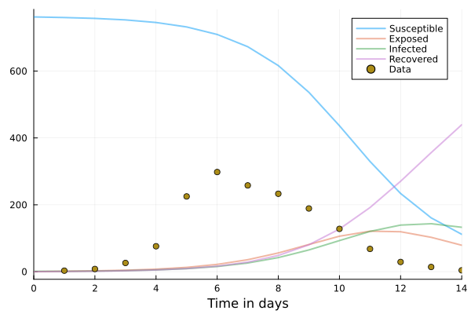  

Don't look so good. Let's try Optim.jl again.  

```julia
function loss_seir(problem, p)
    problem = remake(problem, p=p)
    sol = solve(problem, saveat=1)
    # NOTE: 3rd state is now the (I)nfectious compartment!!!
    sol_for_observed = sol[3, 2:15]
    return sum(abs2.(sol_for_observed - data.in_bed))
end
```

    loss_seir (generic function with 1 method)

```julia
opt_problem = OptimizationProblem(
    OptimizationFunction(
        (p,_) -> loss_seir(problem_seir, p), # function to minimize
        Optimization.AutoForwardDiff()       # use ForwardDiff for automatic differentiation
    ),
    [2.0, 0.5, 0.9],                         # initial values
    lb = [0, 0, 0],                          # lower bounds on variables
    ub = [Inf, Inf, Inf],                    # upper bounds on variables
)
```

    OptimizationProblem. In-place: true
    u0: 3-element Vector{Float64}:
     2.0
     0.5
     0.9

```julia
opt = solve(opt_problem, NelderMead())
```

    u: 3-element Vector{Float64}:
     4.853892250588215
     0.46714672936112517
     0.8150220601014526

```julia
β, γ, σ = opt
```

    u: 3-element Vector{Float64}:
     4.853892250588215
     0.46714672936112517
     0.8150220601014526

```julia
sol_seir = solve(remake(problem_seir, p=(β, γ, σ)), saveat=1)
plot(sol_seir, linewidth=2, xaxis="Time in days", label=["Susceptible" "Exposed" "Infected" "Recovered"], alpha=0.5)
scatter!(1:14, data.in_bed, label="Data", color="black")
```

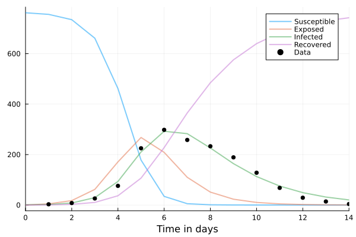  

> But&#x2026;but these are <span class="underline">point estimates</span>! What about distributions? WHAT ABOUT UNCERTAINTY?!  

No, no that's fair.  

Let's do some Bayesian inference then.  

BUT FIRST!  


## Making our future selves less annoyed

It's annoying to have all these different loss-functions for *both* `SIR!` and `SEIR!`  

<div class="fragment (appear)">

```julia
# Abstract type which we can use to dispatch on.
abstract type AbstractEpidemicProblem end

struct SIRProblem{P} <: AbstractEpidemicProblem
    problem::P
    N::Int
end

function SIRProblem(N::Int; u0 = [N - 1, 1, 0.], tspan = (0, 14), p = [2.0, 0.6])
    return SIRProblem(ODEProblem(SIR!, u0, tspan, p), N)
end
```

    SIRProblem

Then we can just construct the problem as  

```julia
sir = SIRProblem(N);
```

</div>

And to make it a bit easier to work with, we add some utility functions  

```julia
# General.
parameters(prob::AbstractEpidemicProblem) = prob.problem.p
initial_state(prob::AbstractEpidemicProblem) = prob.problem.u0
population(prob::AbstractEpidemicProblem) = prob.N

# Specializations.
susceptible(::SIRProblem, u::AbstractMatrix) = u[1, :]
infected(::SIRProblem, u::AbstractMatrix) = u[2, :]
recovered(::SIRProblem, u::AbstractMatrix) = u[3, :]
```

    recovered (generic function with 1 method)

So that once we've solved the problem, we can easily extract the compartment we want, e.g.  

```julia
sol = solve(sir.problem, saveat=1)
infected(sir, sol)
```

```
15-element Vector{Float64}:
   1.0
   4.026799533924022
  15.824575905720003
  56.779007685250534
 154.43105799061686
 248.98982384839158
 243.67838619968526
 181.93939659551984
 120.64627375763273
  75.92085282572398
  46.58644927641269
  28.214678599716414
  16.96318676577873
  10.158687874394722
   6.070415830241046
```


## TASK Implement `SEIRProblem`

```julia
struct SEIRProblem <: AbstractEpidemicProblem
    # ...
end

function SEIRProblem end

susceptible
exposed
infected
recovered
```

```julia
# Some space so you don't cheat.


# Are you sure?
```


## SOLUTION Implement `SEIRProblem`

```julia
struct SEIRProblem{P} <: AbstractEpidemicProblem
    problem::P
    N::Int
end

function SEIRProblem(N::Int; u0 = [N - 1, 0, 1, 0.], tspan = (0, 14), p = [4.5, 0.45, 0.8])
    return SEIRProblem(ODEProblem(SEIR!, u0, tspan, p), N)
end

susceptible(::SEIRProblem, u::AbstractMatrix) = u[1, :]
exposed(::SEIRProblem, u::AbstractMatrix) = u[2, :]
infected(::SEIRProblem, u::AbstractMatrix) = u[3, :]
recovered(::SEIRProblem, u::AbstractMatrix) = u[4, :]
```

    recovered (generic function with 2 methods)

Now, given a `problem` and a `sol`, we can query the `sol` for the `infected` state <span class="underline">without explicit handling of which `problem` we're working with</span>  

```julia
seir = SEIRProblem(N);
sol = solve(seir.problem, saveat=1)
infected(seir, sol)
```

```
15-element Vector{Float64}:
   1.0
   1.9941817088874336
   6.9585823072029
  23.926233517606498
  74.23638542794971
 176.98368495653585
 276.06126059898344
 293.92632518571605
 249.92836195453708
 189.07578975511504
 134.2373192679034
  91.82578430804273
  61.38108478932364
  40.42264366743211
  26.357816296754425
```


## Same `loss` for both!

```julia
function loss(problem_wrapper::AbstractEpidemicProblem, p)
    # NOTE: Extract the `problem` from `problem_wrapper`.
    problem = remake(problem_wrapper.problem, p=p)
    sol = solve(problem, saveat=1)
    # NOTE: Now this is completely general!
    sol_for_observed = infected(problem_wrapper, sol)[2:end]
    return sum(abs2.(sol_for_observed - data.in_bed))
end
```

    loss (generic function with 1 method)

Now we can call the <span class="underline">same `loss` for both</span> `SIR` and `SEIR`  

```julia
loss(SIRProblem(N), [2.0, 0.6])
```

    50257.839781348805

```julia
loss(SEIRProblem(N), [2.0, 0.6, 0.8])
```

    287325.105532706


# GPU programming

```julia
using CUDA
```

I'll use `CUDA` here, but there is also support for other GPU backends  

For more, see <https://juliagpu.org/>  

Because some of you might not have a GPU, we'll use  

```julia
CUDA.has_cuda()
```

    true

to avoid executing the GPU code in that case  

```julia
if CUDA.has_cuda()
    CUDA.versioninfo()
end
```

```
CUDA runtime 11.8, artifact installation
CUDA driver 11.4
NVIDIA driver 470.199.2

CUDA libraries: 
- CUBLAS: 11.11.3
- CURAND: 10.3.0
- CUFFT: 10.9.0
- CUSOLVER: 11.4.1
- CUSPARSE: 11.7.5
- CUPTI: 18.0.0
- NVML: 11.0.0+470.199.2

Julia packages: 
- CUDA: 4.4.1
- CUDA_Driver_jll: 0.5.0+1
- CUDA_Runtime_jll: 0.6.0+0

Toolchain:
- Julia: 1.9.3
- LLVM: 14.0.6
- PTX ISA support: 3.2, 4.0, 4.1, 4.2, 4.3, 5.0, 6.0, 6.1, 6.3, 6.4, 6.5, 7.0, 7.1, 7.2, 7.3, 7.4
- Device capability support: sm_35, sm_37, sm_50, sm_52, sm_53, sm_60, sm_61, sm_62, sm_70, sm_72, sm_75, sm_80, sm_86

1 device:
  0: NVIDIA GeForce GTX 1650 with Max-Q Design (sm_75, 3.815 GiB / 3.822 GiB available)
```

```julia
# Array on CPU
xs = rand(2)
```

    2-element Vector{Float64}:
     0.7911106632038112
     0.7542712130619208

```julia
if CUDA.has_cuda()
    # Array on GPU
    xs_cuda = cu(xs)
end
```

    2-element CuArray{Float32, 1, CUDA.Mem.DeviceBuffer}:
     0.79111063
     0.7542712

And that's it!  

```julia
if CUDA.has_cuda()
    2 * xs_cuda
end
```

    2-element CuArray{Float32, 1, CUDA.Mem.DeviceBuffer}:
     1.5822213
     1.5085424

```julia
if CUDA.has_cuda()
    xs_cuda .+ xs_cuda
end
```

    2-element CuArray{Float32, 1, CUDA.Mem.DeviceBuffer}:
     1.5822213
     1.5085424

```julia
if CUDA.has_cuda()
    X_cuda = xs_cuda * xs_cuda' + 1f-2 * I
    cholesky(X_cuda)
end
```

    Cholesky{Float32, CuArray{Float32, 2, CUDA.Mem.DeviceBuffer}}
    U factor:
    2×2 UpperTriangular{Float32, CuArray{Float32, 2, CUDA.Mem.DeviceBuffer}}:
     0.797406  0.748317
      ⋅        0.137649

<div class="WARNING">

**Important:** Turing.jl is <span class="underline">not</span> completely GPU compatible  

</div>

You can execute all the GPU code you want *inside* the model  

But you can't use GPU for the entire computation, *yet*  

Though some samplers are already GPU compatible  


# Turing.jl

```julia
using Turing
```

and so we are finally here  


## A simple demo

```julia
# 1. Define the model
@model function simple_demo(x, y)
    s ~ InverseGamma(2, 3)
    m ~ Normal(0, sqrt(s))

    x ~ Normal(m, sqrt(s))
    y ~ Normal(m, sqrt(s))
end
# 2. Instantiate the model, giving it some data.
model = simple_demo(1.5, 2.0)
# 3. Sample.
chain = sample(model, NUTS(), 1000);
```

    ┌ Info: Found initial step size
    └   ϵ = 0.8
    Sampling: 100%|█████████████████████████████████████████| Time: 0:00:00

```julia
chain
```

```
Chains MCMC chain (1000×14×1 Array{Float64, 3}):

Iterations        = 501:1:1500
Number of chains  = 1
Samples per chain = 1000
Wall duration     = 9.12 seconds
Compute duration  = 9.12 seconds
parameters        = s, m
internals         = lp, n_steps, is_accept, acceptance_rate, log_density, hamiltonian_energy, hamiltonian_energy_error, max_hamiltonian_energy_error, tree_depth, numerical_error, step_size, nom_step_size

Summary Statistics
  parameters      mean       std      mcse   ess_bulk   ess_tail      rhat   e ⋯
      Symbol   Float64   Float64   Float64    Float64    Float64   Float64     ⋯

           s    1.9267    1.3645    0.0630   485.6727   577.6553    1.0054     ⋯
           m    1.2265    0.7849    0.0309   674.6064   552.4304    1.0099     ⋯
                                                                1 column omitted

Quantiles
  parameters      2.5%     25.0%     50.0%     75.0%     97.5% 
      Symbol   Float64   Float64   Float64   Float64   Float64 

           s    0.5507    1.0696    1.5418    2.3495    5.1686
           m   -0.2176    0.7099    1.1755    1.6958    2.7835
```

```julia
plot(chain)
```

  

```julia
# 1. Define the model
@model function simple_demo(x, y)
    s ~ InverseGamma(2, 3)
    m ~ Normal(0, sqrt(s))

    x ~ Normal(m, sqrt(s))
    y ~ Normal(m, sqrt(s))
end
# 2. Instantiate the model, giving it some data.
model = simple_demo(1.5, 2.0)
# 3. Sample.
chain = sample(model, NUTS(), 1000);
```

> Okay, what is going on here?  

Let's break it down  

To define a model in Turing.jl, we use the `@model` macro  

```julia
@model function simple_demo(x, y)
    s ~ InverseGamma(2, 3)
    m ~ Normal(0, sqrt(s))

    x ~ Normal(m, sqrt(s))
    y ~ Normal(m, sqrt(s))
end
```

    simple_demo (generic function with 2 methods)

which, as we can see, results in a few `simple_demo` methods  

-   One method is for evaluation of the model
-   The rest (one, here) are for constructing the `Model`

<div class="fragment (appear)">

```julia
model = simple_demo(1.5, 2.0)
```

    Model(
      args = (:x, :y)
      defaults = ()
      context = DynamicPPL.DefaultContext()
    )

</div>

In fact, we can call the `model`  

```julia
model()
```

    2.0

It returns `2.0` because the last line was  

```julia
y ~ Normal(m, sqrt(s))
```

where `y` is conditioned to be `2.0`  

We can add an explicit `return` statement if we want  

```julia
@model function simple_demo(x, y)
    s ~ InverseGamma(2, 3)
    m ~ Normal(0, sqrt(s))

    x ~ Normal(m, sqrt(s))
    y ~ Normal(m, sqrt(s))

    # This is just standard Julia, so we can put anything in here.
    return (; s, m, x, y, hello=42)
end
```

    simple_demo (generic function with 2 methods)

```julia
model = simple_demo(1.5, 2.0)
model()
```

    (s = 0.9042382869221636, m = -0.4180599286347479, x = 1.5, y = 2.0, hello = 42)

When we call the `model`, `s` and `m` are sampled from the prior  

This can be very useful for debugging, e.g.  

```julia
@model function demo_buggy()
    x ~ truncated(Normal(), -10, 0)
    y ~ Normal(0, x)
end
model_buggy = demo_buggy()
model_buggy()
```

```
DomainError with -1.5909802088598057:
Normal: the condition σ >= zero(σ) is not satisfied.

Stacktrace:
  [1] #371
    @ ~/.julia/packages/Distributions/Ufrz2/src/univariate/continuous/normal.jl:37 [inlined]
  [2] check_args
    @ ~/.julia/packages/Distributions/Ufrz2/src/utils.jl:89 [inlined]
  [3] #Normal#370
    @ ~/.julia/packages/Distributions/Ufrz2/src/univariate/continuous/normal.jl:37 [inlined]
  [4] Normal
    @ ~/.julia/packages/Distributions/Ufrz2/src/univariate/continuous/normal.jl:36 [inlined]
  [5] #Normal#373
    @ ~/.julia/packages/Distributions/Ufrz2/src/univariate/continuous/normal.jl:42 [inlined]
  [6] Normal(μ::Int64, σ::Float64)
    @ Distributions ~/.julia/packages/Distributions/Ufrz2/src/univariate/continuous/normal.jl:42
  [7] macro expansion
    @ ~/.julia/packages/DynamicPPL/m0PXI/src/compiler.jl:555 [inlined]
  [8] demo_buggy(__model__::DynamicPPL.Model{typeof(demo_buggy), (), (), (), Tuple{}, Tuple{}, DynamicPPL.DefaultContext}, __varinfo__::DynamicPPL.ThreadSafeVarInfo{DynamicPPL.UntypedVarInfo{DynamicPPL.Metadata{Dict{AbstractPPL.VarName, Int64}, Vector{Distribution}, Vector{AbstractPPL.VarName}, Vector{Real}, Vector{Set{DynamicPPL.Selector}}}, Float64}, Vector{Base.RefValue{Float64}}}, __context__::DynamicPPL.SamplingContext{DynamicPPL.SampleFromPrior, DynamicPPL.DefaultContext, TaskLocalRNG})
    @ Main ./In[144]:3
  [9] _evaluate!!
    @ ~/.julia/packages/DynamicPPL/m0PXI/src/model.jl:963 [inlined]
 [10] evaluate_threadsafe!!
    @ ~/.julia/packages/DynamicPPL/m0PXI/src/model.jl:952 [inlined]
 [11] evaluate!!
    @ ~/.julia/packages/DynamicPPL/m0PXI/src/model.jl:887 [inlined]
 [12] evaluate!! (repeats 2 times)
    @ ~/.julia/packages/DynamicPPL/m0PXI/src/model.jl:900 [inlined]
 [13] evaluate!!
    @ ~/.julia/packages/DynamicPPL/m0PXI/src/model.jl:908 [inlined]
 [14] (::DynamicPPL.Model{typeof(demo_buggy), (), (), (), Tuple{}, Tuple{}, DynamicPPL.DefaultContext})()
    @ DynamicPPL ~/.julia/packages/DynamicPPL/m0PXI/src/model.jl:860
 [15] top-level scope
    @ In[144]:6
```

Let's insert some good old-fashioned print-statements  

```julia
@model function demo_buggy()
    x ~ truncated(Normal(), -10, 0)
    println("x=$x")
    y ~ Normal(0, x)
    println("y=$y")
end
model_buggy = demo_buggy()
model_buggy()
```

    x=-0.39059114202501893

```
DomainError with -0.39059114202501893:
Normal: the condition σ >= zero(σ) is not satisfied.

Stacktrace:
  [1] #371
    @ ~/.julia/packages/Distributions/Ufrz2/src/univariate/continuous/normal.jl:37 [inlined]
  [2] check_args
    @ ~/.julia/packages/Distributions/Ufrz2/src/utils.jl:89 [inlined]
  [3] #Normal#370
    @ ~/.julia/packages/Distributions/Ufrz2/src/univariate/continuous/normal.jl:37 [inlined]
  [4] Normal
    @ ~/.julia/packages/Distributions/Ufrz2/src/univariate/continuous/normal.jl:36 [inlined]
  [5] #Normal#373
    @ ~/.julia/packages/Distributions/Ufrz2/src/univariate/continuous/normal.jl:42 [inlined]
  [6] Normal(μ::Int64, σ::Float64)
    @ Distributions ~/.julia/packages/Distributions/Ufrz2/src/univariate/continuous/normal.jl:42
  [7] demo_buggy(__model__::DynamicPPL.Model{typeof(demo_buggy), (), (), (), Tuple{}, Tuple{}, DynamicPPL.DefaultContext}, __varinfo__::DynamicPPL.ThreadSafeVarInfo{DynamicPPL.UntypedVarInfo{DynamicPPL.Metadata{Dict{AbstractPPL.VarName, Int64}, Vector{Distribution}, Vector{AbstractPPL.VarName}, Vector{Real}, Vector{Set{DynamicPPL.Selector}}}, Float64}, Vector{Base.RefValue{Float64}}}, __context__::DynamicPPL.SamplingContext{DynamicPPL.SampleFromPrior, DynamicPPL.DefaultContext, TaskLocalRNG})
    @ Main ./In[145]:4
  [8] _evaluate!!
    @ ~/.julia/packages/DynamicPPL/m0PXI/src/model.jl:963 [inlined]
  [9] evaluate_threadsafe!!(model::DynamicPPL.Model{typeof(demo_buggy), (), (), (), Tuple{}, Tuple{}, DynamicPPL.DefaultContext}, varinfo::DynamicPPL.UntypedVarInfo{DynamicPPL.Metadata{Dict{AbstractPPL.VarName, Int64}, Vector{Distribution}, Vector{AbstractPPL.VarName}, Vector{Real}, Vector{Set{DynamicPPL.Selector}}}, Float64}, context::DynamicPPL.SamplingContext{DynamicPPL.SampleFromPrior, DynamicPPL.DefaultContext, TaskLocalRNG})
    @ DynamicPPL ~/.julia/packages/DynamicPPL/m0PXI/src/model.jl:952
 [10] evaluate!!(model::DynamicPPL.Model{typeof(demo_buggy), (), (), (), Tuple{}, Tuple{}, DynamicPPL.DefaultContext}, varinfo::DynamicPPL.UntypedVarInfo{DynamicPPL.Metadata{Dict{AbstractPPL.VarName, Int64}, Vector{Distribution}, Vector{AbstractPPL.VarName}, Vector{Real}, Vector{Set{DynamicPPL.Selector}}}, Float64}, context::DynamicPPL.SamplingContext{DynamicPPL.SampleFromPrior, DynamicPPL.DefaultContext, TaskLocalRNG})
    @ DynamicPPL ~/.julia/packages/DynamicPPL/m0PXI/src/model.jl:887
 [11] evaluate!! (repeats 2 times)
    @ ~/.julia/packages/DynamicPPL/m0PXI/src/model.jl:900 [inlined]
 [12] evaluate!!
    @ ~/.julia/packages/DynamicPPL/m0PXI/src/model.jl:908 [inlined]
 [13] (::DynamicPPL.Model{typeof(demo_buggy), (), (), (), Tuple{}, Tuple{}, DynamicPPL.DefaultContext})()
    @ DynamicPPL ~/.julia/packages/DynamicPPL/m0PXI/src/model.jl:860
 [14] top-level scope
    @ In[145]:8
```

`x` is negative ⟶ let's fix that  

```julia
@model function demo_buggy()
    x ~ truncated(Normal(), 0, 10)
    println("x=$x")
    y ~ Normal(0, x)
    println("y=$y")
end
model_buggy = demo_buggy()
model_buggy()
```

    x=0.7899722982041668
    y=0.4623970224585408

It works!  

But let's get back to our `simple_demo` example  

```julia
@model function simple_demo(x, y)
    s ~ InverseGamma(2, 3)
    m ~ Normal(0, sqrt(s))

    x ~ Normal(m, sqrt(s))
    y ~ Normal(m, sqrt(s))
end
```

<div class="fragment (appear)"

We've seen a `function` before, so that part isn't new  

```julia
@model function simple_demo(x)
    ...
end
```

Roughly, `@model` "transforms" the function `simple_demo` in a "certain way"  

</div>

<div class="x-small-text">

<div class="fragment (appear)">

If you *really* want to have a look, you can execute the following code block  

```julia
@macroexpand @model function demo()
    x ~ Normal()
    return nothing
end
```

to see the actual code being generated  

</div>

</div>

Then we have the "tilde-statements"  

```julia
s ~ InverseGamma(2, 3)
m ~ Normal(0, sqrt(s))

x ~ Normal(m, sqrt(s))
y ~ Normal(m, sqrt(s))
```

<div class="fragment (appear)">

<span class="underline">Important:</span> only lines of the form `LEFT ~ RIGHT` are touched by `@model`  

</div>

<div class="fragment (appear)">

⟹ Everything that is <span class="underline">not</span> of the form `LEFT ~ RIGHT` is <span class="underline">not</span> touched by `@model`  

> If it's valid Julia code, it's valid inside a `@model` block  

</div>

But in our simple demo model, `s` and `m` are treated differently than `x` and `y`  

`s` and `m` are considered as random variables to be inferred  

`x` and `y` are considered as data / conditioned  

<div class="fragment (appear)">

Basically, `L ~ R` is considered a *conditioned* variable if either  

1.  `L` is present in the arguments of the function defining the model, or
2.  `L` is *conditioned* using `model | (L9 = ..., )` or similar.
3.  `L` is a *literal*, e.g. `1.5 ~ Normal()`.

<span class="underline">Otherwise</span>, `L` is considered a random variable  

</div>

The following are all equivalent  

```julia
# (1): using the arguments of the function
@model function simple_demo_v1(x, y)
    s ~ InverseGamma(2, 3)
    m ~ Normal(0, sqrt(s))

    x ~ Normal(m, sqrt(s))
    y ~ Normal(m, sqrt(s))
end
model_v1 = simple_demo_v1(1.5, 2.0)
```

```julia
# (2): using the `|` operator / `condition`
@model function simple_demo_v2()
    s ~ InverseGamma(2, 3)
    m ~ Normal(0, sqrt(s))

    x ~ Normal(m, sqrt(s))
    y ~ Normal(m, sqrt(s))
end
model_v2 = simple_demo_v2() | (x = 1.5, y = 2.0)
```

```julia
# (3): when `L` is a literal
@model function simple_demo_v3()
    s ~ InverseGamma(2, 3)
    m ~ Normal(0, sqrt(s))

    1.5 ~ Normal(m, sqrt(s))
    2.0 ~ Normal(m, sqrt(s))
end
model_v3 = simple_demo_v3()
```

```julia
with_logger(NullLogger()) do  # just surpressing the log output for presentation
    chain_v1 = sample(model_v1, NUTS(), 1000; progress=false)
    chain_v2 = sample(model_v2, NUTS(), 1000; progress=false)
    chain_v3 = sample(model_v3, NUTS(), 1000; progress=false)
    plot(chainscat(chain_v1, chain_v2, chain_v3))
end
```

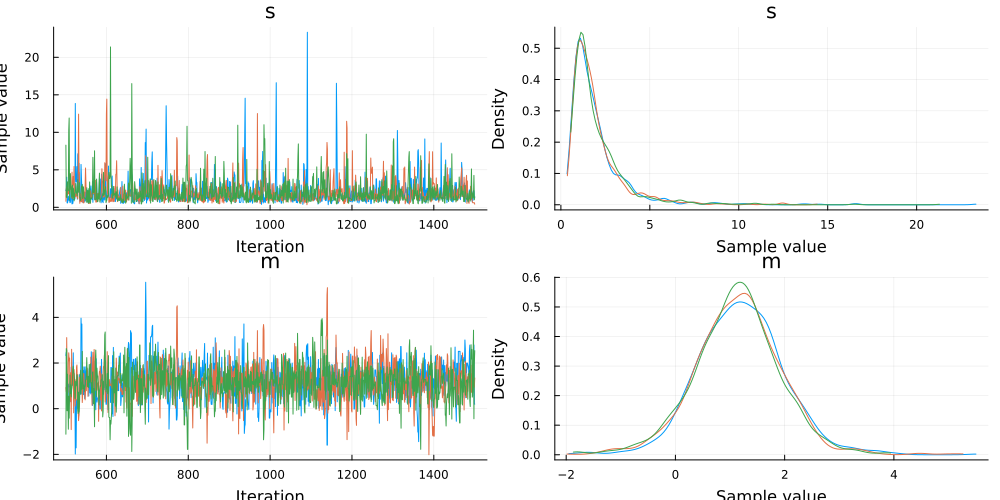  

One thing that Turing.jl cannot handle is the following  

```julia
@model function simple_demo_v1_failure(x, y)
    s ~ InverseGamma(2, 3)
    m ~ Normal(0, sqrt(s))

    x ~ Normal(m, sqrt(s))
    # Used to be: y ~ Normal(m, sqrt(s))
    z = y
    z ~ Normal(m, sqrt(s))
end

model_v1_failure = simple_demo_v1_failure(1.5, 2.0)
model_v1_failure() # `y` is treated as a random variable!!!
```

    -1.6045141567134922

Turing.jl performs no analysis of the code ⟹ don't know that `y` is constant  

`decondition` can be used to "undo" the conditioning of a variable  

<div class="fragment (appear)"

For <span class="underline">argument-based conditioning</span>, we need to replace it with `missing`  

```julia
model_v1_decondition = simple_demo_v1(1.5, missing)
model_v1_decondition()  # `y` is now a random variable
```

    0.011085659616252741

</div>

<div class="fragment (appear)"

For <span class="underline">|-based conditioning</span>, we can just call `decondition`  

```julia
model_v2_decondition = DynamicPPL.decondition(model_v2, @varname(y))
model_v2_decondition()  # `y` is now a random variable!
```

    0.3154944722541396

</div>

<div class="fragment (appear)"

For <span class="underline">literal-based conditioning</span>, `y` is hard-coded, so deconditioning is not possible  

</div>

Overall, |-based conditioning is preferred, i.e.  

```julia
@model function simple_demo_v2()
    s ~ InverseGamma(2, 3)
    m ~ Normal(0, sqrt(s))

    x ~ Normal(m, sqrt(s))
    y ~ Normal(m, sqrt(s))
end
model_v2 = simple_demo_v2() | (x = 1.5, y = 2.0)
```

But you will also encounter the other two approaches in the wild  


## Other actions on a `Model`

**Computing probabilities**  

<div class="fragment (appear)">

```julia
logprior(model, (s = 1, m = 1))
```

    -2.221713955868453

</div>

<div class="fragment (appear)">

```julia
loglikelihood(model, (s = 1, m = 1))
```

    -2.4628770664093453

</div>

<div class="fragment (appear)">

```julia
logjoint(model, (s = 1, m = 1))
```

    -4.6845910222777984

</div>

**Conditioning and fixing**  

<div class="fragment (appear)">

```julia
# Condition a variable to be a value
model_with_condition = Turing.condition(model, s=1.0)  # equivalent to `|` operator
model_with_condition()
```

    (s = 1.0, m = 0.31819749773509765, x = 1.5, y = 2.0, hello = 42)

</div>

<div class="fragment (appear)">

```julia
# Fix a variable to a value
model_with_fixed = Turing.fix(model, s=1.0)
model_with_fixed()
```

    (s = 1.0, m = -1.662009914303139, x = 1.5, y = 2.0, hello = 42)

</div>

<div class="fragment (appear)">

Difference between conditioning and fixing  

```julia
logjoint(model_with_condition, (m=1,)), logjoint(model_with_fixed, (m=1,))
```

    (-4.6845910222777984, -3.881815599614018)

A `fixed` variable is <span class="underline">not</span> included in the log-probability  

</div>

And can query the model about these things  

```julia
DynamicPPL.observations(model_with_condition)
```

    (s = 1.0,)

```julia
DynamicPPL.fixed(model_with_fixed)
```

    (s = 1.0,)

[And much more&#x2026;](https://turinglang.org/library/DynamicPPL/stable/api/)  


## Back to our working example: S(E)IR model

We'll use the following model  

\begin{equation*}
\begin{split}
  \beta &\sim \mathcal{N}_{ + }(2, 1) \\
  \gamma &\sim \mathcal{N}_{ + }(0.4, 0.5) \\
  \phi^{-1} &\sim \mathrm{Exponential}(1/5) \\
   y_i &\sim \mathrm{NegativeBinomial2}\big(F(u_0, t_i;\ \beta, \gamma), \phi \big)
\end{split}
\end{equation*}

where  

-   $\big( y_i \big)_{i = 1}^{14}$ are the observations,
-   $F$ is the integrated system, and
-   $\phi$ is the over-dispersion parameter.

```julia
plot(
    plot(truncated(Normal(2, 1); lower=0), label=nothing, title="β"),
    plot(truncated(Normal(0.4, 0.5); lower=0), label=nothing, title="γ"),
    plot(Exponential(1/5), label=nothing, title="ϕ⁻¹"),
    layout=(3, 1)
)
```

  

`NegativeBinomial(r, p)` represents the number of trials to achieve $r$ successes, where each trial has a probability $p$ of success  

`NegativeBinomial2(μ, ϕ)` is parameterized by mean $μ$ and *dispersion* $\phi$  

```julia
# `NegativeBinomial` already exists, so let's just make an alternative constructor instead.
function NegativeBinomial2(μ, ϕ)
    p = 1/(1 + μ/ϕ)
    r = ϕ
    return NegativeBinomial(r, p)
end
```

    NegativeBinomial2 (generic function with 1 method)

```julia
# Let's just make sure we didn't do something stupid.
μ = 2; ϕ = 3;
dist = NegativeBinomial2(μ, ϕ)
# Source: https://mc-stan.org/docs/2_20/functions-reference/nbalt.html
mean(dist) ≈ μ && var(dist) ≈ μ + μ^2 / ϕ
```

    true

And here's the full model  

```julia
@model function sir_model(
    num_days;                                  # Number of days to model
    tspan = (0.0, float(num_days)),            # Timespan to model
    u0 = [N - 1, 1, 0.0],                      # Initial state
    p0 = [2.0, 0.6],                           # Placeholder parameters
    problem = ODEProblem(SIR!, u0, tspan, p0)  # Create problem once so we can `remake`.
)
    β ~ truncated(Normal(2, 1); lower=0)
    γ ~ truncated(Normal(0.4, 0.5); lower=0)
    ϕ⁻¹ ~ Exponential(1/5)
    ϕ = inv(ϕ⁻¹)

    problem_new = remake(problem, p=[β, γ])  # Replace parameters `p`.
    sol = solve(problem_new, saveat=1)       # Solve!

    sol_for_observed = sol[2, 2:num_days + 1]  # Timesteps we have observations for.
    in_bed = Vector{Int}(undef, num_days)
    for i = 1:length(sol_for_observed)
        # Add a small constant to `sol_for_observed` to make things more stable.
        in_bed[i] ~ NegativeBinomial2(sol_for_observed[i] + 1e-5, ϕ)
    end

    # Some quantities we might be interested in.
    return (R0 = β / γ, recovery_time = 1 / γ, infected = sol_for_observed)
end
```

    sir_model (generic function with 2 methods)

It's break-down time  

```julia
function sir_model(
    num_days;                                  # Number of days to model
    tspan = (0.0, float(num_days)),            # Timespan to model
    u0 = [N - 1, 1, 0.0],                      # Initial state
    p0 = [2.0, 0.6],                           # Placeholder parameters
    problem = ODEProblem(SIR!, u0, tspan, p0)  # Create problem once so we can `remake`.
)
    ...
end
```

```julia
β ~ truncated(Normal(2, 1); lower=0)
γ ~ truncated(Normal(0.4, 0.5); lower=0)
ϕ⁻¹ ~ Exponential(1/5)
ϕ = inv(ϕ⁻¹)
```

defines our prior  

`truncated` is just a way of restricting the domain of the distribution you pass it  

```julia
problem_new = remake(problem, p=[β, γ])  # Replace parameters `p`.
sol = solve(problem_new, saveat=1)       # Solve!
```

We then remake the problem, now with the parameters `[β, γ]` sampled above  

`saveat = 1` gets us the solution at the timesteps `[0, 1, 2, ..., 14]`  

Then we extract the timesteps we have observations for  

```julia
sol_for_observed = sol[2, 2:num_days + 1]  # Timesteps we have observations for.
```

and define what's going to be a likelihood (once we add observations)  

```julia
in_bed = Vector{Int}(undef, num_days)
for i = 1:length(sol_for_observed)
    # Add a small constant to `sol_for_observed` to make things more stable.
    in_bed[i] ~ NegativeBinomial2(sol_for_observed[i] + 1e-5, ϕ)
end
```

Finally we return some values that might be of interest  

```julia
# Some quantities we might be interested in.
return (R0 = β / γ, recovery_time = 1 / γ, infected = sol_for_observed)
```

This is useful for a post-sampling diagnostics, debugging, etc.  

```julia
model = sir_model(length(data.in_bed))
```

    Model(
      args = (:num_days,)
      defaults = (:tspan, :u0, :p0, :problem)
      context = DynamicPPL.DefaultContext()
    )

The model is just another function, so we can call it to check that it works  

<div class="fragment (appear)">

```julia
model().infected
```

```
14-element Vector{Float64}:
   7.245479773214603
  46.940917072935044
 175.06842724268554
 218.33349924642326
 135.9699709916868
  67.18345574595645
  30.7778031212463
  13.708529913965242
   6.037403608626295
   2.646112937992608
   1.1574372086041416
   0.5058188715354062
   0.22097215001835135
   0.09654724443857109
```

Hey, it does!  

</div>


## Is the prior reasonable?

Before we do any inference, we should check if the prior is reasonable  

From domain knowledge we know that (for influenza at least)  

-   $R_0$ is typically between 1 and 2
-   `recovery_time` ($1 / \gamma$) is usually ~1 week

<div class="fragment (appear)">

We want to make sure that your prior belief reflects this knowledge while still being flexible enough to accommodate the observations  

</div>

To check this we'll just simulate some draws from our prior model, i.e. the model *without* conditioning on `in_bed`  

There are two ways to sample form the prior  

<div class="fragment (appear)">

```julia
# 1. By just calling the `model`, which returns a `NamedTuple` containing the quantities of interest
print(model())
```

    (R0 = 3.421935966345707, recovery_time = 1.0862660411734395, infected = [9.113559456088096, 70.63033985892632, 239.93016676827358, 232.25038629413262, 130.1989796907194, 62.916178149981135, 29.018913772921493, 13.152593290124099, 5.918461197786946, 2.6551129148637975, 1.1895164910507834, 0.532615267682943, 0.238423148128917, 0.10672170534563777])

</div>

<div class="fragment (appear)">

Or by just calling `sample` using `Prior`  

```julia
# Sample from prior.
chain_prior = sample(model, Prior(), 10_000);
```

    Sampling: 100%|█████████████████████████████████████████| Time: 0:00:00

</div>

Let's have a look at the prior predictive  

```julia
p = plot(legend=false, size=(600, 300))
plot_trajectories!(p, group(chain_prior, :in_bed); n = 1000)
hline!([N], color="red")
```

  

For certain values we get number of infected *larger* than the actual population  

But this is includes the randomness from `NegativeBinomial2` likelihood  

Maybe more useful to inspect the (I)nfected state from the ODE solution?  

We can also look at the `generated_quantities`, i.e. the values from the `return` statement in our model  

<div class="fragment (appear)">

Our `return` looked like this  

```julia
# Some quantities we might be interested in.
return (R0 = β / γ, recovery_time = 1 / γ, infected = sol_for_observed)
```

</div>

<div class="fragment (appear)">

and so `generated_quantities` (conditioned on `chain_prior`) gives us  

```julia
quantities_prior = generated_quantities(model, chain_prior)
print(quantities_prior[1])
```

    (R0 = 2.204935947161777, recovery_time = 1.876174703727979, infected = [1.8956442506599653, 3.580784916960343, 6.719169194301077, 12.45349236430635, 22.56926177862657, 39.32277667182724, 64.20929976637757, 95.1804136876868, 124.39989367504738, 141.63232495725526, 141.78069289388353, 127.90160667286129, 106.85701946772551, 84.60953676844156])

</div>

We can convert it into a `Chains` using a utility function of mine  

```julia
# Convert to `Chains`.
chain_quantities_prior = to_chains(quantities_prior);

# Plot.
p = plot(legend=false, size=(600, 300))
plot_trajectories!(p, group(chain_quantities_prior, :infected); n = 1000)
hline!([N], color="red")
```

  

<div class="x-small-text">

**NOTE:** `to_chains` is not part of "official" Turing.jl because the `return` can contain *whatever* you want, and so it's not always possible to convert into a `Chains`  

</div>

And the quantiles for the trajectories  

```julia
p = plot(legend=false, size=(600, 300))
plot_trajectory_quantiles!(p, group(chain_quantities_prior, :infected))
hline!(p, [N], color="red")
```

  

```julia
DataFrame(quantile(chain_quantities_prior[:, [:R0, :recovery_time], :]))
```

    2×6 DataFrame
     Row │ parameters     2.5%      25.0%    50.0%    75.0%    97.5%   
         │ Symbol         Float64   Float64  Float64  Float64  Float64 
    ─────┼─────────────────────────────────────────────────────────────
       1 │ R0             0.534892  2.09785  3.71417  7.36482  59.3506
       2 │ recovery_time  0.709748  1.20969  1.88343  3.54966  27.4522

Compare to our prior knowledge of $R_0 \in [1, 2]$ and $(1/\gamma) \approx 1$ for influenza  

Do we really need probability mass on $R_0 \ge 10$?  


## TASK Can we improve the current prior?

<div class="side-by-side">

<div style="margin: auto;">

The SIR model  

\begin{equation*}
\begin{split}
  \frac{\mathrm{d} S}{\mathrm{d} t} &= - \beta S \frac{I}{N} \\
  \frac{\mathrm{d} I}{\mathrm{d} t} &= \beta S \frac{I}{N} - \gamma I \\
  \frac{\mathrm{d} R}{\mathrm{d} t} &= \gamma I
\end{split}
\end{equation*}

</div>

<div>

And here's the current priors  

<div class="x-small-text">

```julia
plot(
    plot(truncated(Normal(2, 1); lower=0), label=nothing, title="β"),
    plot(truncated(Normal(0.4, 0.5); lower=0), label=nothing, title="γ"),
    plot(Exponential(1/5), label=nothing, title="ϕ⁻¹"),
    layout=(3, 1)
)
```

  

</div>

</div>

</div>


## SOLUTION Recovery time shouldn't be several years

We mentioned that `recovery_time`, which is expressed as $1 / \gamma$, is ~1 week  

We're clearly putting high probability on regions near 0, i.e. *long* recovery times  

```julia
plot(truncated(Normal(0.4, 0.5); lower=0), label=nothing, title="γ", size=(500, 300))
```

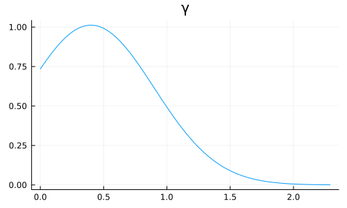  

<span class="underline">Should probably be putting less probability mass near 0</span>  


## SOLUTION What if ${\color{red} \beta} > N$?

Then for $t = 0$ we have  

\begin{equation*}
\frac{\mathrm{d} S}{\mathrm{d} t} \bigg|_{t = 0} = - {\color{red} \beta} S \frac{I}{N} > - N (N - 1) \frac{1}{N} = - (N - 1)
\end{equation*}

i.e. we *immediately* infect everyone on the very first time-step  

Also doesn't seem very realistic  

*But* under our current prior does this matter?  

```julia
# ℙ(β > N) = 1 - ℙ(β ≤ N)
1 - cdf(truncated(Normal(2, 1); lower=0), N)
```

    0.0

Better yet  

```julia
quantile(truncated(Normal(2, 1); lower=0), 0.95)
```

    3.6559843567138275

i.e. 95% of the probability mass falls below ~3.65  

⟹ <span class="underline">Current prior for $\beta$ seems fine (✓)</span>  

Before we change the prior, let's also make it a bit easier to change the prior using `@submodel`  

<div class="fragment (appear)">

`@submodel` allows you call models within models, e.g.  

```julia
@model function ModelA()
    x_hidden_from_B ~ Normal()
    x = x_hidden_from_B + 100
    return x
end

@model function ModelB()
    @submodel x = ModelA()
    y ~ Normal(x, 1)

    return (; x, y)
end
```

    ModelB (generic function with 2 methods)

</div>

<div class="fragment (appear)">

```julia
# So if we call `B` we only see `x` and `y`
println(ModelB()())
```

    (x = 101.64055653138922, y = 100.7647417887675)

</div>

<div class="fragment (appear)">

```julia
# While if we sample from `B` we get the latent variables
println(rand(ModelB()))
```

    (x_hidden_from_B = -0.1589429806607626, y = 98.49097210754098)

</div>

To avoid clashes of variable-names, we can specify a `prefix`  

```julia
@model ModelA() = (x ~ Normal(); return x + 100)

@model function ModelB()
    # Given it a prefix to use for the variables in `A`.
    @submodel prefix=:inner x_inner = ModelA()
    x ~ Normal(x_inner, 1)

    return (; x_inner, x)
end
```

    ModelB (generic function with 2 methods)

```julia
print(rand(ModelB()))
```

    (var"inner.x" = 1.152744983322086, x = 101.51855299222316)

`@submodel` is useful as it allows you to:  

1.  Easy to swap out certain parts of your model.
2.  Can re-use models across projects and packages.

When working on larger projects, this really shines  

Equipped with `@submodel` we can replace  

```julia
β ~ truncated(Normal(2, 1); lower=0)
γ ~ truncated(Normal(0.4, 0.5); lower=0)
```

with  

```julia
@submodel p = prior(problem_wrapper)
```

<div class="fragment (appear)">

where `prior` can be something like  

```julia
@model function prior_original(problem_wrapper::SIRProblem)
    β ~ truncated(Normal(2, 1); lower=0)
    γ ~ truncated(Normal(0.4, 0.5); lower=0)

    return [β, γ]
end

@model function prior_improved(problem_wrapper::SIRProblem)
    # NOTE: Should probably also lower mean for `β` since
    # more probability mass on small `γ` ⟹ `R0 =  β / γ` grows.
    β ~ truncated(Normal(1, 1); lower=0)
    # NOTE: New prior for `γ`.
    γ ~ Beta(2, 5)

    return [β, γ]
end
```

    prior_improved (generic function with 2 methods)

</div>

```julia
@model function epidemic_model(
    problem_wrapper::AbstractEpidemicProblem,
    prior  # NOTE: now we just pass the prior as an argument
)
    # NOTE: And use `@submodel` to embed the `prior` in our model.
    @submodel p = prior(problem_wrapper)

    ϕ⁻¹ ~ Exponential(1/5)
    ϕ = inv(ϕ⁻¹)

    problem_new = remake(problem_wrapper.problem, p=p)  # Replace parameters `p`.
    sol = solve(problem_new, saveat=1)                  # Solve!

    # Extract the `infected`.
    sol_for_observed = infected(problem_wrapper, sol)[2:end]

    # NOTE: `product_distribution` is faster for larger dimensional problems,
    # and it does not require explicit allocation of the vector.
    in_bed ~ product_distribution(NegativeBinomial2.(sol_for_observed .+ 1e-5, ϕ))

    β, γ = p[1:2]
    return (R0 = β / γ, recovery_time = 1 / γ, infected = sol_for_observed)
end
```

    epidemic_model (generic function with 2 methods)

<div class="x-small-text">

Another neat trick is to return early if integration fail  

</div>

```julia
@model function epidemic_model(
    problem_wrapper::AbstractEpidemicProblem,
    prior  # now we just pass the prior as an argument
)
    # And use `@submodel` to embed the `prior` in our model.
    @submodel p = prior(problem_wrapper)

    ϕ⁻¹ ~ Exponential(1/5)
    ϕ = inv(ϕ⁻¹)

    problem_new = remake(problem_wrapper.problem, p=p)  # Replace parameters `p`.
    sol = solve(problem_new, saveat=1)                  # Solve!

    # NOTE: Return early if integration failed.
    if !Part2.issuccess(sol)
        Turing.@addlogprob! -Inf  # NOTE: Causes automatic rejection.
        return nothing
    end

    # Extract the `infected`.
    sol_for_observed = infected(problem_wrapper, sol)[2:end]

    # `product_distribution` is faster for larger dimensional problems,
    # and it does not require explicit allocation of the vector.
    in_bed ~ product_distribution(NegativeBinomial2.(sol_for_observed .+ 1e-5, ϕ))

    β, γ = p[1:2]
    return (R0 = β / γ, recovery_time = 1 / γ, infected = sol_for_observed)
end
```

    epidemic_model (generic function with 2 methods)

Equipped with this we can now easily construct *two* models using different priors  

```julia
sir = SIRProblem(N);
model_original = epidemic_model(sir, prior_original);
model_improved = epidemic_model(sir, prior_improved);
```

but using the same underlying `epidemic_model`  

```julia
chain_prior_original = sample(model_original, Prior(), 10_000; progress=false);
chain_prior_improved = sample(model_improved, Prior(), 10_000; progress=false);
```

Let's compare the resulting priors over some of the quantities of interest  

Let's compare the `generated_quantities`, e.g. $R_0$  

<div class="small-text">

```julia
chain_quantities_original = to_chains(
    generated_quantities(
        model_original,
        chain_prior_original
    );
);

chain_quantities_improved = to_chains(
    generated_quantities(
        model_improved,
        chain_prior_improved
    );
);
```

```julia
p = plot(; legend=false, size=(500, 200))
plot_trajectories!(p, group(chain_quantities_original, :infected); n = 100, trajectory_color="red")
plot_trajectories!(p, group(chain_quantities_improved, :infected); n = 100, trajectory_color="blue")
hline!([N], color="red", linestyle=:dash)
```

  

</div>

<div class="small-text">

```julia
plt1 = plot(legend=false)
plot_trajectory_quantiles!(plt1, group(chain_quantities_original, :infected))
hline!(plt1, [N], color="red", linestyle=:dash)

plt2 = plot(legend=false)
plot_trajectory_quantiles!(plt2, group(chain_quantities_improved, :infected))
hline!(plt2, [N], color="red", linestyle=:dash)

plot(plt1, plt2, layout=(2, 1))
```

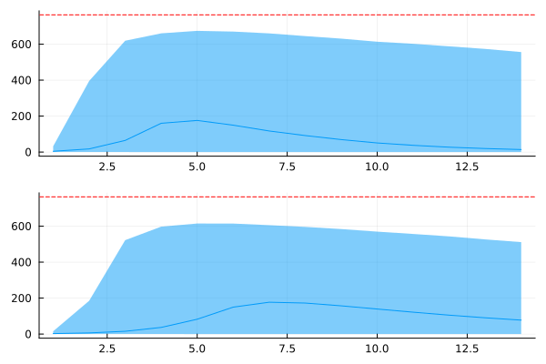  

</div>

This makes sense: if half of the population is immediately infected ⟹ number of infected tapers wrt. time as they recover  

For `model_improved` we then have  

```julia
DataFrame(quantile(chain_quantities_improved[:, [:R0, :recovery_time], :]))
```

    2×6 DataFrame
     Row │ parameters     2.5%      25.0%    50.0%    75.0%    97.5%   
         │ Symbol         Float64   Float64  Float64  Float64  Float64 
    ─────┼─────────────────────────────────────────────────────────────
       1 │ R0             0.311812  2.28184  4.43501  8.35226  34.1911
       2 │ recovery_time  1.56854   2.54757  3.75472  6.21961  22.6241

Compare to `model_original`  

```julia
DataFrame(quantile(chain_quantities_original[:, [:R0, :recovery_time], :]))
```

    2×6 DataFrame
     Row │ parameters     2.5%      25.0%    50.0%    75.0%    97.5%   
         │ Symbol         Float64   Float64  Float64  Float64  Float64 
    ─────┼─────────────────────────────────────────────────────────────
       1 │ R0             0.528003  2.10801  3.77232  7.34902  73.5875
       2 │ recovery_time  0.707391  1.22814  1.89126  3.54464  33.5939


## TASK Make `epidemic_model` work for `SEIRProblem`

1.  [ ] Implement a prior which also includes $\sigma$ and execute  
    `epidemic_model` with it
2.  [ ] Can we make a better prior for $\sigma$? Do we even need one?

```julia
@model function prior_original(problem_wrapper::SEIRProblem)
    # TODO: Implement
end
```

```julia
# Some space so you don't cheat.


# Are you sure?
```


## SOLUTION

```julia
@model function prior_original(problem_wrapper::SEIRProblem)
    β ~ truncated(Normal(2, 1); lower=0)
    γ ~ truncated(Normal(0.4, 0.5); lower=0)
    σ ~ truncated(Normal(0.8, 0.5); lower=0)

    return [β, γ, σ]
end
```

    prior_original (generic function with 4 methods)

```julia
model_seir = epidemic_model(SEIRProblem(N), prior_original)
print(model_seir())
```

    (R0 = 1.1047986187921068, recovery_time = 0.9906676968248809, infected = [0.5602452665531149, 0.5136476859462638, 0.5266355538208665, 0.5493052805718489, 0.5741884446928026, 0.6001760717397501, 0.6271154531635528, 0.6549950994966428, 0.683772907797617, 0.7135447417415389, 0.744111701180274, 0.775785089897001, 0.8083022220361633, 0.8416712774662599])


## WARNING Consult with domain experts

This guy should <span class="underline">not</span> be the one setting your priors!  

  

Get an actual scientist to do that&#x2026;  


## Condition

Now let's actually involve the data  

<div class="fragment (appear)">

We can condition a `Model` as so  

```julia
# Condition on the observations.
model = epidemic_model(SIRProblem(N), prior_improved)
model_conditioned = model | (in_bed = data.in_bed,)
```

    Model(
      args = (:problem_wrapper, :prior)
      defaults = ()
      context = ConditionContext((in_bed = [3, 8, 26, 76, 225, 298, 258, 233, 189, 128, 68, 29, 14, 4],), DynamicPPL.DefaultContext())
    )

</div>

<div class="fragment (appear)">

You know what time it is: *inference time*!  

</div>


## Metropolis-Hastings (MH)

```julia
chain_mh = sample(model_conditioned, MH(), MCMCThreads(), 10_000, 4; discard_initial=5_000);
```

Rhat is *okay-ish* but not great, and ESS is pretty low innit?  

```julia
plot(chain_mh; size=(800, 500))
```

  

Eeehh doesn't look the greatest  

Difficult to trust these results, but let's check if it at least did *something* useful  

```julia
# We're using the unconditioned model!
predictions_mh = predict(model, chain_mh)
```

```
Chains MCMC chain (10000×14×4 Array{Float64, 3}):

Iterations        = 1:1:10000
Number of chains  = 4
Samples per chain = 10000
parameters        = in_bed[1], in_bed[2], in_bed[3], in_bed[4], in_bed[5], in_bed[6], in_bed[7], in_bed[8], in_bed[9], in_bed[10], in_bed[11], in_bed[12], in_bed[13], in_bed[14]
internals         = 

Summary Statistics
  parameters       mean       std      mcse     ess_bulk     ess_tail      rha ⋯
      Symbol    Float64   Float64   Float64      Float64      Float64   Float6 ⋯

   in_bed[1]     3.3496    2.2548    0.0143   28844.0197   24663.7952    1.000 ⋯
   in_bed[2]    11.0049    5.6044    0.1124    2485.6291    4471.3269    1.001 ⋯
   in_bed[3]    34.8531   16.6902    0.5174     993.2220    2136.9653    1.004 ⋯
   in_bed[4]    95.1006   43.6147    1.5454     739.0583    1949.4236    1.005 ⋯
   in_bed[5]   190.1128   82.0691    2.5249     951.7581    2492.6706    1.003 ⋯
   in_bed[6]   250.7661   99.5104    1.9748    2134.3829    2956.1255    1.001 ⋯
   in_bed[7]   237.7858   92.0707    1.1639    5027.4189    3758.1239    1.002 ⋯
   in_bed[8]   186.2204   73.3891    1.1480    3683.3975    2930.1316    1.003 ⋯
   in_bed[9]   131.9364   52.5514    1.1589    1980.6418    2853.4127    1.003 ⋯
  in_bed[10]    89.4755   36.8751    0.9178    1551.2900    2489.5252    1.004 ⋯
  in_bed[11]    59.3121   25.7064    0.7421    1164.8430    2155.1517    1.005 ⋯
  in_bed[12]    38.8393   17.4595    0.5330    1041.9480    2363.9809    1.007 ⋯
  in_bed[13]    25.2249   12.1044    0.4070     897.4136    1677.4979    1.009 ⋯
  in_bed[14]    16.2789    8.3131    0.2775     896.9420    1922.5588    1.009 ⋯
                                                               2 columns omitted

Quantiles
  parameters      2.5%      25.0%      50.0%      75.0%      97.5% 
      Symbol   Float64    Float64    Float64    Float64    Float64 

   in_bed[1]    0.0000     2.0000     3.0000     5.0000     9.0000
   in_bed[2]    2.0000     7.0000    10.0000    14.0000    24.0000
   in_bed[3]   11.0000    24.0000    32.0000    43.0000    73.0000
   in_bed[4]   31.0000    66.0000    88.0000   116.0000   199.0000
   in_bed[5]   66.0000   135.0000   179.0000   230.0000   386.0000
   in_bed[6]   92.0000   183.0000   240.0000   303.0000   480.0000
   in_bed[7]   88.0000   176.0000   228.0000   287.0000   448.0250
   in_bed[8]   69.0000   137.0000   178.0000   225.0000   354.0000
   in_bed[9]   47.0000    96.0000   126.0000   160.0000   254.0000
  in_bed[10]   31.0000    65.0000    85.0000   109.0000   176.0000
  in_bed[11]   19.0000    42.0000    56.0000    73.0000   119.0000
  in_bed[12]   12.0000    27.0000    37.0000    48.0000    80.0000
  in_bed[13]    7.0000    17.0000    24.0000    31.0000    54.0000
  in_bed[14]    4.0000    10.0000    15.0000    21.0000    36.0000
```

```julia
plot_trajectories!(plot(legend=false, size=(600, 300)), predictions_mh; data=data)
```

  

```julia
plot_trajectory_quantiles!(plot(legend=false, size=(600, 300)), predictions_mh; data=data)
```

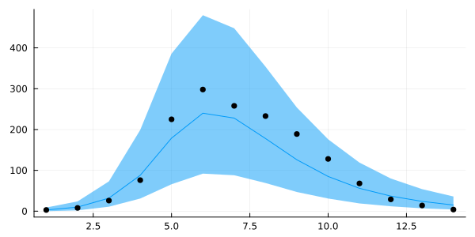  

Okay, it's not *completely* useless, but my trust-issues are still present.  

Metropolis-Hastings have disappointed me one too many times before.  


## So instead, let's go `NUTS`

That's right, we're reaching for the **No U-Turn sampler (NUTS)**  


### 

[https://chi-feng.github.io/mcmc-demo/app.html](https://chi-feng.github.io/mcmc-demo/app.html)  


## 

> Wooaah there! `NUTS` requires gradient information!  
> 
> How are you going to get that through that `solve`?  

Good question, voice in my head  

I'm obviously not going to it myself  


## Automatic differentiation (AD) in Julia

-   [ForwardDiff.jl](https://github.com/JuliaDiff/ForwardDiff.jl): forward-mode AD *(default in Turing.jl)*
-   [ReverseDiff.jl](https://github.com/JuliaDiff/ReverseDiff.jl): tape-based reverse-mode AD
-   [Zygote.jl](https://github.com/FluxML/Zygote.jl): source-to-source reverse-mode AD
-   And more&#x2026;

<div class="fragment (appear)">

Up-and-coming  

-   [Enzyme.jl](https://github.com/EnzymeAD/Enzyme.jl): Julia bindings for [Enzyme](https://github.com/EnzymeAD/Enzyme.jl) which ADs LLVM (low-level)
-   [Diffractor.jl](https://github.com/JuliaDiff/Diffractor.jl): experimental mixed-mode AD meant to replace Zygote.jl

</div>

<div class="fragment (appear)">

Of importance  

-   [ChainRulesCore.jl](https://github.com/JuliaDiff/ChainRulesCore.jl): light-weight package for defining rules, compatible with many of the above

</div>

**Important**  

> When you write code, you don't have to make a choice which one you want to use!  

All the (stable) ones, will (mostly) work  

*But* how you write code will affect performance characteristics  

Takes a bit of know-how + a bit of digging to go properly "vroom!"  


## Differentiating through `solve`

With that being said, differentiating through numerical `solve` is not necessarily trivial to do efficiently  

There are numerous ways of approaching this problem  

  

[https://arxiv.org/abs/1812.01892](https://arxiv.org/abs/1812.01892) is *great* resource  

<div class="fragment (appear)">

But this is why we have [`SciMLSensitivity.jl`](https://github.com/SciML/SciMLSensitivity.jl)  

[SciMLSensitivity.jl docs](https://docs.sciml.ai/SciMLSensitivity/stable/manual/differential_equation_sensitivities/#Choosing-a-Sensitivity-Algorithm) also provides a great overview of different approaches  

</div>

```julia
using SciMLSensitivity
```

It offers  

1.  *Discrete sensitivity analysis* or the *"Direct" method*: just use  
    `ForwardDiff.Dual` in the `solve`.
2.  *Continuous local sensitivity analysis (CSA)*: extends the original  
    system such that the `solve` gives you both the solution and the the  
    gradient simultaenously.
3.  *Adjoint methods*: construct a backwards system whose solution gives  
    us the gradient.

Just do `solve(problem, solver, sensealg = ...)`  


## Back to being `NUTS`

```julia
chain = sample(model_conditioned, NUTS(0.8), MCMCThreads(), 1000, 4);
```

```
┌ Info: Found initial step size
└   ϵ = 0.025
┌ Info: Found initial step size
└   ϵ = 0.0125
┌ Info: Found initial step size
└   ϵ = 0.05
┌ Info: Found initial step size
└   ϵ = 0.8
┌ Warning: Instability detected. Aborting
└ @ SciMLBase ~/.julia/packages/SciMLBase/szsYq/src/integrator_interface.jl:606
```

```julia
chain
```

```
Chains MCMC chain (1000×15×4 Array{Float64, 3}):

Iterations        = 501:1:1500
Number of chains  = 4
Samples per chain = 1000
Wall duration     = 27.18 seconds
Compute duration  = 108.0 seconds
parameters        = β, γ, ϕ⁻¹
internals         = lp, n_steps, is_accept, acceptance_rate, log_density, hamiltonian_energy, hamiltonian_energy_error, max_hamiltonian_energy_error, tree_depth, numerical_error, step_size, nom_step_size

Summary Statistics
  parameters      mean       std      mcse    ess_bulk    ess_tail      rhat   ⋯
      Symbol   Float64   Float64   Float64     Float64     Float64   Float64   ⋯

           β    1.7305    0.0542    0.0010   2794.5077   2357.1357    1.0008   ⋯
           γ    0.5297    0.0439    0.0009   2349.9049   2086.4939    1.0010   ⋯
         ϕ⁻¹    0.1379    0.0749    0.0016   1948.2556   1937.4531    0.9999   ⋯
                                                                1 column omitted

Quantiles
  parameters      2.5%     25.0%     50.0%     75.0%     97.5% 
      Symbol   Float64   Float64   Float64   Float64   Float64 

           β    1.6305    1.6948    1.7282    1.7644    1.8434
           γ    0.4407    0.5026    0.5288    0.5570    0.6182
         ϕ⁻¹    0.0447    0.0862    0.1212    0.1709    0.3336
```

Muuuch better! Both ESS and Rhat is looking good  

```julia
plot(chain; size=(800, 500))
```

  

```julia
# Predict using the results from NUTS.
predictions = predict(model, chain)
```

```
Chains MCMC chain (1000×14×4 Array{Float64, 3}):

Iterations        = 1:1:1000
Number of chains  = 4
Samples per chain = 1000
parameters        = in_bed[1], in_bed[2], in_bed[3], in_bed[4], in_bed[5], in_bed[6], in_bed[7], in_bed[8], in_bed[9], in_bed[10], in_bed[11], in_bed[12], in_bed[13], in_bed[14]
internals         = 

Summary Statistics
  parameters       mean        std      mcse    ess_bulk    ess_tail      rhat ⋯
      Symbol    Float64    Float64   Float64     Float64     Float64   Float64 ⋯

   in_bed[1]     3.3200     2.2872    0.0367   3869.0113   3757.5599    1.0004 ⋯
   in_bed[2]    10.8800     5.4558    0.0884   3760.4499   3840.4952    1.0010 ⋯
   in_bed[3]    34.3910    16.2547    0.2673   3950.1408   3297.1476    0.9999 ⋯
   in_bed[4]    92.7687    44.5892    0.7711   3360.5024   3226.8261    1.0002 ⋯
   in_bed[5]   185.6832    79.4009    1.3986   3298.6495   3442.5850    1.0013 ⋯
   in_bed[6]   247.6912   100.4472    1.6388   3716.0238   3738.6149    1.0002 ⋯
   in_bed[7]   235.3295    91.1449    1.5092   3657.6049   3748.3664    1.0010 ⋯
   in_bed[8]   182.7982    70.6465    1.1247   3939.1717   3967.9279    1.0002 ⋯
   in_bed[9]   131.7473    52.3558    0.8474   3857.4942   3845.1358    1.0004 ⋯
  in_bed[10]    89.3732    36.8920    0.6141   3756.4616   3366.1403    1.0016 ⋯
  in_bed[11]    59.0973    25.0144    0.4067   3855.0060   3928.0521    0.9997 ⋯
  in_bed[12]    38.8780    16.8736    0.2787   3674.5558   3612.8610    1.0000 ⋯
  in_bed[13]    25.1333    11.9396    0.1968   3686.2674   3575.0453    1.0015 ⋯
  in_bed[14]    16.1432     8.0709    0.1342   3629.5783   3442.4297    0.9997 ⋯
                                                                1 column omitted

Quantiles
  parameters      2.5%      25.0%      50.0%      75.0%      97.5% 
      Symbol   Float64    Float64    Float64    Float64    Float64 

   in_bed[1]    0.0000     2.0000     3.0000     5.0000     9.0000
   in_bed[2]    3.0000     7.0000    10.0000    14.0000    24.0000
   in_bed[3]   10.0000    23.0000    32.0000    43.0000    73.0000
   in_bed[4]   30.9750    63.0000    85.0000   112.0000   201.0000
   in_bed[5]   67.0000   131.0000   174.0000   225.0000   374.0000
   in_bed[6]   90.0000   179.0000   235.0000   299.0000   477.0000
   in_bed[7]   88.0000   174.0000   226.0000   282.0000   441.0000
   in_bed[8]   68.9750   135.0000   175.0000   221.0000   341.0250
   in_bed[9]   52.0000    96.0000   125.0000   159.0000   255.0000
  in_bed[10]   31.0000    65.0000    84.0000   109.0000   175.0000
  in_bed[11]   21.0000    42.0000    56.0000    72.0000   119.0250
  in_bed[12]   13.0000    27.0000    37.0000    48.0000    81.0000
  in_bed[13]    7.0000    17.0000    23.0000    31.0000    52.0000
  in_bed[14]    4.0000    10.0000    15.0000    21.0000    35.0000
```

```julia
plot_trajectories!(plot(legend=false, size=(600, 300)), predictions; n = 1000, data=data)
```

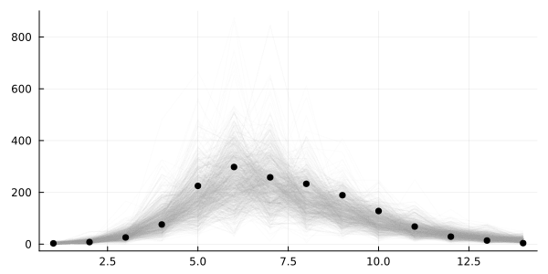  

```julia
plot_trajectory_quantiles!(plot(legend=false, size=(600, 300)), predictions; data=data)
```

  


## Simulation-based calibration (SBC) [Talts et. al. (2018)](https://arxiv.org/abs/1804.06788)

1.  Sample from prior $\theta_1, \dots, \theta_n \sim p(\theta)$.
2.  Sample datasets $\mathcal{D}_i \sim p(\cdot \mid \theta_i)$ for $i = 1, \dots, n$.
3.  Obtain (approximate) $p(\theta \mid \mathcal{D}_i)$ for $i = 1, \dots, n$.

For large enough (n), the "combination" of the posteriors should recover the prior!  

"Combination" here usually means computing some statistic and comparing against what it should be  

  

That's very expensive → in practice we just do this once or twice  

```julia
# Sample from the conditioned model so we don't get the `in_bed` variables too
using Random  # Just making sure the numbers of somewhat interesting
rng = MersenneTwister(43);
test_values = rand(rng, NamedTuple, model_conditioned)
```

    (β = 1.2254566808077714, γ = 0.27594266205681933, ϕ⁻¹ = 0.13984179162984164)

Now we condition on those values and run once to generate data  

```julia
model_test = model | test_values
```

    Model(
      args = (:problem_wrapper, :prior)
      defaults = ()
      context = ConditionContext((β = 1.2254566808077714, γ = 0.27594266205681933, ϕ⁻¹ = 0.13984179162984164), DynamicPPL.DefaultContext())
    )

```julia
in_best_test = rand(rng, model_test).in_bed;
```

Next, inference!  

```julia
model_test_conditioned = model | (in_bed = in_best_test,)
```

    Model(
      args = (:problem_wrapper, :prior)
      defaults = ()
      context = ConditionContext((in_bed = [1, 9, 11, 45, 159, 136, 270, 123, 463, 376, 231, 148, 99, 162],), DynamicPPL.DefaultContext())
    )

```julia
# Let's just do a single chain here.
chain_test = sample(model_test_conditioned, NUTS(0.8), 1000);
```

    ┌ Info: Found initial step size
    └   ϵ = 0.025
    Sampling: 100%|█████████████████████████████████████████| Time: 0:00:00

Did we recover the parameters?  

<div class="small-text">

```julia
ps = []
for sym in [:β, :γ, :ϕ⁻¹]
    p = density(chain_test[:, [sym], :])
    vline!([test_values[sym]])
    push!(ps, p)
end
plot(ps..., layout=(3, 1), size=(600, 400))
```

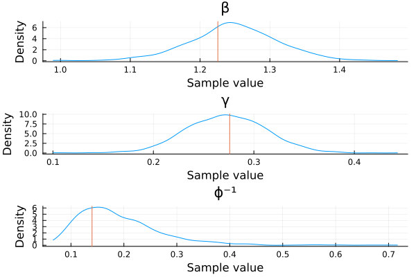  

</div>

Yay!  


## Samplers in Turing.jl

-   Metropolis-Hastings, MALA, emcee ([AdvancedMH.jl](https://github.com/TuringLang/AdvancedMH.jl))
-   Hamiltonian Monte Carlo, NUTS ([AdvancedHMC.jl](https://github.com/TuringLang/AdvancedMH.jl))
-   SMC ([AdvancedPS.jl](https://github.com/TuringLang/AdvancedPS.jl))
-   Elliptical Slice Sampling ([EllipticalSliceSampling.jl](https://github.com/TuringLang/EllipticalSliceSampling.jl))
-   Nested sampling ([NestedSamplers.jl](https://github.com/TuringLang/NestedSamplers.jl))
-   (Experimental) Tempered sampling ([Pigeons.jl](https://github.com/Julia-Tempering/Pigeons.jl) and [MCMCTempering.jl](https://github.com/TuringLang/MCMCTempering.jl))

You can also combine some of these in Turing.jl  

<div class="small-text">

```julia
using LinearAlgebra: I

@model function linear_regression(X)
    num_params = size(X, 1)
    β ~ MvNormal(ones(num_params))
    σ² ~ InverseGamma(2, 3)
    y ~ MvNormal(vec(β' * X), σ² * I)
end

# Generate some dummy data.
X = randn(2, 1_000); lin_reg = linear_regression(X); true_vals = rand(lin_reg)

# Condition.
lin_reg_conditioned = lin_reg | (y = true_vals.y,);
```

We can then do `Gibbs` but sampling $β$ using `ESS` and $\sigma^2$ using `HMC`  

```julia
chain_ess_hmc = sample(lin_reg_conditioned, Gibbs(ESS(:β), HMC(1e-3, 16, :σ²)), 1_000);
```

    Sampling: 100%|█████████████████████████████████████████| Time: 0:00:00

</div>

<div class="small-text">

```julia
chain_ess_hmc
```

```
Chains MCMC chain (1000×4×1 Array{Float64, 3}):

Iterations        = 1:1:1000
Number of chains  = 1
Samples per chain = 1000
Wall duration     = 13.28 seconds
Compute duration  = 13.28 seconds
parameters        = β[1], β[2], σ²
internals         = lp

Summary Statistics
  parameters      mean       std      mcse   ess_bulk   ess_tail      rhat   e ⋯
      Symbol   Float64   Float64   Float64    Float64    Float64   Float64     ⋯

        β[1]    0.2368    0.0377    0.0021   303.6277   312.7163    1.0020     ⋯
        β[2]   -0.4866    0.0367    0.0017   368.4395   359.5562    0.9992     ⋯
          σ²    0.9832    0.0579    0.0168    12.1798    77.1990    1.1376     ⋯
                                                                1 column omitted

Quantiles
  parameters      2.5%     25.0%     50.0%     75.0%     97.5% 
      Symbol   Float64   Float64   Float64   Float64   Float64 

        β[1]    0.1636    0.2152    0.2359    0.2575    0.2987
        β[2]   -0.5474   -0.5090   -0.4879   -0.4627   -0.4245
          σ²    0.8816    0.9409    0.9804    1.0215    1.0941
```

Could potentially lead to improvements  

**NOTE:** Usually *very* difficult to choose sampler parameters in this case  

</div>

Means one can also mix discrete and continuous  

<div class="small-text">

```julia
@model function mixture(n)
    cluster ~ filldist(Categorical([0.25, 0.75]), n)
    μ ~ MvNormal([-10.0, 10.0], I)
    x ~ product_distribution(Normal.(μ[cluster], 1))
end

model_mixture = mixture(10)
fake_values_mixture = rand(model_mixture)
model_mixture_conditioned = model_mixture | (x = fake_values_mixture.x, )
chain_discrete = sample(
    model_mixture_conditioned, Gibbs(PG(10, :cluster), HMC(1e-3, 16, :μ)), MCMCThreads(), 1_000, 4
)
```

```
Chains MCMC chain (1000×13×4 Array{Float64, 3}):

Iterations        = 1:1:1000
Number of chains  = 4
Samples per chain = 1000
Wall duration     = 36.46 seconds
Compute duration  = 144.91 seconds
parameters        = cluster[1], cluster[2], cluster[3], cluster[4], cluster[5], cluster[6], cluster[7], cluster[8], cluster[9], cluster[10], μ[1], μ[2]
internals         = lp

Summary Statistics
   parameters      mean       std      mcse    ess_bulk   ess_tail      rhat   ⋯
       Symbol   Float64   Float64   Float64     Float64    Float64   Float64   ⋯

   cluster[1]    2.0000    0.0000       NaN         NaN        NaN       NaN   ⋯
   cluster[2]    1.0163    0.1265    0.0137     85.5708    85.5708    1.0281   ⋯
   cluster[3]    1.0285    0.1664    0.0222     56.1096    56.1096    1.0695   ⋯
   cluster[4]    1.0085    0.0918    0.0076    147.7564   147.7564    1.0148   ⋯
   cluster[5]    2.0000    0.0000       NaN         NaN        NaN       NaN   ⋯
   cluster[6]    2.0000    0.0000       NaN         NaN        NaN       NaN   ⋯
   cluster[7]    1.9990    0.0316    0.0007   2002.5842        NaN    1.0007   ⋯
   cluster[8]    2.0000    0.0000       NaN         NaN        NaN       NaN   ⋯
   cluster[9]    2.0000    0.0000       NaN         NaN        NaN       NaN   ⋯
  cluster[10]    1.9937    0.0788    0.0056    197.6402        NaN    1.0250   ⋯
         μ[1]   -9.3065    0.3103    0.1036     10.0162    38.6601    2.0981   ⋯
         μ[2]    9.7775    0.8181    0.2839      8.5007    14.8574    3.7783   ⋯
                                                                1 column omitted

Quantiles
   parameters      2.5%     25.0%     50.0%     75.0%     97.5% 
       Symbol   Float64   Float64   Float64   Float64   Float64 

   cluster[1]    2.0000    2.0000    2.0000    2.0000    2.0000
   cluster[2]    1.0000    1.0000    1.0000    1.0000    1.0000
   cluster[3]    1.0000    1.0000    1.0000    1.0000    2.0000
   cluster[4]    1.0000    1.0000    1.0000    1.0000    1.0000
   cluster[5]    2.0000    2.0000    2.0000    2.0000    2.0000
   cluster[6]    2.0000    2.0000    2.0000    2.0000    2.0000
   cluster[7]    2.0000    2.0000    2.0000    2.0000    2.0000
   cluster[8]    2.0000    2.0000    2.0000    2.0000    2.0000
   cluster[9]    2.0000    2.0000    2.0000    2.0000    2.0000
  cluster[10]    2.0000    2.0000    2.0000    2.0000    2.0000
         μ[1]   -9.9258   -9.5774   -9.2221   -9.0471   -8.8829
         μ[2]    7.9865    9.2653    9.7118   10.4310   11.0571
```

</div>

<div class="x-small-text">

```julia
ps = []
for (i, realizations) in enumerate(eachcol(Array(group(chain_discrete, :cluster))))
    p = density(
        realizations,
        legend=false,
        ticks=false,
        border=:none
    )
    vline!(p, [fake_values_mixture.cluster[i]])
    push!(ps, p)
end
plot(ps..., layout=(length(ps) ÷ 2, 2), size=(600, 40 * length(ps)))
```

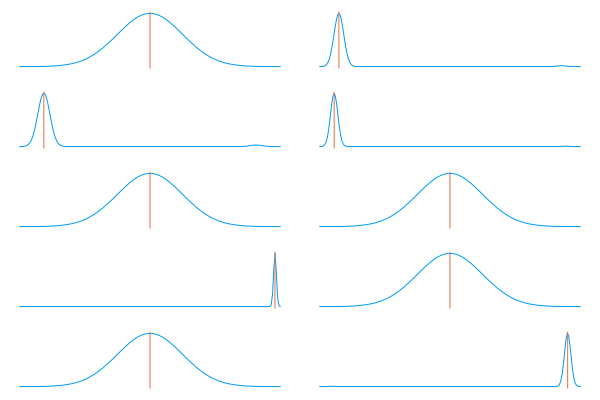  

</div>

Again, this is difficult to get to work properly on non-trivial examples  

<span class="underline">But</span> it is possible  


## Other utilities for Turing.jl

-   [TuringGLM.jl](https://github.com/TuringLang/TuringGLM.jl): GLMs using the formula-syntax from R but using Turing.jl under the hood
-   [TuringBenchmarking.jl](https://github.com/TuringLang/TuringBenchmarking.jl): useful for benchmarking Turing.jl models
-   [TuringCallbacks.jl](https://github.com/TuringLang/TuringCallbacks.jl): on-the-fly visualizations using `tensorboard`


### TuringGLM.jl

```julia
using TuringGLM
```

We'll use the KidIQ dataset for a quick example  

```julia
register(DataDep(
    "kidiq",
    "Survey of adult American women and their respective children from 2007",
    "https://raw.githubusercontent.com/TuringLang/TuringGLM.jl/bbc9129fc2d1ff7a1026fe2189b6580303d5c9f5/data/kidiq.csv",
))
```

    DataDep("kidiq", "https://raw.githubusercontent.com/TuringLang/TuringGLM.jl/bbc9129fc2d1ff7a1026fe2189b6580303d5c9f5/data/kidiq.csv", nothing, DataDeps.fetch_default, identity, "Survey of adult American women and their respective children from 2007")

```julia
fname = joinpath(datadep"kidiq", "kidiq.csv")
kidiq = DataFrame(CSV.File(fname))
```

```
434×4 DataFrame
 Row │ kid_score  mom_hs  mom_iq    mom_age 
     │ Int64      Int64   Float64   Int64   
─────┼──────────────────────────────────────
   1 │        65       1  121.118        27
   2 │        98       1   89.3619       25
   3 │        85       1  115.443        27
   4 │        83       1   99.4496       25
   5 │       115       1   92.7457       27
   6 │        98       0  107.902        18
   7 │        69       1  138.893        20
   8 │       106       1  125.145        23
   9 │       102       1   81.6195       24
  10 │        95       1   95.0731       19
  11 │        91       1   88.577        23
  ⋮  │     ⋮        ⋮        ⋮         ⋮
 425 │        42       1   78.2446       27
 426 │       102       1  127.676        29
 427 │       104       1  124.515        23
 428 │        59       0   80.464        21
 429 │        93       0   74.8607       25
 430 │        94       0   84.8774       21
 431 │        76       1   92.9904       23
 432 │        50       0   94.8597       24
 433 │        88       1   96.8566       21
 434 │        70       1   91.2533       25
                            413 rows omitted
```

Now we can create the formula  

```julia
fm = @formula(kid_score ~ mom_hs * mom_iq)
```

    FormulaTerm
    Response:
      kid_score(unknown)
    Predictors:
      mom_hs(unknown)
      mom_iq(unknown)
      mom_hs(unknown) & mom_iq(unknown)

which can then easily be converted into a Turing.jl-model  

```julia
model = turing_model(fm, kidiq);
```

And then we can use our standard Turing.jl workflow:  

```julia
chns = sample(model, NUTS(), 1000)
```

    ┌ Info: Found initial step size
    └   ϵ = 0.0015625
    Sampling: 100%|█████████████████████████████████████████| Time: 0:00:02

```
Chains MCMC chain (1000×17×1 Array{Float64, 3}):

Iterations        = 501:1:1500
Number of chains  = 1
Samples per chain = 1000
Wall duration     = 17.79 seconds
Compute duration  = 17.79 seconds
parameters        = α, β[1], β[2], β[3], σ
internals         = lp, n_steps, is_accept, acceptance_rate, log_density, hamiltonian_energy, hamiltonian_energy_error, max_hamiltonian_energy_error, tree_depth, numerical_error, step_size, nom_step_size

Summary Statistics
  parameters      mean       std      mcse   ess_bulk   ess_tail      rhat   e ⋯
      Symbol   Float64   Float64   Float64    Float64    Float64   Float64     ⋯

           α   31.3384    6.4780    0.3341   373.7576   549.8589    0.9991     ⋯
        β[1]    0.5098    2.3878    0.1392   506.3722   195.9589    1.0006     ⋯
        β[2]    0.5107    0.0714    0.0037   374.7500   463.9428    0.9991     ⋯
        β[3]    0.0498    0.0333    0.0018   415.5495   215.4668    1.0050     ⋯
           σ   18.2205    0.6039    0.0229   705.3081   654.7311    1.0041     ⋯
                                                                1 column omitted

Quantiles
  parameters      2.5%     25.0%     50.0%     75.0%     97.5% 
      Symbol   Float64   Float64   Float64   Float64   Float64 

           α   19.1674   27.0275   30.8933   36.0974   43.9800
        β[1]   -2.8269   -0.5578    0.2158    1.0697    7.1574
        β[2]    0.3667    0.4572    0.5153    0.5602    0.6489
        β[3]   -0.0235    0.0319    0.0522    0.0718    0.1083
           σ   17.1135   17.8058   18.1929   18.6014   19.4824
```


### TuringCallbacks.jl

```julia
using TuringCallbacks
```

```julia
model = simple_demo(1.5, 2.0);
```

```julia
logdir = mktempdir()
```

    "/tmp/jl_uVazSd"

```julia
callback = TensorBoardCallback(joinpath(logdir, "logs"); include_hyperparams=true)
chain = sample(model, NUTS(0.8), 1000; callback=callback);
```

    ┌ Info: Found initial step size
    └   ϵ = 0.40625

If you have `tensorboard` installed, you can then run  

```sh
python3 -m tensorboard.main --logdir /tmp/jl_uVazSd
```

  

Can inspect hyperparameters, e.g. target acceptance rate for `NUTS`  

  


## Downsides of using Turing.jl

-   ${\color{red} \times}$ No depedency-extraction of the model  
    -   ⟹ can't do things like automatic marginalization
    -   *But* it's not impossible; just a matter of development effort
    -   ${\color{green} \checkmark}$ And we have JuliaBUGS now!
-   ${\color{red} \times}$ NUTS performance is at the mercy of AD in Julia
-   ${\color{green} \checkmark}$ You <span class="underline">can</span> put anything in a model
-   ${\color{red} \times}$ Whether you <span class="underline">should</span> put anything in a model is a another matter


# Setting up a project environment

Now we're going to do some live-coding!  


## What we're doing

1.  Create project.  
    -   What does that mean?
2.  Add dependencies.  
    -   Project.toml and Manifest.toml
    -   Dependencies we need
3.  Get our S(?)IR implementation into the project.
4.  Run some experiments.  
    -   Use Pluto.jl notebook to get started
    -   Move into a script if we have time


# Case study

It's time to do a case study!  

But on which dataset?  

**You're own!**  

But if you don't have one, here are some alternatives:  

1.  Lotka-Volterra model for snowhoe hares and Canadian lynxes  
    -   A classic example of predator-prey dynamics
2.  Cockroaches in residential buildings throughout New York  
    -   Become your landlord's favorite tenant by minimizing cockroach complaints in residential buildings while keeping costs low
3.  Synthetic time-series model  
    -   A syncthetic time-series with periodic behavior
4.  S(?)IR modeling of influenza  
    -   You already have the data; go knock yourself out!
5.  Pick one from RDatasets.jl

Go to the next slides for more details  


## 1. Lotka-Volterra Predator-Prey model

<div class="small-text">

<div class="side-by-side">

<div>

The species of interest in this case study are:  

-   Snowshoe hares, an hervivorous cousin of rabbits
-   Canadian lynxes, a feline predator whose diet consists largely of snowshoe hares

</div>

<div>

Use Lotka-Volterra equations to model the population dynamics  

\begin{equation*}
\begin{aligned}
\frac{dH}{dt} &= \alpha H - \beta H L \\
\frac{dL}{dt} &= \delta H L - \gamma L
\end{aligned}
\end{equation*}

</div>

</div>

Use Turing.jl to infer the parameters  

-   $\alpha$: growth rate of the prey population
-   $\beta$: rate of shrinkage of the prey population
-   $\delta$: rate of growth of the predator population
-   $\gamma$: rate of shrinkage of the predator population

[Source (but don't look!)](https://mc-stan.org/users/documentation/case-studies/lotka-volterra-predator-prey.html)  

</div>

<div class="small-text">

```julia
register(DataDep(
    "hares-and-lynxes",
    "Numerical data for the number of pelts collected by the Hudson’s Bay Company in the years 1900-1920.",
    "https://raw.githubusercontent.com/stan-dev/example-models/master/knitr/lotka-volterra/hudson-bay-lynx-hare.csv",
))
```

And then we can load it  

```julia
df = DataFrame(
    CSV.File(
        joinpath(datadep"hares-and-lynxes", "hudson-bay-lynx-hare.csv"),
        skipto=4,
        header=3
    )
)
```

```
21×3 DataFrame
 Row │ Year    Lynx     Hare   
     │ Int64  Float64  Float64 
─────┼─────────────────────────
   1 │  1900      4.0     30.0
   2 │  1901      6.1     47.2
   3 │  1902      9.8     70.2
   4 │  1903     35.2     77.4
   5 │  1904     59.4     36.3
   6 │  1905     41.7     20.6
   7 │  1906     19.0     18.1
   8 │  1907     13.0     21.4
   9 │  1908      8.3     22.0
  10 │  1909      9.1     25.4
  11 │  1910      7.4     27.1
  12 │  1911      8.0     40.3
  13 │  1912     12.3     57.0
  14 │  1913     19.5     76.6
  15 │  1914     45.7     52.3
  16 │  1915     51.1     19.5
  17 │  1916     29.7     11.2
  18 │  1917     15.8      7.6
  19 │  1918      9.7     14.6
  20 │  1919     10.1     16.2
  21 │  1920      8.6     24.7
```

</div>


## 2. Cockroaches in New York

<div class="x-small-text">

> Imagine that you are a statistician or data scientist working as an independent contractor. One of your clients is a company that owns many residential buildings throughout New York City. The property manager explains that they are concerned about the number of cockroach complaints that they receive from their buildings. Previously the company has offered monthly visits from a pest inspector as a solution to this problem. While this is the default solution of many property managers in NYC, the tenants are rarely home when the inspector visits, and so the manager reasons that this is a relatively expensive solution that is currently not very effective.  
> 
> One alternative to this problem is to deploy long term bait stations. In this alternative, child and pet safe bait stations are installed throughout the apartment building. Cockroaches obtain quick acting poison from these stations and distribute it throughout the colony. The manufacturer of these bait stations provides some indication of the space-to-bait efficacy, but the manager suspects that this guidance was not calculated with NYC roaches in mind. NYC roaches, the manager rationalizes, have more hustle than traditional roaches; and NYC buildings are built differently than other common residential buildings in the US. This is particularly important as the unit cost for each bait station per year is quite high.  

[Source #1](https://github.com/jgabry/stancon2018helsinki_intro) and [Source #2](https://github.com/jgabry/stancon2018helsinki_intro)  <span class="underline">(but don't look!)</span>  

</div>

<div class="x-small-text">

The manager wishes to employ your services to help them to find the optimal number of roach bait stations they should place in each of their buildings in order to minimize the number of cockroach complaints while also keeping expenditure on pest control affordable.  

A subset of the company's buildings have been randomly selected for an experiment:  

-   At the beginning of each month, a pest inspector randomly places a number of bait stations throughout the building, without knowledge of the current cockroach levels in the building
-   At the end of the month, the manager records the total number of cockroach complaints in that building.
-   The manager would like to determine the optimal number of traps (`traps`) that balances the lost revenue (`R`) such that complaints (`complaints`) generate with the all-in cost of maintaining the traps (`TC`).

Formally, we are interested in finding  

\begin{equation*}
\arg \max_{\mathrm{traps} \in \mathbb{N}} \mathbb{E}_{\mathrm{complaints}} \big[ R \big( \mathrm{complaints}(\mathrm{traps}) \big) - \mathrm{TC}(\mathrm{traps}) \big]
\end{equation*}

The property manager would also, if possible, like to learn how these results generalize to buildings they haven't treated so they can understand the potential costs of pest control at buildings they are acquiring as well as for the rest of their building portfolio.  

As the property manager has complete control over the number of traps set, the random variable contributing to this expectation is the number of complaints given the number of traps. We will model the number of complaints as a function of the number of traps.  

</div>

```julia
DataFrame(CSV.File(joinpath("data", "pest_data.csv")))
```

```
120×14 DataFrame
 Row │ mus        building_id  wk_ind  date        traps    floors   sq_footag ⋯
     │ Float64    Int64        Int64   Date        Float64  Float64  Float64   ⋯
─────┼──────────────────────────────────────────────────────────────────────────
   1 │ 0.369134            37       1  2017-01-15      8.0      8.0            ⋯
   2 │ 0.359355            37       2  2017-02-14      8.0      8.0
   3 │ 0.281783            37       3  2017-03-16      9.0      8.0
   4 │ 0.129254            37       4  2017-04-15     10.0      8.0
   5 │ 0.452041            37       5  2017-05-15     11.0      8.0            ⋯
   6 │ 0.44213             37       6  2017-06-14     11.0      8.0
   7 │ 0.990865            37       7  2017-07-14     10.0      8.0
   8 │ 0.785977            37       8  2017-08-13     10.0      8.0
   9 │ 0.691797            37       9  2017-09-12      9.0      8.0            ⋯
  10 │ 0.480696            37      10  2017-10-12      9.0      8.0
  11 │ 0.562431            37      11  2017-11-11      8.0      8.0
  ⋮  │     ⋮           ⋮         ⋮         ⋮          ⋮        ⋮             ⋮ ⋱
 111 │ 0.542095            98       3  2017-03-16      7.0     13.0
 112 │ 0.866334            98       4  2017-04-15      6.0     13.0            ⋯
 113 │ 1.40571             98       5  2017-05-15      6.0     13.0
 114 │ 1.65598             98       6  2017-06-14      5.0     13.0
 115 │ 2.2483              98       7  2017-07-14      4.0     13.0
 116 │ 2.30359             98       8  2017-08-13      3.0     13.0            ⋯
 117 │ 2.253               98       9  2017-09-12      2.0     13.0
 118 │ 2.0419              98      10  2017-10-12      2.0     13.0
 119 │ 1.90705             98      11  2017-11-11      2.0     13.0
 120 │ 2.10317             98      12  2017-12-11      1.0     13.0            ⋯
                                                   8 columns and 99 rows omitted
```


## 3. Synthetic time-series

Or you can have a go at this synthetic time-series example  

<div class="side-by-side small-text">

<div>

```julia
DataFrame(CSV.File(
    joinpath("data", "time-series.csv")
))
```

```
67×2 DataFrame
 Row │ t          y         
     │ Float64    Float64   
─────┼──────────────────────
   1 │ 0.0        -19.3009
   2 │ 0.0151515  -18.2195
   3 │ 0.030303   -17.931
   4 │ 0.0454545  -18.5562
   5 │ 0.0606061  -19.2006
   6 │ 0.0757576  -18.7376
   7 │ 0.0909091  -16.4586
   8 │ 0.106061   -15.0723
   9 │ 0.121212   -12.6583
  10 │ 0.136364   -11.1347
  11 │ 0.151515   -10.9626
  ⋮  │     ⋮          ⋮
  58 │ 0.863636    -6.70737
  59 │ 0.878788    -6.59501
  60 │ 0.893939    -7.91087
  61 │ 0.909091    -8.78053
  62 │ 0.924242    -9.81755
  63 │ 0.939394    -9.06206
  64 │ 0.954545    -7.48517
  65 │ 0.969697    -4.72118
  66 │ 0.984848    -1.85908
  67 │ 1.0          0.0
             46 rows omitted
```

</div>

<div class="center">

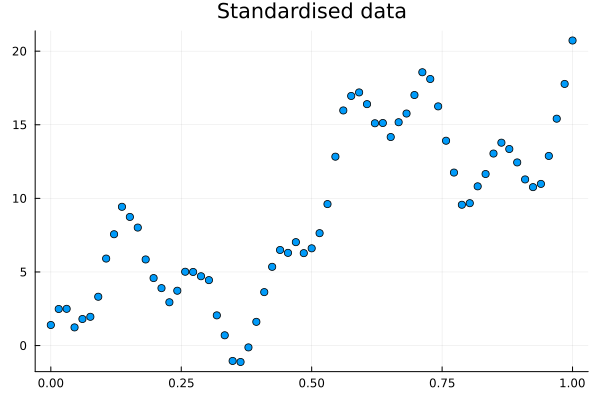  

</div>

</div>


## 4. Influenza at British boarding school (same as before)

An outbreak of influenza A (H1N1) in 1978 at a British boarding school  

-   763 male students -> 512 of which became ill
-   Reported that one infected boy started the epidemic
-   Observations are number of boys in bed over 14 days

Data are freely available in the R package `outbreaks`, maintained as part of the [R Epidemics Consortium](http://www.repidemicsconsortium.org/)  

```julia
DataFrame(CSV.File(joinpath("data", "influenza_england_1978_school.csv")))
```

```
14×4 DataFrame
 Row │ Column1  date        in_bed  convalescent 
     │ Int64    Date        Int64   Int64        
─────┼───────────────────────────────────────────
   1 │       1  1978-01-22       3             0
   2 │       2  1978-01-23       8             0
   3 │       3  1978-01-24      26             0
   4 │       4  1978-01-25      76             0
   5 │       5  1978-01-26     225             9
   6 │       6  1978-01-27     298            17
   7 │       7  1978-01-28     258           105
   8 │       8  1978-01-29     233           162
   9 │       9  1978-01-30     189           176
  10 │      10  1978-01-31     128           166
  11 │      11  1978-02-01      68           150
  12 │      12  1978-02-02      29            85
  13 │      13  1978-02-03      14            47
  14 │      14  1978-02-04       4            20
```


## 5. Anything from `RDatasets.jl`

Or you can just do `]add RDatasets` and knock yourself out  

<https://github.com/JuliaStats/RDatasets.jl>  


# Julia: The Good, the Bad, and the Ugly

An honest take from a little 27-year old Norwegian boy  


### The Good

-   Speed
-   Composability (thank you multiple dispatch)
-   No need to tie yourself to an underlying computational framework
-   Interactive
-   Transparency
-   Very easy to call into other languages


### Speed

I think you got this already&#x2026;  


### Composability

We've seen some of that  

Defining `infected(problem_wrapper, u)` allowed us to abstract away how to extract the compartment of interest  


### Transparency

For starters, almost all the code you'll end up using is pure Julia  

Hence, you can always look at the code  

You can find the implementation by using `@which`  

```julia
# Without arguments
@which sum
```

    Base

```julia
# With arguments
@which sum([1.0])
```

    sum(a::AbstractArray; dims, kw...)
         @ Base reducedim.jl:994

And yeah, you can even look into the macros  

<div class="small-text">

```julia
@macroexpand @model f() = x ~ Normal()
```

```
quote
    function f(__model__::DynamicPPL.Model, __varinfo__::DynamicPPL.AbstractVarInfo, __context__::AbstractPPL.AbstractContext; )
        #= In[245]:1 =#
        begin
            var"##dist#7280" = Normal()
            var"##vn#7277" = (DynamicPPL.resolve_varnames)((AbstractPPL.VarName){:x}(), var"##dist#7280")
            var"##isassumption#7278" = begin
                    if (DynamicPPL.contextual_isassumption)(__context__, var"##vn#7277")
                        if !((DynamicPPL.inargnames)(var"##vn#7277", __model__)) || (DynamicPPL.inmissings)(var"##vn#7277", __model__)
                            true
                        else
                            x === missing
                        end
                    else
                        false
                    end
                end
            begin
                #= /home/tor/.julia/packages/DynamicPPL/m0PXI/src/compiler.jl:555 =#
                var"##retval#7282" = if (DynamicPPL.contextual_isfixed)(__context__, var"##vn#7277")
                        x = (DynamicPPL.getfixed_nested)(__context__, var"##vn#7277")
                    elseif var"##isassumption#7278"
                        begin
                            (var"##value#7281", __varinfo__) = (DynamicPPL.tilde_assume!!)(__context__, (DynamicPPL.unwrap_right_vn)((DynamicPPL.check_tilde_rhs)(var"##dist#7280"), var"##vn#7277")..., __varinfo__)
                            x = var"##value#7281"
                            var"##value#7281"
                        end
                    else
                        if !((DynamicPPL.inargnames)(var"##vn#7277", __model__))
                            x = (DynamicPPL.getconditioned_nested)(__context__, var"##vn#7277")
                        end
                        (var"##value#7279", __varinfo__) = (DynamicPPL.tilde_observe!!)(__context__, (DynamicPPL.check_tilde_rhs)(var"##dist#7280"), x, var"##vn#7277", __varinfo__)
                        var"##value#7279"
                    end
                #= /home/tor/.julia/packages/DynamicPPL/m0PXI/src/compiler.jl:556 =#
                return (var"##retval#7282", __varinfo__)
            end
        end
    end
    begin
        $(Expr(:meta, :doc))
        function f(; )
            #= In[245]:1 =#
            return (DynamicPPL.Model)(f, NamedTuple{()}(()); )
        end
    end
end
```

</div>

I told you didn't want to see that.  

Can make it *a bit* cleaner by removing linenums:  

<div class="x-small-text">

```julia
@macroexpand(@model f() = x ~ Normal()) |> Base.remove_linenums!
```

```
quote
    function f(__model__::DynamicPPL.Model, __varinfo__::DynamicPPL.AbstractVarInfo, __context__::AbstractPPL.AbstractContext; )
        begin
            var"##dist#7286" = Normal()
            var"##vn#7283" = (DynamicPPL.resolve_varnames)((AbstractPPL.VarName){:x}(), var"##dist#7286")
            var"##isassumption#7284" = begin
                    if (DynamicPPL.contextual_isassumption)(__context__, var"##vn#7283")
                        if !((DynamicPPL.inargnames)(var"##vn#7283", __model__)) || (DynamicPPL.inmissings)(var"##vn#7283", __model__)
                            true
                        else
                            x === missing
                        end
                    else
                        false
                    end
                end
            begin
                var"##retval#7288" = if (DynamicPPL.contextual_isfixed)(__context__, var"##vn#7283")
                        x = (DynamicPPL.getfixed_nested)(__context__, var"##vn#7283")
                    elseif var"##isassumption#7284"
                        begin
                            (var"##value#7287", __varinfo__) = (DynamicPPL.tilde_assume!!)(__context__, (DynamicPPL.unwrap_right_vn)((DynamicPPL.check_tilde_rhs)(var"##dist#7286"), var"##vn#7283")..., __varinfo__)
                            x = var"##value#7287"
                            var"##value#7287"
                        end
                    else
                        if !((DynamicPPL.inargnames)(var"##vn#7283", __model__))
                            x = (DynamicPPL.getconditioned_nested)(__context__, var"##vn#7283")
                        end
                        (var"##value#7285", __varinfo__) = (DynamicPPL.tilde_observe!!)(__context__, (DynamicPPL.check_tilde_rhs)(var"##dist#7286"), x, var"##vn#7283", __varinfo__)
                        var"##value#7285"
                    end
                return (var"##retval#7288", __varinfo__)
            end
        end
    end
    begin
        $(Expr(:meta, :doc))
        function f(; )
            return (DynamicPPL.Model)(f, NamedTuple{()}(()); )
        end
    end
end
```

</div>

```julia
f(x) = 2x
```

    f (generic function with 1 method)

You can inspect the type-inferred and lowered code  

```julia
@code_typed f(1)
```

    CodeInfo(
    1 ─ %1 = Base.mul_int(2, x)::Int64
    └──      return %1
    ) => Int64

You can inspect the LLVM code  

```julia
@code_llvm f(1)
```

    ;  @ In[247]:1 within `f`
    define i64 @julia_f_40807(i64 signext %0) #0 {
    top:
    ; ┌ @ int.jl:88 within `*`
       %1 = shl i64 %0, 1
    ; └
      ret i64 %1
    }

And even the resulting machine code  

```julia
@code_native f(1)
```

```
	.text
	.file	"f"
	.globl	julia_f_40844                   # -- Begin function julia_f_40844
	.p2align	4, 0x90
	.type	julia_f_40844,@function
julia_f_40844:                          # @julia_f_40844
; ┌ @ In[247]:1 within `f`
	.cfi_startproc
# %bb.0:                                # %top
	pushq	%rbp
	.cfi_def_cfa_offset 16
	.cfi_offset %rbp, -16
	movq	%rsp, %rbp
	.cfi_def_cfa_register %rbp
; │┌ @ int.jl:88 within `*`
	leaq	(%rdi,%rdi), %rax
; │└
	popq	%rbp
	.cfi_def_cfa %rsp, 8
	retq
.Lfunc_end0:
	.size	julia_f_40844, .Lfunc_end0-julia_f_40844
	.cfi_endproc
; └
                                        # -- End function
	.section	".note.GNU-stack","",@progbits
```

It really just depends on which level of "I hate my life" you're currently at  


### Calling into other languages

-   [C and Fortran comes built-in stdlib](https://docs.julialang.org/en/v1/manual/calling-c-and-fortran-code/)
-   [RCall.jl](https://juliainterop.github.io/RCall.jl/stable/): call into `R`
-   [PyCall.jl](https://github.com/JuliaPy/PyCall.jl): call into `python`
-   Etc.

When working with `Array`, etc. memory is usually shared ⟹ fairly low overhead  


### C and Fortran

```julia
# Define the Julia function
function mycompare(a, b)::Cint
    println("mycompare($a, $b)")  # NOTE: Let's look at the comparisons made.
    return (a < b) ? -1 : ((a > b) ? +1 : 0)
end

# Get the corresponding C function pointer.
mycompare_c = @cfunction(mycompare, Cint, (Ref{Cdouble}, Ref{Cdouble}))

# Array to sort.
arr = [1.3, -2.7, 4.4, 3.1];

# Call in-place quicksort.
ccall(:qsort, Cvoid, (Ptr{Cdouble}, Csize_t, Csize_t, Ptr{Cvoid}),
      arr, length(arr), sizeof(eltype(arr)), mycompare_c)
```

    mycompare(1.3, -2.7)
    mycompare(4.4, 3.1)
    mycompare(-2.7, 3.1)
    mycompare(1.3, 3.1)

```julia
# All sorted!
arr
```

    4-element Vector{Float64}:
     -2.7
      1.3
      3.1
      4.4

[Example is from Julia docs](https://docs.julialang.org/en/v1/manual/calling-c-and-fortran-code/#Creating-C-Compatible-Julia-Function-Pointers)  


### The Bad

Sometimes  

-   your code might just slow down without a seemingly good reason,
-   someone did bad, and Julia can't tell which method to call, or
-   someone forces the Julia compiler to compile insane amounts of code


### "Why is my code suddenly slow?"

One word: **type-instability**  

Sometimes the Julia compiler can't quite infer what types fully  

<div class="fragment (appear)">

**Result:** python-like performance (for those particular function calls)  

```julia
# NOTE: this is NOT `const`, and so it could become some other type
# at any given point without `my_func` knowing about it!
global_variable = 1
my_func_unstable(x) = global_variable * x
```

    my_func_unstable (generic function with 1 method)

```julia
using BenchmarkTools
@btime my_func_unstable(2.0);
```

    19.901 ns (2 allocations: 32 bytes)

</div>

Luckily there are tools for inspecting this  

```julia
@code_warntype my_func_unstable(2.0)
```

```
MethodInstance for my_func_unstable(::Float64)
  from my_func_unstable(x) @ Main In[253]:4
Arguments
  #self#::Core.Const(my_func_unstable)
  x::Float64
Body::Any
1 ─ %1 = (Main.global_variable * x)::Any
└──      return %1
```

See that `Any` there? <span class="underline">'tis a big no-no!</span>  

Once discovered, it can be fixed  

```julia
const constant_global_variable = 1
my_func_fixed(x) = constant_global_variable * x
@code_warntype my_func_fixed(2.0)
```

    MethodInstance for my_func_fixed(::Float64)
      from my_func_fixed(x) @ Main In[257]:2
    Arguments
      #self#::Core.Const(my_func_fixed)
      x::Float64
    Body::Float64
    1 ─ %1 = (Main.constant_global_variable * x)::Float64
    └──      return %1

So long Python performance!  

```julia
@btime my_func_fixed(2.0);
```

    1.238 ns (0 allocations: 0 bytes)

*But* this is not always so easy to discover (though this is generally rare)  

```julia
# HACK: Here we explicitly tell Julia what type `my_func_unstable`
# returns. This is _very_ rarely a good idea because it just hides
# the underlying problem from `@code_warntype`!
my_func_forced(x) = my_func_unstable(x)::typeof(x)
@code_warntype my_func_forced(2.0)
```

```
MethodInstance for my_func_forced(::Float64)
  from my_func_forced(x) @ Main In[259]:4
Arguments
  #self#::Core.Const(my_func_forced)
  x::Float64
Body::Float64
1 ─ %1 = Main.my_func_unstable(x)::Any
│   %2 = Main.typeof(x)::Core.Const(Float64)
│   %3 = Core.typeassert(%1, %2)::Float64
└──      return %3
```

We can still see the `Any` in there, but on a first glance it looks like `my_func_forced` is type-stable  

There are more natural cases where this might occur, e.g. unfortunate closures deep in your callstack  

To discovery these there are a couple of more advanced tools:  

-   [Cthulhu.jl](https://github.com/JuliaDebug/Cthulhu.jl): Allows you to step through your code like a debugger and perform `@code_warntype`
-   [JET.jl](https://github.com/aviatesk/JET.jl): Experimental package which attempts to automate the process

And even simpler: profile using [ProfileView.jl](https://github.com/timholy/ProfileView.jl) and look for code-paths that *should* be fast but take up a lot of the runtime  

```julia
using ProfileView
```

```julia
@profview foreach(_ -> my_func_unstable(2.0), 1_000_000)
```

  

Note that there's no sign of multiplication here  

But most of the runtime is the `./reflection.jl` at the top there  

That's Julia looking up the type at runtime  


### Method ambiguity

```julia
ambiguous_function(x, y::Int) = y
ambiguous_function(x::Int, y) = x

# NOTE: Here we have `ambiguous_function(x::Int, y::Int)`
# Which one should we hit?!
ambiguous_function(1, 2)
```

```
MethodError: ambiguous_function(::Int64, ::Int64) is ambiguous.

Candidates:
  ambiguous_function(x, y::Int64)
    @ Main In[261]:1
  ambiguous_function(x::Int64, y)
    @ Main In[261]:2

Possible fix, define
  ambiguous_function(::Int64, ::Int64)


Stacktrace:
 [1] top-level scope
   @ In[261]:6
```

But here Julia warns us, and so we can fix this by just doing as it says: define `ambiguous_function(::Int64, ::Int64)`  

```julia
ambiguous_function(::Int64, ::Int64) = "neato"
ambiguous_function(1, 2)
```

    "neato"


### Long compilation times

In Julia, for better or worse, we can generate code  

**Problem:** it can be *lots* of code of we really want to  

**Result:** first execution can be *slow*  

<div class="fragment (appear)">

**Time to first plot (TTFP)** is Julia's worst enemy  

But things are always improving  

  

</div>


### Another example: mis-use of `@generated`

```julia
# NOTE: `@generated` only has access to static information, e.g. types of arguments.
# Here I'm using the special type `Val` to make a number `N` static.
@generated function unrolled_addition(::Val{N}) where {N}
    expr = Expr(:block)
    push!(expr.args, :(x = 0))
    for i = 1:N
        push!(expr.args, :(x += $(3.14 * i)))
    end

    return expr
end
```

    unrolled_addition (generic function with 1 method)

When I call this with some `Val(N)`, Julia will execute this *at compile-time*!  

```julia
# NOTE: At runtime, it then just returns the result immediately
@code_typed unrolled_addition(Val(10))
```

    CodeInfo(
    1 ─     return 172.70000000000002
    ) => Float64

But if I just change the value `10` to `11`, it's a *completely* different type!  

So Julia has to compile `unrolled_addition` from scratch  

```julia
@time @eval unrolled_addition(Val(11));
```

    0.008437 seconds (10.35 k allocations: 620.520 KiB)

Or a bit crazier  

```julia
@time @eval unrolled_addition(Val(10_001));
```

    0.269772 seconds (782.52 k allocations: 37.372 MiB, 9.83% gc time)

Here it took ~0.4s, of which 99.95% was compilation time  

I think you get the idea  

But boy is it fast to run!  

```julia
@btime unrolled_addition(Val(10_001));
```

    1.080 ns (0 allocations: 0 bytes)

```julia
function not_unrolled_addition(N)
    x = 0
    for i = 1:N
        x += 3.14 * i
    end

    return x
end
```

    not_unrolled_addition (generic function with 1 method)

```julia
@btime not_unrolled_addition(10_001);
```

    8.522 μs (0 allocations: 0 bytes)

**Funny side-note:** at first I did the following  

```julia
@generated function unrolled_addition_old(::Val{N}) where {N}
    expr = Expr(:block)
    push!(expr.args, :(x = 0))
    for i = 1:N
        push!(expr.args, :(x += $i))  # NOTE: No 3.14!
    end
    return expr
end
function not_unrolled_addition_old(N)
    x = 0
    for i = 1:N
        x += i  # NOTE: No 3.14!
    end
    return x
end
```

    not_unrolled_addition_old (generic function with 1 method)

```julia
@btime unrolled_addition_old(Val(10_001));
@btime not_unrolled_addition_old(10_001);
```

    1.080 ns (0 allocations: 0 bytes)
    2.227 ns (0 allocations: 0 bytes)

LLVM probably recognized the pattern of `not_unrolled_addition_old` and unrolls it for us  

Let's check!  

```julia
# NOTE: The one LLVM failed to unroll
@code_llvm not_unrolled_addition(10_001)
```

```
;  @ In[268]:1 within `not_unrolled_addition`
define { {}*, i8 } @julia_not_unrolled_addition_41667([8 x i8]* noalias nocapture noundef nonnull align 8 dereferenceable(8) %0, i64 signext %1) #0 {
top:
;  @ In[268]:3 within `not_unrolled_addition`
; ┌ @ range.jl:5 within `Colon`
; │┌ @ range.jl:397 within `UnitRange`
; ││┌ @ range.jl:404 within `unitrange_last`
     %.inv = icmp sgt i64 %1, 0
     %. = select i1 %.inv, i64 %1, i64 0
; └└└
  br i1 %.inv, label %L17.preheader, label %union_move16

L17.preheader:                                    ; preds = %top
;  @ In[268]:5 within `not_unrolled_addition`
; ┌ @ range.jl:891 within `iterate`
; │┌ @ promotion.jl:499 within `==`
    %.not30 = icmp eq i64 %., 1
; └└
  br i1 %.not30, label %union_move, label %L48

L48:                                              ; preds = %L48, %L17.preheader
  %value_phi1032 = phi double [ %value_phi10, %L48 ], [ 3.140000e+00, %L17.preheader ]
  %value_phi431 = phi i64 [ %2, %L48 ], [ 1, %L17.preheader ]
; ┌ @ range.jl:891 within `iterate`
   %2 = add i64 %value_phi431, 1
; └
;  @ In[268]:4 within `not_unrolled_addition`
; ┌ @ promotion.jl:411 within `*`
; │┌ @ promotion.jl:381 within `promote`
; ││┌ @ promotion.jl:358 within `_promote`
; │││┌ @ number.jl:7 within `convert`
; ││││┌ @ float.jl:159 within `Float64`
       %3 = sitofp i64 %2 to double
; │└└└└
; │ @ promotion.jl:411 within `*` @ float.jl:410
   %4 = fmul double %3, 3.140000e+00
; └
;  @ In[268] within `not_unrolled_addition`
  %value_phi10 = fadd double %value_phi1032, %4
;  @ In[268]:5 within `not_unrolled_addition`
; ┌ @ range.jl:891 within `iterate`
; │┌ @ promotion.jl:499 within `==`
    %.not = icmp eq i64 %2, %.
; └└
  br i1 %.not, label %L17.union_move_crit_edge, label %L48

post_union_move:                                  ; preds = %union_move16, %union_move
  %tindex_phi1429 = phi i8 [ 2, %union_move16 ], [ 1, %union_move ]
;  @ In[268]:7 within `not_unrolled_addition`
  %5 = insertvalue { {}*, i8 } { {}* null, i8 undef }, i8 %tindex_phi1429, 1
  ret { {}*, i8 } %5

L17.union_move_crit_edge:                         ; preds = %L48
;  @ In[268]:5 within `not_unrolled_addition`
  %phi.cast = bitcast double %value_phi10 to i64
  br label %union_move

union_move:                                       ; preds = %L17.union_move_crit_edge, %L17.preheader
  %value_phi10.lcssa = phi i64 [ %phi.cast, %L17.union_move_crit_edge ], [ 4614253070214989087, %L17.preheader ]
;  @ In[268]:7 within `not_unrolled_addition`
  %6 = bitcast [8 x i8]* %0 to i64*
  store i64 %value_phi10.lcssa, i64* %6, align 8
  br label %post_union_move

union_move16:                                     ; preds = %top
  %7 = bitcast [8 x i8]* %0 to i64*
  store i64 0, i64* %7, align 8
  br label %post_union_move
}
```

```julia
# NOTE: The one LLVM seems to have unrolled.
@code_llvm not_unrolled_addition_old(10_001)
```

```
;  @ In[270]:9 within `not_unrolled_addition_old`
define i64 @julia_not_unrolled_addition_old_41669(i64 signext %0) #0 {
top:
;  @ In[270]:11 within `not_unrolled_addition_old`
; ┌ @ range.jl:5 within `Colon`
; │┌ @ range.jl:397 within `UnitRange`
; ││┌ @ range.jl:404 within `unitrange_last`
     %.inv = icmp sgt i64 %0, 0
     %. = select i1 %.inv, i64 %0, i64 0
; └└└
  br i1 %.inv, label %L17.preheader, label %L32

L17.preheader:                                    ; preds = %top
;  @ In[270]:13 within `not_unrolled_addition_old`
  %1 = shl nuw i64 %., 1
  %2 = add nsw i64 %., -1
  %3 = zext i64 %2 to i65
  %4 = add nsw i64 %., -2
  %5 = zext i64 %4 to i65
  %6 = mul i65 %3, %5
  %7 = lshr i65 %6, 1
  %8 = trunc i65 %7 to i64
  %9 = add i64 %1, %8
  %10 = add i64 %9, -1
;  @ In[270]:14 within `not_unrolled_addition_old`
  br label %L32

L32:                                              ; preds = %L17.preheader, %top
  %value_phi10 = phi i64 [ 0, %top ], [ %10, %L17.preheader ]
  ret i64 %value_phi10
}
```


### The Ugly

<span class="underline">**Reverse-mode automatic differentiation**</span>  

ForwardDiff.jl is a pure joy, but slows down as dimensionality grows  

Then one should reach for ReverseDiff.jl or Zygote.jl  

<div class="fragment (appear)">

Most of the time it works really well, but sometimes you hit a real sharp edge  

And sharp edges cut; they cut *deep*  

Like <span class="underline">"16X slower when the function is implemented more efficiently"-deep</span>  

  

</div>

<div class="fragment (appear)">

If you want to see a man in pain, you can find the full issue [here](https://github.com/TuringLang/Turing.jl/issues/1934)  

On the flip-side, once addressed (a type-instability), it's [3X faster than before](https://github.com/TuringLang/DistributionsAD.jl/pull/231)  

</div>


### Overall

Julia is pretty darn awesome  

Easy to get going, and you can always make it faster by just optimizing <span class="underline">Julia</span> code  

No need to drop down to C++  

Buuuut it can't beat Python at deep learning  

Otherwise, it's worth a try  

Godspeed to you  


# Fin