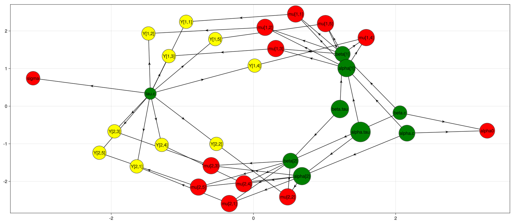

# **JuliaBUGS**

---

## **What is `BUGS`?**

- Influential project that began in 1989, right here
- The first Probabilistic Programming Language
- Software for Bayesian analysis of statistical model
  - Originally with Gibbs
  - Now HMC/NUTS with JuliaBUGS, and more algorithms coming

---

## **Why Choose `JuliaBUGS`?**

- Compatible with existing `BUGS` syntax
- User-friendly modelling language
- Generates the Directed Acyclic Graph (DAG)
- Works seamlessly with other Julia packages
- Supports distributed, parallel, and GPU computations*

---

## **A Simple Example - Rats**

The weights of 30 young rats were measured weekly for five weeks

Rat | $x_j = 8$ | $x_j = 15$ | $x_j = 22$ | $x_j = 29$ | $x_j = 36$ |
--- | --- | --- | --- | --- | --- |
1 | 151 | 199 | 246 | 283 | 320 |
2 | 145 | 199 | 249 | 293 | 354 |
$\cdots$ |  |  |  |  |  |
30 | 153 | 200 | 244 | 286 | 324 |

---

## **The Rats Model**

$$
Y_{ij} \sim \text{Normal}\left( \alpha_i + \beta_i \left( x_j - \bar{x} \right), \tau_c \right)
$$

$$
\alpha_i \sim \text{Normal}\left( \alpha_c, \tau_\alpha \right)
$$

$$
\beta_i \sim \text{Normal}\left( \beta_c, \tau_\beta \right)
$$

---

## **`BUGS` Program for the Rats Model**

```julia
model_def = @bugs("""model{
    for( i in 1 : N ) {
        for( j in 1 : T ) {
        Y[i , j] ~ dnorm(mu[i , j],tau.c)
        mu[i , j] <- alpha[i] + beta[i] * (x[j] - xbar)
        }
        alpha[i] ~ dnorm(alpha.c,alpha.tau)
        beta[i] ~ dnorm(beta.c,beta.tau)
    }
    tau.c ~ dgamma(0.001,0.001)
    sigma <- 1 / sqrt(tau.c)
    alpha.c ~ dnorm(0.0,1.0E-6)   
    alpha.tau ~ dgamma(0.001,0.001)
    beta.c ~ dnorm(0.0,1.0E-6)
    beta.tau ~ dgamma(0.001,0.001)
    alpha0 <- alpha.c - xbar * beta.c   
}""", false) # `false` means R-style variable names are kept 
```

**Nothing** is different from the original BUGS

---

## **Workflow in `JuliaBUGS`**

**Step 1** *Write the model in Julia-flavored or the original `BUGS` syntax, then use `@bugs` macro to transform it into Julia AST*

```julia
quote
    for i = 1:N
        for j = 1:T
            $(Expr(:~, :(Y[i, j]), :(dnorm(mu[i, j], var"tau.c"))))
            mu[i, j] = alpha[i] + beta[i] * (x[j] - xbar)
        end
        $(Expr(:~, :(alpha[i]), :(dnorm(var"alpha.c", var"alpha.tau"))))
        $(Expr(:~, :(beta[i]), :(dnorm(var"beta.c", var"beta.tau"))))
    end
    $(Expr(:~, Symbol("tau.c"), :(dgamma(0.001, 0.001))))
    sigma = 1 / sqrt(var"tau.c")
    $(Expr(:~, Symbol("alpha.c"), :(dnorm(0.0, 1.0e-6))))
    $(Expr(:~, Symbol("alpha.tau"), :(dgamma(0.001, 0.001))))
    $(Expr(:~, Symbol("beta.c"), :(dnorm(0.0, 1.0e-6))))
    $(Expr(:~, Symbol("beta.tau"), :(dgamma(0.001, 0.001))))
    alpha0 = var"alpha.c" - xbar * var"beta.c"
end
```

---

## **Workflow in `JuliaBUGS` (cont.)**

**Step 2** *Prepare data and initial values*

```julia
data=(
    x=[8.0, 15.0, 22.0, 29.0, 36.0],
    xbar=22, N=30, T=5,
    Y=[
        151 199 246 283 320
        145 199 249 293 354
        ...
        153 200 244 286 324
    ],
)
inits=(
    alpha=ones(Integer, 30) .* 250,
    beta=ones(Integer, 30) .* 6,
    var"alpha.c"=150, var"beta.c"=10, var"tau.c"=1,
    var"alpha.tau"=1, var"beta.tau"=1,
)
```

---

## **Workflow in `JuliaBUGS` (cont.)**

**Step 3** *Compile the model*

```julia
model = compile(model_def, data, inits)
```

A series of functions are implemented for the `model`:

```julia-repl
julia> LogDensityProblems.dimension(model) # number of parameters
65
```

and

```julia-repl
julia> LogDensityProblems.logdensity(model, rand(65)) # log-density of the model
-1.2096997168777153e7
```

---

## **Visualizing the `BUGSModel` as a DAG**

To visualize the Directed Acyclic Graph (DAG) underlying the `BUGSModel`, we can utilize standard plotting libraries. In this example, we employ [`Makie.jl`](https://github.com/MakieOrg/GraphMakie.jl) and illustrate the DAG using only the first two rows of the rats' weights data.



---

## **Workflow in `JuliaBUGS` (cont.)**

**Step 4** *Transform the model to be AD-ready (only necessary for HMC/NUTS)*

```julia
ad_model = ADgradient(:ReverseDiff, model; compile = Val(true)) # if using ReverseDiff
ad_model = ADgradient(:ForwardDiff, model) # if using ForwardDiff
```

After the transformation, we can take the gradient of the log-density function

```julia-repl
julia>logp, gradients = LogDensityProblems.logdensity_and_gradient(ad_model, rand(65));

julia> gradients
65-element Vector{Float64}:
   11.027615568346802
   14.156247939871195
 3288.2000788518317
 ...
 1800.9201449927032
```

---

## **Workflow in `JuliaBUGS` (cont.)**

**Step 5** *Ready to sample!*

```julia
n_samples = 3000; n_adapts = 1000 # number of samples and adaptation steps
initial_θ = rand(LogDensityProblems.dimension(model)) # initial values
samples_and_stats = AbstractMCMC.sample(
    ad_model,
    AdvancedHMC.NUTS(0.65),
    n_samples;
    chain_type = Chains,
    n_adapts = n_adapts,
    init_params = initial_θ,
    discard_initial = n_adapts,
)
```

### Here we

- Use the `AbstractMCMC` interface to sample
- An `MCMCChains.Chain` object is returned (see next slide)

---

## **Workflow in `JuliaBUGS` (cont.)**

The sampling results (simplified for legibility)

```julia
Chains MCMC chain (3000×80×1 Array{Real, 3}):
...
Summary Statistics
  parameters       mean       std      mcse    ess_bulk      rhat   ess_per_sec 
      Symbol    Float64   Float64   Float64        Real   Float64       Missing 

      beta.c     6.1856    0.1083    0.0018   3594.9367    1.0005       missing
       sigma     6.0966    0.4802    0.0119   1640.5283    0.9998       missing
      alpha0   106.6111    3.5747    0.0574   3884.4420    1.0005       missing

Quantiles
  parameters       2.5%      25.0%      50.0%      75.0%      97.5% 
      Symbol    Float64    Float64    Float64    Float64    Float64 

      beta.c     5.9663     6.1156     6.1855     6.2578     6.3940
       sigma     5.2499     5.7528     6.0588     6.4025     7.1354
      alpha0    99.8404   104.1624   106.6278   108.9566   113.6170
```

which contains all the sample values and statistics

---

## **Registering Functions and Distributions**

`JuliaBUGS` has implemented most of the distributions and functions in `BUGS`

Users can also register their own functions and distributions by

```julia
JuliaBUGS.@register_primitive function myfunc(x::Float64, y::Float64)
    return x + y
end
```

alternatively,

```julia
function myfunc(x::Float64, y::Float64)
    return x + y
end
JuliaBUGS.@register_primitive myfunc
```

then `myfunc` is ready to use in a `JuliaBUGS` model

---

## **Source Folder Tour**

```bash
├── ext # package extensions
│   ├── JuliaBUGSAdvancedHMCExt.jl 
│   ├── JuliaBUGSGraphMakieExt.jl
│   ├── JuliaBUGSGraphPlotExt.jl
│   └── JuliaBUGSTikzGraphsExt.jl
├── src # source code
│   ├── BUGSExamples # defines examples from OpenBUGS
│   │   ├── BUGSExamples.jl
│   │   ├── Backgrounds
│   │   │   ├── README.md
│   │   │   └── rats.md
│   │   ├── README.md
│   │   ├── Volume_I
│   │   │   ├── Blocker.jl
...
│   │   └── Volume_II
│   │       ├── BiRats.jl
│   │       └── Eyes.jl
│   ├── BUGSPrimitives # defines BUGS distributions and functions
│   │   ├── BUGSPrimitives.jl
│   │   ├── distributions.jl
│   │   └── functions.jl
│   ├── JuliaBUGS.jl
│   ├── compiler_pass.jl # compiler implementation
│   ├── graphs.jl # the DAG MetaGraph interface
│   ├── logdensityproblems.jl # the LogDensityProblem interface
│   ├── model.jl # defines the model and log-density computation
│   ├── parser.jl # the parser of BUGS
│   ├── utils.jl
│   └── variable_types.jl # defines some datatype used in the compiler
```

---

## **Current Status and Caveats**

- `JuliaBUGS` is in early development. Bugs and discrepancies with `BUGS` may exist.
- The compiler is not optimized for large models.
- Initial `compile` function calls may be slow, but subsequent calls will be faster.
- Inference is supported via the `LogDensityProblem` interface with HMC/NUTS from `AdvancedHMC.jl` and MH algorithms from `AdvancedMH.jl`.
- We are working on exploiting the graphical structure for implementing algorithms.

---

## **Future Plans**

- Optimize the compiler to handle larger models efficiently
- Extend inference support with more algorithms and more efficient implementations
- Continue testing and debugging

# **Collaborate with us!**