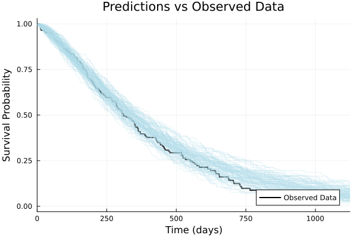
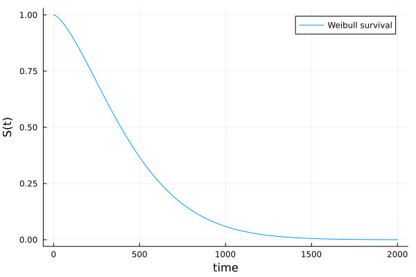
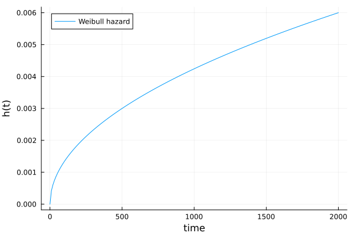
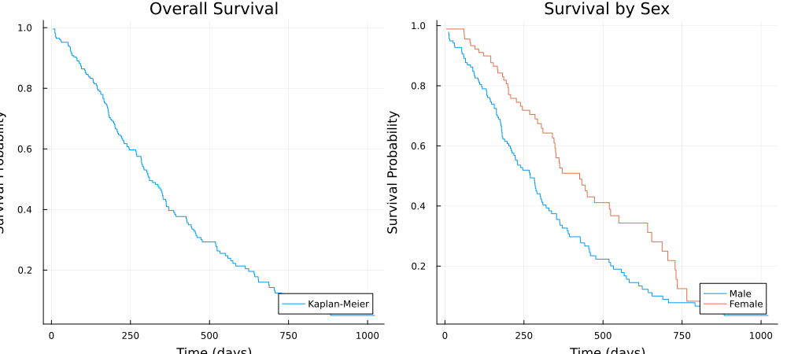
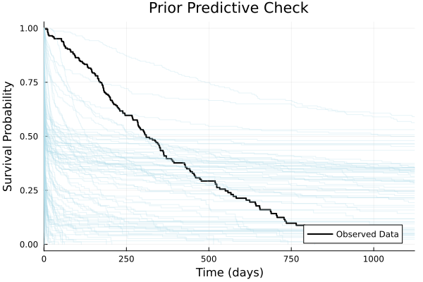
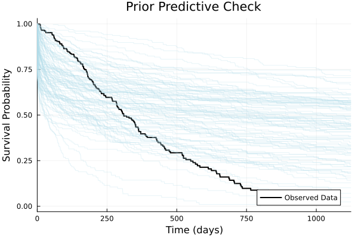
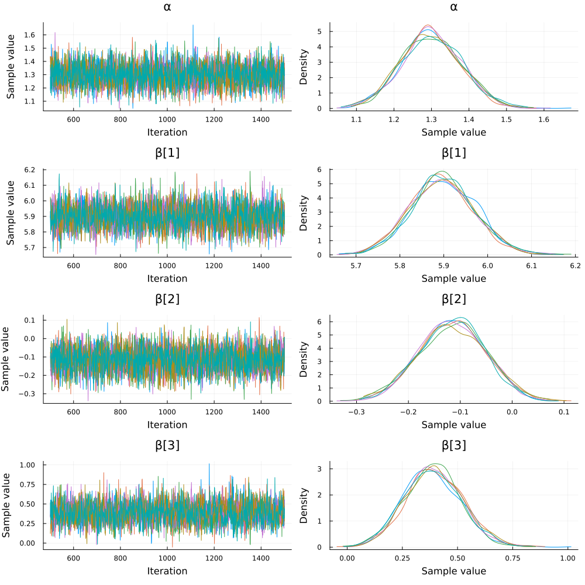
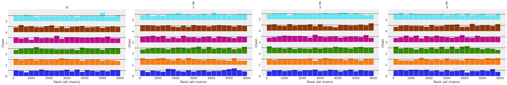
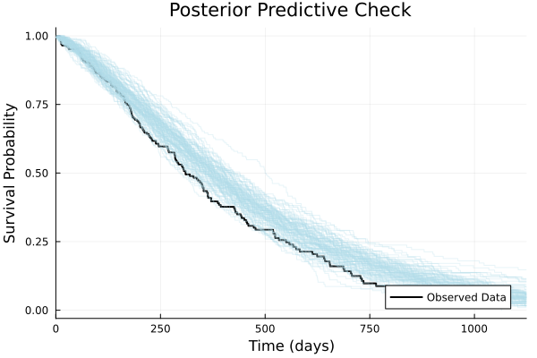
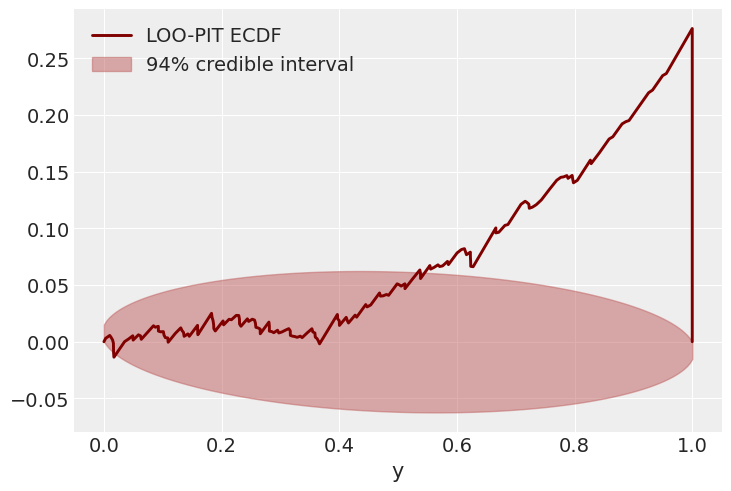

# Bayesian Modeling with Turing.jl

---

I will use a case study in Survival Analysis to demonstrate some useful things to do with Julia and Turing.jl

---

## The Purpose of the Talk

* Show some useful things to do with Julia and Turing.jl.

* Convey some abstractions to think about Bayesian modeling.

* NOT on what model to use.

---



---

## Bayesian Modeling

* We'll restrict ourselves to *parametric* models.
  * We have some parameters
    * Each set of parameter realizations specify a particular model
    * Each particular model is then a possible data generating process
    * E.g., coin flip:
      * Parameters: probability of heads
      * Each set of parameters specify a different coin
      * Each coin can generate different data

---

## Generative Perspective

* The parameters provide a summary of the data generating process
* There exist a simulator that can generate the data
* We use computer programs to simulate
* E.g., coin flip:
  * Parameters: probability of heads
    * Summarize the data generating process (wind, hand, etc. are not modeled)
  * Simulator: flip the coin
  * Program: `[rand(Bernoulli(p)) for _ in 1:10]`

---

## Alternative Perspective (Likelihood)

$$
p(x, \theta) = p(\theta) \prod_{i=1}^{n} p(x_i \mid \theta)
$$

---

## Probabilistic Programming - Simulation Perspective

* Probabilistic programs are simulators
* Inference as inverse problem
* In parametric models, random variables are not fundamentally different from each other
  * `condition` operator to change the prior distribution into a posterior distribution
  * E.g., coin flip:
    * If conditioned on the coin flip outcome, we are inferring the parameters
    * If conditioned on the parameters, we are inferring the coin flip outcome

---

## Probabilistic Programming - Likelihood Perspective

* A probabilistic program can be interpreted as a log density function that maps parameters realizations to the log joint density
* E.g., coin flip:
  $$
  \log p(x, \theta) = \log p(\theta) + \sum_{i=1}^{n} \log p(x_i \mid \theta)
  $$
  i.e. $\text{prior} + \text{likelihood}$
---

For parametric models, we encourage people to think in terms of generative models, but the probabilistic program is the log density function.

Samplers (like Hamiltonian Monte Carlo) works with the log density function interface, where it can propose new parameters realizations and evaluate the log density function and its gradient.

---

## (Incomplete) History and Personal Journey


---

## Primer on Julia

the minimum to read the slides

---

### Functions

Julia uses *multiple dispatch*: 

A single function name can have many specialized *methods* distinguished by the types of its arguments.

```julia
square(x) = x^2

function square(x::Complex)
    return abs2(x)
end
```

Behind the scenes Julia *specializes* each method on the concrete argument types.

---

#### `.` for Broadcasting

```julia
# Broadcasting applies the method element-wise
square.(1:5)                    # → [1, 4, 9, 16, 25]
```

---

### Type

You can define your own types, other than the numeric types. And it can contain multiple fields.

```julia
struct Patient{T<:Real}
    time :: T   
    event :: Bool
end
```

A *struct* is immutable, for performance reasons. `mutable struct` is also available.

```julia-repl
# Constructing a value automatically infers the parameter T
julia> Patient(120.0, true)
Patient{Float64}(120.0, true)
```

---

Functions can then be defined specialized on the struct type.

```julia
function query_time(patient::Patient{Float64})
    return patient.time
end
```

---

### Package System

* Package management:
  * Built around the `Pkg` module and project-specific environments.
  * Project directory includes `Project.toml` and `Manifest.toml` for reproducible dependencies.
* Use `using` to import packages into scope (e.g., `using Turing, Distributions`).
  * Reserve `import` for extending existing types.
* Multiple dispatch enables seamless interoperability; most of the packages and their source code are available on Github.

---

## Primer on Survival Modeling

---

### Survival Function $S(t)$

The probability that the event happens after time $t$:

$$
S(t) = \Pr(T > t).
$$

For a Weibull distribution with **shape** $\alpha$ and **scale** $\theta$, the survival function is

$$
S(t\mid \alpha, \theta) = \exp\bigl(-(t/\theta)^{\alpha}\bigr).
$$

---



for $\theta = 500$ and $\alpha = 1.5$

---

### Hazard Function $h(t)$

Given that the event hasn't happened *yet* (i.e., survived up to time $t$), what's the *instantaneous risk* or likelihood that it will happen *right now*, in this very next tiny moment?

Mathematically, it's defined as:
$$ 
h(t) = -\frac{d}{dt}\,\log S(t).
$$

For our Weibull example, the hazard function is:
$$ h(t \mid α, θ) = \frac{α}{θ} \left(\frac{t}{θ}\right)^{α-1}. $$

---



for $\theta = 500$ and $\alpha = 1.5$

---

### Interpretation of Parameters

$$
S(t\mid \alpha, \theta) = \exp\bigl(-(t/\theta)^{\alpha}\bigr).
$$

- $\theta$ acts as a "characteristic lifetime" or time scale.
    - A **larger $\theta$** means the typical survival time is longer, implying the risk generally stays lower for a longer period.
- $\alpha$ controls how this instantaneous risk *evolves* over time:
  - **$\alpha > 1$**: The risk *increases* as time goes on. Think of wear-and-tear – the longer something has been in use, the more likely it is to fail (e.g., an old car).
  - **$\alpha < 1$**: The risk *decreases* over time.
  - **$\alpha = 1$**: The risk is *constant* over time.

---

## NCCTG Lung Cancer Data

Survival in patients with advanced lung cancer from the North Central Cancer Treatment Group.

* Includes patient age, sex, performance status, and survival time.
* Many observations are right-censored, meaning patients were alive or lost to follow-up when the study ended.

---



_Some exploratory data analysis is always a good idea._

---

## Accelerated Failure Time Model

The Accelerated Failure Time (AFT) framework models the logarithm of the event time as linear in covariates:

$$
T_i = \exp(\mathbf{x}_i^{\top}\beta + \sigma \varepsilon_i),\qquad \varepsilon_i \sim F_0(0,1).
$$

Equivalently, the subject‑specific survival curve is a horizontally **stretched** version of the baseline curve:

$$
S_i(t) = S_0\!\bigl(t\,\mathrm{e}^{-\mathbf{x}_i^{\top}\beta}\bigr).
$$


A one‑unit increase in $x_{ij}$ multiplies the characteristic time by the **acceleration factor** $e^{\beta_j}$.

---

$$
T_i = \exp(\mathbf{x}_i^{\top}\beta + \sigma \varepsilon_i),\qquad \varepsilon_i \sim F_0(0,1).
$$

When $F_0$ is the standard Gumbel distribution, the model becomes a Weibull survival model:

$$
T_i \sim \text{Weibull}(\alpha, \theta_i) \quad \text{where} \quad \theta_i = \exp(\mathbf{x}_i^{\top}\beta)
$$

---

```julia
using Turing

@model function aft_weibull_model(X, event, y_obs)
    n, p = size(X)
    y = Vector{Real}(undef, n)
    
    # Priors
    α ~ LogNormal(0, 2)             # Weibull shape parameter
    β ~ MvNormal(zeros(p), 10.0I)   # Regression coefficients
    
    # Weibull scale parameter for every individual (θᵢ = exp(xᵢᵀβ))
    θ = exp.(X * β)                 # vector of length n
    
    # Generate survival times from Weibull distribution with censoring
    for i in 1:n
        # Base distribution for this individual
        weibull_dist = Weibull(α, θ[i])
        
        if event[i]
            # Event (death)
            y[i] ~ weibull_dist
        else
            # Right-censored observation
            y[i] ~ censored(weibull_dist; upper = y_obs[i])
        end
    end
    
    return (; α, β, y)
end
```

_Here we use the observation as the right-censoring limit._

---

```julia
# Create a model instance without data
# `X` is a matrix with feature: Age and Sex
# `event` is a vector: true if the patient has died, false if censored
# `y` is a vector of observed survival or censoring times
model = aft_weibull_model(X, event, y)
```

---

```julia
# Simulate from the prior
sampled_return_values = model()
sample_of_model_parameters = rand(model)
```


---

### Prior Predictive Checks

To verify that the prior is reasonable, we can sample from the prior predictive distribution.

---

```julia
# Sample from the prior predictive distribution
prior_samples = sample(model, Prior(), 100)

# Get returned values with the sampled parameters
returned_values = returned(model, prior_samples)
```

---



---

We want to "stretch" the survival curves to match the observed data.

---

```julia
@model function aft_weibull_model_improved(X, event, y_obs)
    n, p = size(X)
    y = Vector{Real}(undef, n)
    
    # prior for Weibull shape parameter (heavier‑tailed; mean ≈ 0.8 on original scale)
    α ~ LogNormal(-0.223143551, 0.5)
    
    # prior for regression coefficients
    μβ = [log(500.0); zeros(p - 1)]                  # prior median survival ≈ 500 days at baseline
    σβ = Diagonal(vcat([1.0^2], fill(5.0^2, p - 1)))
    β ~ MvNormal(μβ, σβ)
    
    # Weibull scale parameter for every individual (θᵢ = exp(xᵢᵀβ))
    θ = exp.(X * β)                                  # vector of length n
    
    # Generate survival times from Weibull distribution with censoring
    for i in 1:n
        # Base distribution for this individual
        weibull_dist = Weibull(α, θ[i])
        
        if event[i]
            # Event (death)
            y[i] ~ weibull_dist
        else
            # Right-censored observation
            y[i] ~ censored(weibull_dist; upper = y_obs[i])
        end
    end
    
    return (; α, β, y) 
end
```

---



* Looks much better!
* The tail is too optimistic, but we'll move on for now.

---

### Interlude: Handling Missing Data

* Turing.jl decides whether a variable is a model parameter or not based on whether it's a `missing` value.
* The following model is functionally equivalent to the previous unconditioned model.

```julia
missing_model = model | (; y = similar(y, Missing))
```

---

`condition` operator turns a prior model into a posterior model conditioned on some observed data.

```julia
# Condition the model on the observations
conditioned_model = model | (; y = y)
```

---

## Posterior Sampling

```julia
using ReverseDiff

# Draw 500 samples from the posterior, 6 chains, using the NUTS sampler with reverse-mode AD
posterior_chains = sample(
    conditioned_model, 
    NUTS(; adtype = AutoReverseDiff(; compile = true)), 
    MCMCThreads(), 
    500, 
    6; 
    n_adapt = 500
)
```

---


---

* `rhat` values are ≈ 1.00 (<1.01)
* `ess_bulk` and `ess_tail` ($\gt 100 \times 6 = 600$)

the chains are well-mixed.

---

### Trace Plot

```julia
using StatsPlots, Plots

# MCMCChains integrates with StatsPlots
plot(posterior_chains)
```

---



---

### Rank Plot

```julia
using ArviZ, ArviZPythonPlots

use_style("arviz-darkgrid")

idata = ArviZ.from_mcmcchains(posterior_chains)
plot_rank(idata)
gcf()
```



---

## Posterior Predictive Checks

* Take a sample from the posterior.
* `fix` the model with the sampled parameters.
* Generate simulated data from the model.
* Plot the Kaplan-Meier curve of the simulated data.

```julia
fixed_model = fix(model, (; 
    α = params_chain.α[idx], 
    β = [params_chain.β[i][idx] for i in 1:size(X, 2)]
))

# Generate simulated data
sim_data = fixed_model()
```

---



* The posterior predictive check shows that the model fits the data pretty well. But the model is putting too little probability on the right tail of the survival curve.

---

## Model Checking (With ArviZ)



---

* The LOO‑PIT ECDF confirms the misfit suggested by the posterior predictive check.  
* Too few PIT values near 0 and too many near 1 mean the model seldom over‑predicts early failures but systematically under‑predicts the longest survival times.  
* The resulting S‑shape (negative deviations on the left, positive on the right) shows the predictive distribution is **under‑dispersed** and its right tail is too light.  
* Remedy: adopt a heavier‑tailed baseline (e.g., Log‑Normal) or add subject‑level frailty/random effects to capture the extra variance.

---

The point is, at this stage, we have more information to improve the model.

We will simply peek at a model with _individual Gamma frailty_.

**with submodels**

---

```julia
@model gamma_frailty(i, k) = individual_frailty ~ Gamma(k, k)

@model function aft_weibull_frailty_sub(X, event, y_obs)
    n, p = size(X)

    # population-level parameters
    α ~ LogNormal(0, 1.5)
    β ~ MvNormal(zeros(p), 10I)
    k ~ Gamma(2, 2)                           # frailty precision

    θ = exp.(X * β)                           # individual scales

    # storage
    y = Vector{Real}(undef, n)
    v = Vector{Real}(undef, n)

    for i in 1:n
        v[i] ~ to_submodel(gamma_frailty(i, k))

        d = Weibull(α, θ[i] / v[i]^(1/α))     # frailty-adjusted scale
        if event[i]
            y[i] ~ d                          # death observed
        else
            y[i] ~ censored(d; upper = y_obs[i])  # right-censored
        end
    end

    return (; y = y, v = v)
end
```

---


Weilbull model

---


With frailty

---

Building a good Bayesian model is an iterative process.

Simulating and plotting are helpful.

Turing.jl's syntax allows using the same generative model throughout.

Julia's ecosystem has more to offer than demonstrated here.

Give it a try!
