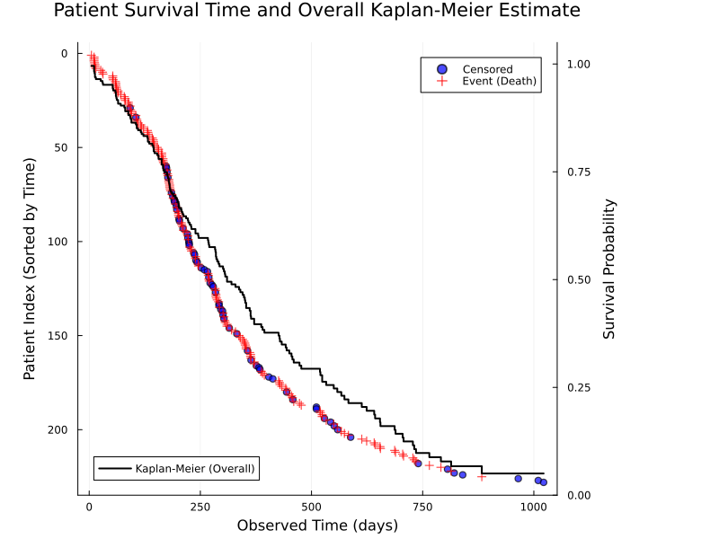

# A Case Study in Bayesian Survival Analysis 
## with **Turing.jl**

---

## Why Listen?

**Inform:** Showcase some capabilities of Turing.jl.

**Entice:** Encourage you to explore Turing.jl (and Julia) as valuable additions to your toolkit.

**NOT:** A guide to Bayesian modeling.
  * Attend *Michael Betancourt*'s sessions tomorrow for that.

---

### Assumed Background

We will speak casually of *likelihoods*, *priors*, *posteriors*, and of Markov‑chain Monte‑Carlo (MCMC).

There will be some math related to survival models, but it is not essential for understanding the main point.

**Please stop me** if anything is unclear.

---

## Parametric Bayesian Modeling from Generative Perspective

We'll restrict attention to **parametric** models.

A finite parameter vector

$$\theta\in\Theta\subset\mathbb R^{d}.$$

fully specifies a stochastic *simulator* 

$$S(\theta,\cdot)$$ 

that can emit "fake data" 

$$x\sim p(x\mid\theta).$$

Running that simulator forward is easy; *inference* is the inverse problem of discovering plausible $\theta$ from observed data.

---

The key assumption is:
* *not* that we know every microscopic cause,
* but that their collective effects can be captured by $\theta$.

---

### Example - coin flip

Let $p\in[0,1]$ be the probability of heads.  

All complex physical factors—air resistance, spin, bounce—are summarized by the single parameter *p*.

Simulation is straightforward:

```julia
rand(Bernoulli(p), 10)      # ten flips
```

---

Thinking generatively involves viewing the model as a simulator that explains data generation, and then using Bayesian methods to perform the inference.

---

## Probabilistic Programming

Probabilistic Programming Languages (PPLs) like Stan, PyMC, and Turing.jl offer abstractions for intuitively defining Bayesian models as probabilistic programs.

PPLs typically include built-in inference engines.

---

## Probabilistic Programming - Generative Perspective

* A probabilistic program is a simulator
* Conditioning turns priors into posteriors; inference is an inverse problem.  
* In parametric models, all random variables are treated symmetrically: you can condition on any subset and sample the remainder.

---

## Probabilistic Programming - Likelihood Perspective


The same program can be read as a log-density evaluator:  

$$
\log p(x,\theta) = \underbrace{\log p(\theta)}_{\text{prior}}
                 + \underbrace{\sum_{i=1}^{n}\log p(x_i\mid\theta)}_{\text{likelihood}}.
$$

Gradients of this function drive gradient-based samplers such as HMC or NUTS.

This can be used in MLE/MAP estimations, and Generalized Bayes.

---

Samplers, such as Hamiltonian Monte Carlo (HMC), operate using a log-density function interface. This allows them to propose new parameter values and evaluate both the log-density function and its gradient.

---

We will stop at getting the posterior distribution.

Many questions can be answered by computing expectations of some test functions under the posterior distribution.

---

## A (very) short note on history


---

## Turing.jl

* Hong Ge led the development throughout
* It's a community effort:
  * Many contributors and users
  * Julia ecosystem support
  * Martin Trapp (talk on Thursday)
* Tor Fjelde contributed significantly to the current version
* Penelope Yong will give another talk on Thursday

---


---

## Julia

**High-level yet high-performance**

---

### Multiple dispatch in one slide

```julia
square(x)        = x^2
square(x::Complex) = abs2(x)

square.(1:5)  # broadcasting → [1,4,9,16,25]
```

Different argument types automatically invoke specialized, compiled versions of the function.

---

### Defining custom types

```julia
struct Patient{T<:Real}
    time  :: T
    event :: Bool
end
```

Methods specialized on `Patient` are as natural as on built-ins.

---

## "Old" complaints and the 2025 reality

* **Automatic differentiation felt fragmented.**  
  * ForwardDiff and ReverseDiff are battle-tested.  
  * *Mooncake* (Enzyme) is a next-generation, state-of-the-art AD.

* **First time to execute was slow due to compilation.**  
  * Pretty much a solved problem since 1.10 by smart caching and precompilation.

---

## The package system

Project-specific environments (using `Project.toml` and `Manifest.toml`) facilitate reproducible research. Multiple dispatch ensures seamless interoperability between different packages.

---

## Primer on Survival Modeling

**Goal:** Model a non-negative *time-to-event* random variable $T$.  
Right-censoring—knowing only that $T$ exceeds a certain bound—is central.


---

## NCCTG Lung Cancer Data ([RDatasets](https://vincentarelbundock.github.io/Rdatasets/doc/survival/lung.html))

* 228 patients with advanced lung cancer.  
* Covariates: age, sex, performance status, Karnofsky score.  
* Response: survival time (days) plus censoring indicator.

---


---

### Kaplan–Meier estimator

Censored patients tend to survive longer; the Kaplan–Meier curve honours this by stair-stepping only at observed events.

---



---

Survival Function $S(t)$ is the probability that the event happens after time $t$:

$$
S(t) = \Pr(T > t).
$$

Hazard Function $h(t)$ is the instantaneous risk of the event happening at time $t$ given that it hasn't happened yet:

$$
h(t) = -\frac{d}{dt}\,\log S(t).
$$

For a Weibull distribution with **shape** $\alpha$ and **scale** $\theta$, the survival function is

$$
S(t\mid \alpha, \theta) = \exp\bigl(-(t/\theta)^{\alpha}\bigr).
$$

$$ 
h(t \mid α, θ) = \frac{α}{θ} \left(\frac{t}{θ}\right)^{α-1}. 
$$

---


---


---


Exploratory plots often reveal covariate effects - here a clear difference by sex.

---

## Weibull Model with Uninformative Priors

$$ \alpha \sim \text{LogNormal}(0, 2) $$
$$ \beta \sim \text{MvNormal}(\mathbf{0}_p, 10 \cdot \mathbf{I}_p) $$
$$T_i \sim \text{Weibull}(\alpha, \theta_i) \quad \text{where} \quad \theta_i = \exp(\mathbf{x}_i^{\top}\beta)$$

---

```julia
using Turing

@model function aft_weibull_model(X, event, censoring_time)
    n, p = size(X)
    y = Vector{Real}(undef, n)

    α ~ LogNormal(0, 2) # Weibull shape parameter

    # Weibull scale parameter for every individual (θᵢ = exp(xᵢᵀβ))
    β ~ MvNormal(zeros(p), 10.0I)
    θ = exp.(X * β)

    for i in 1:n
        if event[i] # death
            y[i] ~ Weibull(α, θ[i])
        else
            y[i] ~ censored(Weibull(α, θ[i]); upper=censoring_time[i])
        end
    end

    return (; α, β, y)
end
```

_Assumption_: censoring times are known for the patients dropped out of the study.

---

```julia
# Create a model instance without data
# `X` is a matrix with feature: Age and Sex
# `event` is a vector: true if the patient has died, false if censored
# `y` is a vector of observed survival or censoring times
model = aft_weibull_model(X, event, y)
```

---

```julia
# Simulate from the prior
sampled_return_values = model()
sample_of_model_parameters = rand(model)
```

---

### Prior Predictive Checks

To verify that the prior is reasonable, we can sample from the prior predictive distribution.

---

```julia
# Sample from the prior predictive distribution
prior_samples = sample(model, Prior(), 100)

# Get returned values with the sampled parameters
returned_values = returned(model, prior_samples)
```

---


We adjust the priors to be a bit more informative to match the observed data.

---

```julia
@model function aft_weibull_model_adjusted(X, event, censoring_time)
    n, p = size(X)
    y = Vector{Real}(undef, n)
    
    α ~ LogNormal(log(0.8), 0.5)
    
    μβ = [log(500.0); zeros(p - 1)]
    σβ = Diagonal(vcat([1.0^2], fill(5.0^2, p - 1)))
    β ~ MvNormal(μβ, σβ)
    
    θ = exp.(X * β)
    
    for i in 1:n
        if event[i]
            y[i] ~ Weibull(α, θ[i])
        else
            y[i] ~ censored(Weibull(α, θ[i]); upper = censoring_time[i])
        end
    end
    
    return (; α, β, y) 
end
```

---


---

## `condition` Operator to Incorporate Observations

`condition` operator turns a prior model into a posterior model conditioned on some observed data.

```julia
# Condition the model on the observations
conditioned_model = model | (; y = y)
```

---

## How Turing.jl decides if a variable is a model parameter or not

If a LHS variable is not conditioned on or conditioned on a `missing` value, it is a model parameter.

---

## Posterior Sampling

```julia
using ReverseDiff

# Draw 500 samples from the posterior, 6 chains, using the NUTS sampler with reverse-mode AD
posterior_chains = sample(
    conditioned_model, 
    NUTS(; adtype = AutoReverseDiff(; compile = true)), 
    # MCMCThreads(),
    MCMCSerial(),
    500,
    6; 
    n_adapt = 500
)
```

---

According to _Rank-normalization, folding, and localization: An improved Rˆ for assessing convergence of MCMC_ by **Vehtari et al.**, 

* `rhat` < 1.01 is considered good.
* `ess_bulk` and `ess_tail` ($\gt 100 \times 6 = 600$) are considered good.

the chains are well-mixed.

---

### Trace Plot

```julia
using StatsPlots, Plots

# MCMCChains integrates with StatsPlots
plot(posterior_chains)
```

---


Looks like the chains are well-mixed.

---

### Rank Plot

```julia
using ArviZ, ArviZPythonPlots

use_style("arviz-darkgrid")

idata = ArviZ.from_mcmcchains(posterior_chains)
plot_rank(idata)
gcf()
```


---

## Posterior Predictive Checks

Take a sample from the posterior predictive distribution.

Procedure:
* Sample from the posterior.
* For the model parameters, fix the sampled values.
  * They stop being random variables.
* For variables that are observations in the original model, now consider them as unobserved and sample them.

---

### `fix` Operator

The contributions of the fixed parameters to the log density are 0.

```julia
fixed_model = fix(model, (; 
    α = posterior_chains.α[idx], 
    β = [posterior_chains.β[i][idx] for i in 1:size(X, 2)]
))

# Generate simulated data
sim_data = fixed_model()
```

---


The posterior predictive check shows that the model fits the data pretty well. 

The observed survival curve (black) consistently indicates poorer survival outcomes than the bulk of the posterior predictive simulations (blue), suggesting the model may be overly optimistic.

---

## Model Checking (With ArviZ)

```
PSISLOOResult with estimates
      elpd  elpd_mcse  p  p_mcse 
 -1.15e+03         40  4    0.66

and PSISResult with 500 draws, 6 chains, and 228 parameters
Pareto shape (k) diagnostic values:
                    Count         Min. ESS
 (-Inf, 0.5]  good  228 (100.0%)  1454
```

---


Too few PIT values near 0 and too many near 1 mean the model seldom over-predicts early failures but systematically under-predicts the longest survival times.

The resulting S-shape (negative deviations on the left, positive on the right) shows the predictive distribution is **under-dispersed** and its right tail is too light.

---

The point is, at this stage, we have more information to improve the model.

We will simply peek at a model with _individual Gamma frailty_.

---

```julia
@model function vectorized_gamma_frailties_submodel(n::Int, k::Real)
    frailties ~ Turing.arraydist([Gamma(k, k) for _ = 1:n])
end

@model function aft_weibull_frailty_age_sub(X, event, censoring_time)
    n, p = size(X)

    α ~ LogNormal(0, 1.5)
    β ~ MvNormal(zeros(p), 10I)
    k ~ Gamma(2, 2)

    v = Vector{Real}(undef, n)
    v ~ to_submodel(vectorized_gamma_frailties_submodel(n, k))

    θ_base = exp.(X * β)

    y = Vector{Real}(undef, n)
    for i = 1:n
        d = Weibull(α, θ_base[i] / (v[i]^(1 / α)))

        if event[i]
            y[i] ~ d
        else
            y[i] ~ censored(d; upper = censoring_time[i])
        end
    end

    return (; α, β, v, k, y)
end
```

---

## References

* [Turing.jl](https://turinglang.org/), where you can find
  * [Tutorials](https://turinglang.org/docs/tutorials/coin-flipping/index.html)
  * [Documentation](https://turinglang.org/library/)

* [ArviZ](https://arviz-devs.github.io/ArviZ.jl/stable/)

---


Penelope Yong will give another talk on _The Design of Turing.jl_ on Thursday, 1-2pm.

https://learnbayes.se/events/design-of-turing-jl

---

Building a good Bayesian model is an iterative process.

Simulating and plotting are helpful.

Turing.jl's syntax allows using the same generative model throughout.

Julia's ecosystem has more to offer than demonstrated here.

Give it a try!
