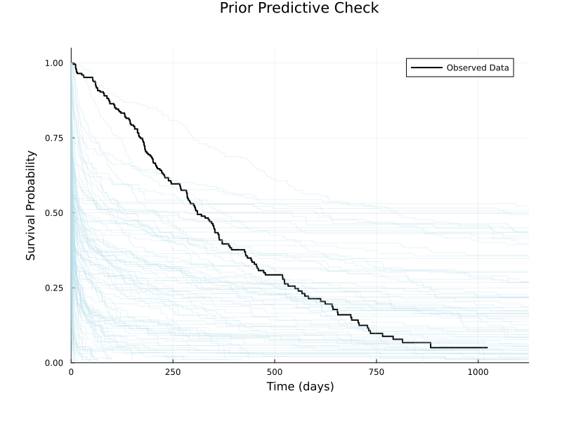
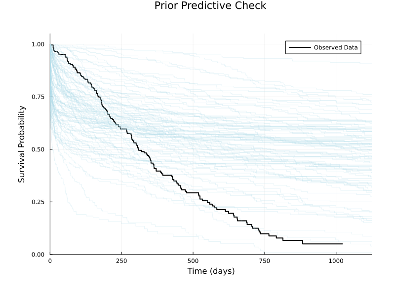
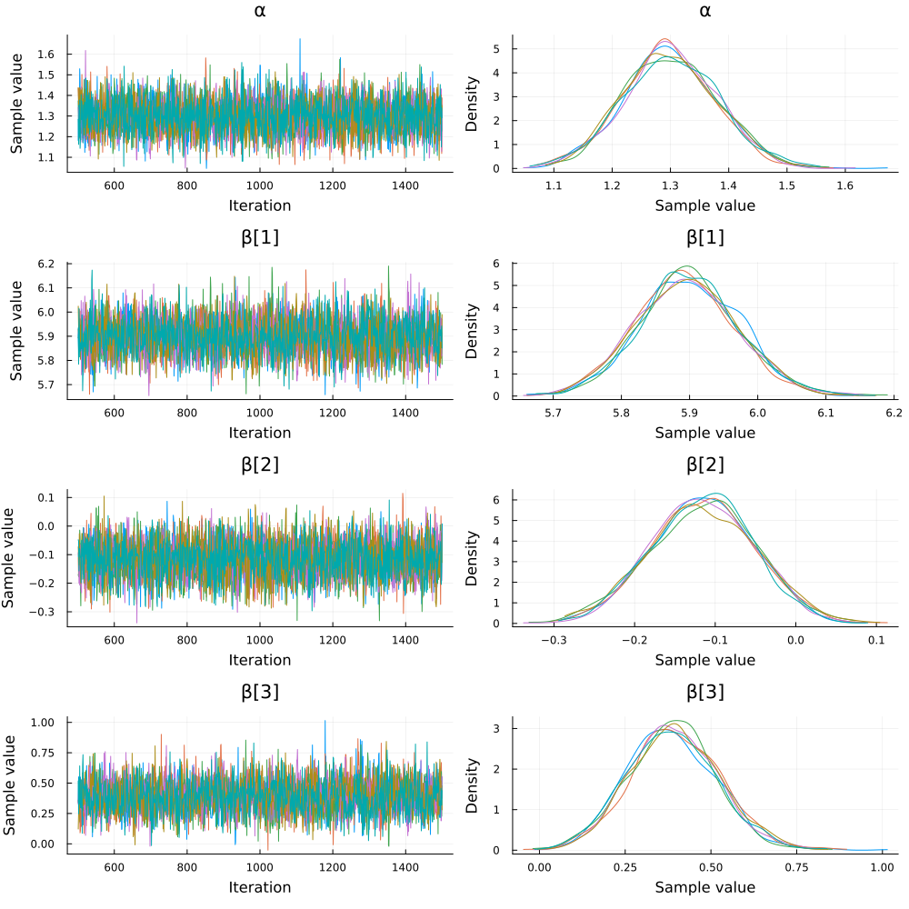
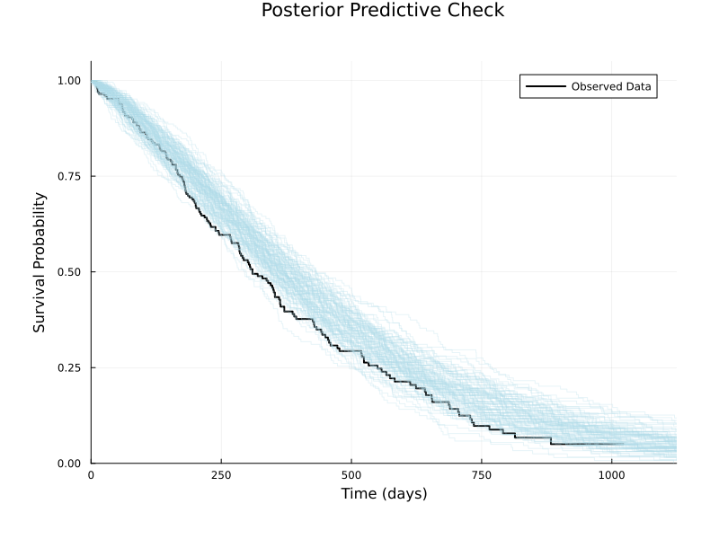
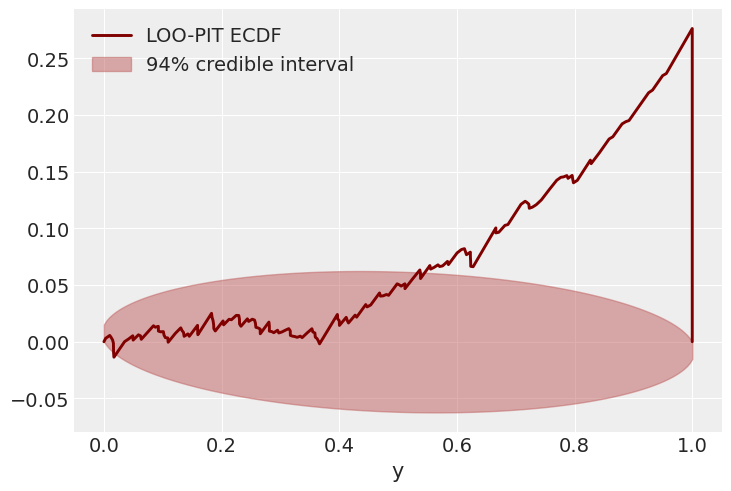

# Bayesian Modeling in Julia with Turing.jl

- [Bayesian Modeling in Julia with Turing.jl](#bayesian-modeling-in-julia-with-turingjl)
  - [Purpose of the Talk](#purpose-of-the-talk)
  - [Primer on Julia](#primer-on-julia)
    - [Functions](#functions)
    - [Type](#type)
    - [Package System](#package-system)
  - [NCCTG Lung Cancer Data](#ncctg-lung-cancer-data)
  - [Primer on Survival Modeling](#primer-on-survival-modeling)
    - [Survival Function](#survival-function)
    - [Hazard Function](#hazard-function)
  - [Kaplan-Meier (KM) Estimator and Plot](#kaplan-meier-km-estimator-and-plot)
  - [A First Model -- AFT Weibull Model](#a-first-model----aft-weibull-model)
    - [Meaning of the Model](#meaning-of-the-model)
    - [Simulate](#simulate)
  - [Prior Predictive Checks](#prior-predictive-checks)
  - [Adjust Prior](#adjust-prior)
    - [Handling missing values](#handling-missing-values)
  - [Posterior Sampling](#posterior-sampling)
  - [Convergence Diagnostics](#convergence-diagnostics)
    - [Diagnostic Statistics](#diagnostic-statistics)
    - [Trace Plot](#trace-plot)
    - [Rank Plot](#rank-plot)
  - [Posterior Predictive Checks](#posterior-predictive-checks)
  - [Model Checking](#model-checking)
    - [LOO](#loo)
  - [Heavier tails (Log‑Normal baseline) -- Log‑Normal AFT model](#heavier-tails-lognormal-baseline----lognormal-aft-model)
    - [Posterior sampling](#posterior-sampling-1)
    - [Posterior predictive check](#posterior-predictive-check)
  - [Gamma Frailty Model](#gamma-frailty-model)
  - [Other Possible Topic](#other-possible-topic)
    - [Turing Model as Log Density Function](#turing-model-as-log-density-function)
    - [Inference Algorithm Development and Debugging](#inference-algorithm-development-and-debugging)
    - [Use ODE: model hazard as a function of latent state](#use-ode-model-hazard-as-a-function-of-latent-state)

## Purpose of the Talk

* Demonstrate some useful things to do with Julia and Turing.jl
* Not on how to do Bayesian modeling

## Primer on Julia

This section provides a very brief primer on Julia. So audience can follow the talk.

### Functions

Julia uses multiple dispatch, meaning that a single function name can have many specialized *methods* distinguished by the types of its arguments. This allows highly expressive and fast generic code.

```julia
# One-line definition
square(x) = x^2

# Specialize on complex numbers
square(x::Complex) = abs2(x)

# Broadcasting applies the method element-wise
square.(1:5)                    # → [1, 4, 9, 16, 25]

# Multiline function definition
function logit(p::Real)
    @assert 0 < p < 1 "p must lie in (0,1)"
    return log(p / (1 - p))
end
```

Behind the scenes Julia *specializes* each method on the concrete argument types it first encounters, producing highly-optimized machine code.

### Type

Julia's *type system* enables the definition of new, concrete data structures that can participate in multiple dispatch. A *struct* is immutable by default and should be preferred for performance-critical data.

```julia
struct Patient{T<:Real}
    time   :: T      # observed survival/censoring time
    event  :: Bool   # death (true) or right-censored (false)
end

# Constructing a value automatically infers the parameter T
Patient(120.0, true)

# Mutable variants (rarely needed)
mutable struct RunningStats
    n::Int
    mean::Float64
    var::Float64
end
```

Parametric types such as `Patient{Float64}` behave like *templates* while still being fully concrete at compile time, ensuring type-stable, high-performance code.

### Package System

Julia's package manager *Pkg* is integrated into the language (press `]` in the REPL). Development is most convenient inside a *project-specific environment*:

```julia-repl
(@v1.11) pkg> activate lung-survival    # create/enter new environment
(lung-survival) pkg> add Turing Survival ArviZ ArviZPythonPlots
```

The environment's manifest (`Project.toml`/`Manifest.toml`) is kept *next to your code*, ensuring full reproducibility. From code you can perform the same steps programmatically:

```julia
using Pkg
Pkg.activate("lung-survival")
Pkg.instantiate()                # ensure all dependencies are present
```

## NCCTG Lung Cancer Data

Survival in patients with advanced lung cancer from the North Central Cancer Treatment Group.

```julia
using DataFrames, Statistics, RDatasets

# Load original data
df_lung = dataset("survival", "cancer")
DataFrames.describe(df_lung)

# Define columns of interest
vars_to_check = [:Time, :Status, :Age, :Sex]

# Remove rows with missing values in columns of interest
df = dropmissing(df_lung, vars_to_check)

# Define standardization function
standardise(x) = (x .- mean(x)) ./ std(x)

# Prepare predictors
# 1. Standardize Age
age_std = standardise(df.Age)
# 2. Create boolean indicator for Female (Sex == 2)
female = df.Sex .== 2

# Create design matrix X with intercept, standardized Age, and Female indicator
X = hcat(ones(nrow(df)), age_std, female)

# Extract outcome variable: survival time
y = Float64.(df.Time)

# Create event indicator (true if event/death occurred, false if censored)
# Convention: Status=1 -> censored, Status=2 -> dead (event)
event = df.Status .== 2
```

## Primer on Survival Modeling

### Survival Function

The survival function gives the probability of surviving *beyond* time `t`:

$$ S(t) = \Pr(T > t) = 1 - F(t) $$

For a `Weibull(α, θ)` distribution the closed-form expression is

$$ S(t \mid α, θ) = \exp\!\bigl(-(t/θ)^{α}\bigr). $$

```julia
using Distributions, Plots, StatsPlots

α, θ = 1.5, 500.0
t = range(0, 2000; length=200)
plot(t, exp.(-(t ./ θ) .^ α); 
     label="Weibull survival", 
     xlabel="time", 
     ylabel="S(t)")
```

Interpreting survival curves visually is often an easier starting point than working with the density or hazard directly.

### Hazard Function

The (instantaneous) *hazard* is the conditional failure rate at time `t` given survival up to that point:

$$ h(t) = \frac{f(t)}{S(t)} = -\frac{d}{dt}\,\log S(t). $$

For the Weibull example this becomes

$$ h(t \mid α, θ) = \frac{α}{θ} \left(\frac{t}{θ}\right)^{α-1}. $$

```julia
plot(t, (α/θ) .* (t ./ θ).^(α - 1); 
     label="Weibull hazard", 
     xlabel="time", 
     ylabel="h(t)")
```

The complementary perspectives of *survival*, *density*, and *hazard* are all useful when building and checking a survival model.

## Kaplan-Meier (KM) Estimator and Plot

```julia
using Survival
using Plots
using StatsPlots

# Fit overall Kaplan-Meier estimator
# Note: KaplanMeier expects 'true' for an event (death), which matches our 'event' variable
km_overall_fit = fit(KaplanMeier, y, event)

# Plot 1: Overall Kaplan-Meier curve
p1 = plot(
    km_overall_fit.events.time,
    km_overall_fit.survival,
    seriestype = :steppost,
    title = "Overall Survival",
    xlabel = "Time (days)",
    ylabel = "Survival Probability",
    label = "Kaplan-Meier",
    legend = :bottomright
)

# Plot 2: Kaplan-Meier curves stratified by Sex
# Group the original DataFrame `df` by Sex (1=male, 2=female)
km_fits_by_sex = Dict()
for group in groupby(df, :Sex)
    sex_group = first(group.Sex)                 # Get the sex value (1 or 2)
    group_y = Float64.(group.Time)               # Extract time for the group
    # Extract event indicator for the group based on the overall 'event' definition
    group_event = group.Status .== 2
    km_fits_by_sex[sex_group] = fit(KaplanMeier, group_y, group_event)
end

p2 = plot(
    title = "Survival by Sex",
    xlabel = "Time (days)",
    ylabel = "Survival Probability",
    legend = :bottomright
)

# Plot Male curve (Sex=1)
plot!(p2,
    km_fits_by_sex[1].events.time,
    km_fits_by_sex[1].survival,
    seriestype = :steppost,
    label = "Male"
)

# Plot Female curve (Sex=2)
plot!(p2,
    km_fits_by_sex[2].events.time,
    km_fits_by_sex[2].survival,
    seriestype = :steppost,
    label = "Female"
)

# Combine and display the plots
plot(p1, p2, layout=(1, 2), size=(1000, 450))
```

## A First Model -- AFT Weibull Model

```julia
using Turing, Distributions, DynamicPPL

@model function aft_weibull_model(X, event, y_obs)
    n, p = size(X)
    y = Vector{Real}(undef, n)
    
    # Priors
    α ~ LogNormal(0, 2)             # Weibull shape parameter
    β ~ MvNormal(zeros(p), 10.0I)   # Regression coefficients
    
    # Weibull scale parameter for every individual (θᵢ = exp(xᵢᵀβ))
    θ = exp.(X * β)                 # vector of length n
    
    # Generate survival times from Weibull distribution with censoring
    for i in 1:n
        # Base distribution for this individual
        weibull_dist = Weibull(α, θ[i])
        
        if event[i]
            # Event (death)
            y[i] ~ weibull_dist
        else
            # Right-censored observation
            y[i] ~ censored(weibull_dist; upper = y_obs[i])
        end
    end
    
    return (; α, β, y)
end
```

### Meaning of the Model

This is an Accelerated Failure Time (AFT) model where:
- Survival times `y` follow a Weibull distribution.
- The Weibull shape `α` is shared across individuals.
- The Weibull scale `θᵢ` for individual `i` depends on covariates `X` and coefficients `β` (`θᵢ = exp(Xᵢᵀβ)`).
- It handles right-censoring based on the `event` status and observed times `y_obs`.
- Priors are defined for `α` and `β`.

### Simulate

```julia
# Create a model instance without data
model = aft_weibull_model(X, event, y)

# Simulate from the prior
sampled_return_values = model()
sample_of_model_parameters = rand(model)
```

## Prior Predictive Checks

```julia
# Sample from the prior predictive distribution
prior_samples = sample(model, Prior(), 100)

# Get returned values with the sampled parameters
returned_values = returned(model, prior_samples)
```

```julia
function plot_prior_pred_check(
    model::DynamicPPL.Model, 
    prior_samples::MCMCChains.Chains, 
    y,
    event
)    
    returned_values = returned(model, prior_samples)
    p_prior = plot(
        title = "Prior Predictive Check",
        xlabel = "Time (days)",
        ylabel = "Survival Probability",
        legend = :bottomright
    )

    km_obs = fit(KaplanMeier, y, event)
    plot!(p_prior, 
        km_obs.events.time, 
        km_obs.survival,
        seriestype = :steppost,
        label = "Observed Data",
        color = :black,
        linewidth = 2
    )

    for returned_value in returned_values
        y_sim = returned_value.y
        km_sim = fit(KaplanMeier, y_sim, event)
        plot!(p_prior, 
            km_sim.events.time, 
            km_sim.survival,
            seriestype = :steppost,
            label = "",
            color = :lightblue,
            xlims = (0, maximum(y) * 1.1),
            alpha = 0.3
        )
    end
    display(p_prior)
end

plot_prior_pred_check(model, prior_samples, y, event)
```



* **Observation:** The prior predictive check shows that while the prior *can* generate survival curves consistent with the observed data, most simulated curves drop much faster than the observed data. This indicates the prior distribution implies unrealistically short survival times on average.
* **Reason:** The prior for the intercept term, `beta[0]`, was centered at 0 (`Normal(0, 1)`). Since the Weibull scale parameter $\theta$ is calculated as $\theta = \exp(\beta_0 + \dots)$, a baseline `beta[0]` near 0 results in a baseline $\theta$ near $\exp(0) = 1$.
* **Implication:** For a Weibull distribution, the scale parameter $\theta$ represents a characteristic survival time. A baseline $\theta \approx 1$ (days), combined with the prior for the shape parameter $\alpha$ (which was also centered around 1), leads to extremely short median survival times (median = $\theta (\ln 2)^{1/\alpha} \approx 1 \cdot (\ln 2)^1 \approx 0.7$ days). This is why the simulated survival curves plunge rapidly, inconsistent with the observed data where survival extends over hundreds of days.

## Adjust Prior

```julia
using Turing, Distributions, LinearAlgebra

@model function aft_weibull_model_improved(X, event, y_obs)
    n, p = size(X)
    y = Vector{Real}(undef, n)
    
    # prior for Weibull shape parameter (heavier‑tailed; mean ≈ 0.8 on original scale)
    α ~ LogNormal(-0.223143551, 0.5)
    
    # prior for regression coefficients
    μβ = [log(500.0); zeros(p - 1)]                  # prior median survival ≈ 500 days at baseline
    σβ = Diagonal(vcat([1.0^2], fill(5.0^2, p - 1)))
    β ~ MvNormal(μβ, σβ)
    
    # Weibull scale parameter for every individual (θᵢ = exp(xᵢᵀβ))
    θ = exp.(X * β)                                  # vector of length n
    
    # Generate survival times from Weibull distribution with censoring
    for i in 1:n
        # Base distribution for this individual
        weibull_dist = Weibull(α, θ[i])
        
        if event[i]
            # Event (death)
            y[i] ~ weibull_dist
        else
            # Right-censored observation
            y[i] ~ censored(weibull_dist; upper = y_obs[i])
        end
    end
    
    return (; α, β, y) 
end
```

```julia
# Model checking function, useful for debugging
DynamicPPL.DebugUtils.check_model_and_trace(model)
```

```julia
model = aft_weibull_model_improved(X, event, y)
prior_samples = sample(model, Prior(), 100)
plot_prior_pred_check(model, prior_samples, y, event)
```



* Looks much better!
* The tail is too optimistic, but we'll move on for now.

### Handling missing values

* When some data points are missing, we treat them as model parameters.
* The following model is functionally equivalent to the previous unconditioned model.

```julia
missing_model = model | (; y = similar(y, Missing))
rand(missing_model)
```

## Posterior Sampling

```julia
# Condition the model on the observed data
conditioned_model = model | (; y = y)
```

```julia
using Mooncake

sample_chains = sample(
    conditioned_model, 
    NUTS(; adtype = AutoMooncake(; config = nothing)), 
    MCMCThreads(), 
    1000, 
    6; 
    n_adapt = 500
)
```

```julia
using ReverseDiff

# Draw 500 samples from the posterior, 6 chains, using the NUTS sampler with reverse-mode AD
posterior_chains = sample(
    conditioned_model, 
    NUTS(; adtype = AutoReverseDiff(; compile = true)), 
    MCMCThreads(), 
    500, 
    6; 
    n_adapt = 500
)
```

## Convergence Diagnostics

```
┌ Info: Found initial step size
└   ϵ = 3.814697265625e-7
┌ Info: Found initial step size
└   ϵ = 0.025
┌ Info: Found initial step size
└   ϵ = 0.003125
┌ Info: Found initial step size
└   ϵ = 0.025
┌ Info: Found initial step size
└   ϵ = 0.025
┌ Info: Found initial step size
└   ϵ = 0.00625
Chains MCMC chain (500×16×6 Array{Float64, 3}):

Iterations        = 251:1:750
Number of chains  = 6
Samples per chain = 500
Wall duration     = 5.89 seconds
Compute duration  = 33.88 seconds
parameters        = α, β[1], β[2], β[3]
internals         = lp, n_steps, is_accept, acceptance_rate, log_density, hamiltonian_energy, hamiltonian_energy_error, max_hamiltonian_energy_error, tree_depth, numerical_error, step_size, nom_step_size

Summary Statistics
  parameters      mean       std      mcse    ess_bulk    ess_tail      rhat   ess_per_sec 
      Symbol   Float64   Float64   Float64     Float64     Float64   Float64       Float64 

           α    1.3005    0.0826    0.0015   3176.5584   2327.6059    1.0026       93.7702
        β[1]    5.8957    0.0752    0.0016   2190.2029   2218.9017    1.0007       64.6535
        β[2]   -0.1156    0.0652    0.0012   3127.1951   2082.9506    1.0005       92.3130
        β[3]    0.3938    0.1323    0.0029   2117.4403   1999.0650    1.0008       62.5056

Quantiles
  parameters      2.5%     25.0%     50.0%     75.0%     97.5% 
      Symbol   Float64   Float64   Float64   Float64   Float64 

           α    1.1450    1.2414    1.2993    1.3566    1.4614
        β[1]    5.7547    5.8450    5.8945    5.9472    6.0439
        β[2]   -0.2416   -0.1588   -0.1142   -0.0711    0.0101
        β[3]    0.1452    0.3015    0.3916    0.4828    0.6579
        
```

### Diagnostic Statistics

* **`rhat` (Potential Scale Reduction Factor):** Measures convergence by comparing within-chain and between-chain variance. Values close to 1.0 indicate good convergence. A common threshold is `rhat` < 1.01 (Vehtari et al., 2021). Our summary shows all `rhat` values are ≈ 1.00 (the maximum observed is 1.0026), well within this threshold, suggesting the chains have converged well.
* **`ess` (Effective Sample Size):** Estimates the number of independent samples equivalent to the autocorrelated MCMC samples. Higher values mean better exploration and more reliable estimates. `ess_bulk` focuses on the center of the distribution (mean, variance), while `ess_tail` focuses on the tails (quantiles). A common guideline suggests a total ESS > $100 \times M$ (where $M$ is the number of chains) for stable estimates (Vehtari et al., 2021). Our summary shows $M=6$ chains. The `ess_bulk` and `ess_tail` values are generally > 1900 (e.g., for $\alpha$, ESS_bulk ≈ 3177, ESS_tail ≈ 2328), which is well above the $100 \times 6 = 600$ threshold. This indicates good mixing and reliable parameter estimates.

### Trace Plot

```julia
using StatsPlots, Plots

# MCMCChains integrates with StatsPlots
plot(posterior_chains)
```



Alternatively, we can use ArviZ to plot the trace plot.

```julia
using ArviZ, ArviZPythonPlots

use_style("arviz-darkgrid")

idata = ArviZ.from_mcmcchains(posterior_chains)
plot_trace(idata)
gcf()
```

### Rank Plot

```julia
using ArviZ, ArviZPythonPlots

use_style("arviz-darkgrid")

idata = ArviZ.from_mcmcchains(posterior_chains)
plot_rank(idata)
gcf()
```


## Posterior Predictive Checks

```julia
function plot_posterior_pred_check(
    model::DynamicPPL.Model,
    posterior_samples::MCMCChains.Chains, 
    y, 
    event,
)
    p_post = plot(
        title = "Posterior Predictive Check",
        xlabel = "Time (days)",
        ylabel = "Survival Probability",
        legend = :bottomright
    )

    km_obs = fit(KaplanMeier, y, event)
    plot!(p_post, 
        km_obs.events.time, 
        km_obs.survival,
        seriestype = :steppost,
        label = "Observed Data",
        color = :black,
        linewidth = 2
    )

    # Get parameter samples from the posterior
    params_chain = get(posterior_samples; section = :parameters)
    
    # Generate multiple posterior predictive samples
    n_samples = 100
    for i in 1:n_samples
        # Get a random sample index
        idx = rand(1:length(params_chain.α))
        
        # Fix the model with parameters from posterior
        fixed_model = fix(model, (; 
            α = params_chain.α[idx], 
            β = [params_chain.β[i][idx] for i in 1:size(X, 2)]
        ))
        
        # Generate simulated data
        sim_data = fixed_model()

        y_sim = sim_data.y

        km_sim = fit(KaplanMeier, y_sim, event)
        plot!(p_post, 
            km_sim.events.time, 
            km_sim.survival,
            seriestype = :steppost,
            label = "",
            color = :lightblue,
            xlims = (0, maximum(y) * 1.1),
            alpha = 0.3
        )
    end

    display(p_post)
end

plot_posterior_pred_check(model, posterior_chains, y, event)
```



* The posterior predictive check shows that the model fits the data pretty well. But the model is putting too little probability on the right tail.

## Model Checking

### LOO

```julia
using ArviZ
using DynamicPPL
using MCMCChains
using DimensionalData

# Extract parameter samples from the chain
parameter_samples = MCMCChains.get_sections(posterior_chains, :parameters)

# Compute pointwise log likelihoods (returns an `OrderedDict`)
log_likelihood_dict = DynamicPPL.pointwise_loglikelihoods(
    conditioned_model,
    parameter_samples
)

# Compute posterior predictive samples
posterior_predictive_chain = DynamicPPL.predict(
    model, # Use the unconditioned model for prediction
    parameter_samples
)

# Reformat the log likelihoods into an array suitable for ArviZ
# Dimensions: (draws, chains, observations)
n_draws, n_params, n_chains = size(posterior_chains)
n_obs = length(y)
log_lik_values = Array{Float64}(undef, n_draws, n_chains, n_obs)
post_pred_values = Array{Float64}(undef, n_draws, n_chains, n_obs)

for i in 1:n_obs
    vn_str = "y[$i]"
    vn_sym = Symbol(vn_str)

    log_lik_values[:, :, i] .= log_likelihood_dict[vn_str]
    post_pred_values[:, :, i] .= dropdims(posterior_predictive_chain[[vn_sym],].value, dims = 2)
end

log_likelihood_data = (; y = log_lik_values)
posterior_predictive_data = (; y = post_pred_values)

idata_loo = ArviZ.from_mcmcchains(
    posterior_chains;
    log_likelihood = log_likelihood_data,
    posterior_predictive = posterior_predictive_data,
    observed_data = (; y = y),
    coords = (obs_id = 1:n_obs, coef_dim = 1:size(X, 2)),
    dims = (y = [:obs_id], β = [:coef_dim])
)

loo_result = ArviZ.loo(idata_loo)
display(loo_result)

log_weights = loo_result.psis_result.log_weights
loo_pit_values = ArviZ.loo_pit(idata_loo, log_weights)
display(loo_pit_values)

plot_loo_pit(idata_loo; y = "y", ecdf = true, color = "maroon")
gcf()
```



* The LOO-PIT ECDF plot verifies the previous concern about the tail.

## Heavier tails (Log‑Normal baseline) -- Log‑Normal AFT model

```julia
using Turing, Distributions, LinearAlgebra

@model function aft_lognormal_model(X, event, y_obs)
    n, p = size(X)
    y = Vector{Real}(undef, n)

    # Priors
    σ ~ LogNormal(0, 1)                     # shape (σ > 0), sd on log‑time scale
    μβ = [log(500.0); zeros(p - 1)]         # baseline median ≈ 500 days
    Σβ = Diagonal(vcat([1.0^2], fill(5.0^2, p - 1)))
    β ~ MvNormal(μβ, Σβ)                    # regression coefficients

    # Individual location parameters on the log‑time scale
    μ = X * β                               # vector length n

    for i in 1:n
        d = LogNormal(μ[i], σ)
        if event[i]
            y[i] ~ d                   
        else
            y[i] ~ censored(d; upper = y_obs[i])
        end
    end

    return (; σ, β, y)
end
```

### Posterior sampling

```julia
model_ln = aft_lognormal_model(X, event, y)
conditioned_model_ln = model_ln | (; y = y)

posterior_chains_ln = sample(
    conditioned_model_ln,
    NUTS(; adtype = AutoReverseDiff(; compile = true)),
    MCMCThreads(),
    1000, 6; 
    n_adapt = 500
)
```

### Posterior predictive check

```julia
function plot_posterior_pred_check_ln(
    model::DynamicPPL.Model, 
    posterior_samples::MCMCChains.Chains, 
    y, 
    event,
)
    p_post = plot(
        title = "Posterior Predictive Check",
        xlabel = "Time (days)",
        ylabel = "Survival Probability",
        legend = :bottomright
    )

    # Plot the observed KM curve
    km_obs = fit(KaplanMeier, y, event)
    plot!(p_post, 
        km_obs.events.time, 
        km_obs.survival,
        seriestype = :steppost,
        label = "Observed Data",
        color = :black,
        linewidth = 2
    )

    params_chain = get(posterior_samples; section = :parameters)
    
    n_samples = 100
    for i in 1:n_samples
        idx = rand(1:length(params_chain))
        
        σ_sample = params_chain.σ[idx] 
        β_sample = [params_chain.β[1][idx], params_chain.β[2][idx], params_chain.β[3][idx]]
        fixed_model = fix(model, (; 
            σ = σ_sample, 
            β = β_sample
        ))
        
        sim_data = fixed_model()
        y_sim = sim_data.y

        km_sim = fit(KaplanMeier, y_sim, event)
        plot!(p_post, 
            km_sim.events.time, 
            km_sim.survival,
            seriestype = :steppost,
            label = "",
            color = :lightblue,
            xlims = (0, maximum(y) * 1.1),
            alpha = 0.3
        ) 
    end

    display(p_post)
end

plot_posterior_pred_check_ln(model_ln, posterior_chains_ln, y, event)
```

## Gamma Frailty Model

```julia
@model gamma_frailty(i, k) = individual_frailty ~ Gamma(k, k)

@model function aft_weibull_frailty_sub(X, event, y_obs)
    n, p = size(X)

    # population-level parameters
    α ~ LogNormal(0, 1.5)
    β ~ MvNormal(zeros(p), 10I)
    k ~ Gamma(2, 2)                           # frailty precision

    θ = exp.(X * β)                           # individual scales

    # storage
    y = Vector{Real}(undef, n)
    v = Vector{Real}(undef, n)

    for i in 1:n
        # v[i] ~ to_submodel(gamma_frailty(i, k))
        v[i] ~ Gamma(k, k)

        d = Weibull(α, θ[i] / v[i]^(1/α))     # frailty-adjusted scale
        if event[i]
            y[i] ~ d                          # death observed
        else
            y[i] ~ censored(d; upper = y_obs[i])  # right-censored
        end
    end

    return (; y = y, v = v)
end
```

```julia
model_sub = aft_weibull_frailty_sub(X, event, y)
conditioned_sub = model_sub | (; y = y)

# The model with submodels behaves as expected, notice the name prefix
rand(model_sub)
model_sub()
```

```julia
DynamicPPL.DebugUtils.model_warntype(model_sub)
```

```julia
chains_sub = sample(
    conditioned_sub,
    NUTS(; adtype = AutoReverseDiff(; compile = true)),
    MCMCThreads(),
    1000, 
    6; 
    n_adapt = 500
)
```

```julia
function plot_posterior_pred_check_frail(
    model::DynamicPPL.Model, 
    posterior_samples::MCMCChains.Chains, 
    y, 
    event,
)
    p_post = plot(
        # title = "Posterior Predictive Check",
        title = "Predictions vs Observed Data",
        xlabel = "Time (days)",
        ylabel = "Survival Probability",
        legend = :bottomright
    )

    km_obs = fit(KaplanMeier, y, event)
    plot!(p_post, 
        km_obs.events.time, 
        km_obs.survival,
        seriestype = :steppost,
        label = "Observed Data",
        color = :black,
        linewidth = 2
    )
    
    params_chain = get(posterior_samples; section = :parameters)
    
    n_samples = 100
    for i in 1:n_samples
        idx = rand(1:length(params_chain))
        
        fixed_model = fix(model, (; 
            α = params_chain.α[idx], 
            β = [params_chain.β[i][idx] for i in 1:size(X, 2)],
            k = params_chain.k[idx],
            v = [params_chain.v[i][idx] for i in 1:size(X, 1)]
        ))
        
        sim_data = fixed_model()
        y_sim = sim_data.y

        km_sim = fit(KaplanMeier, y_sim, event)
        plot!(p_post, 
            km_sim.events.time, 
            km_sim.survival,
            seriestype = :steppost,
            label = "",
            color = :lightblue,
            xlims = (0, maximum(y) * 1.1),
            alpha = 0.3
        )
    end

    display(p_post)
end

plot_posterior_pred_check_frail(model_sub, chains_sub, y, event)
```

## Other Possible Topic

### Turing Model as Log Density Function
* `LogDensityFunction` interface
* `@addlogprob!`

### Inference Algorithm Development and Debugging
* `AbstractMCMC.step`

### Use ODE: model hazard as a function of latent state
