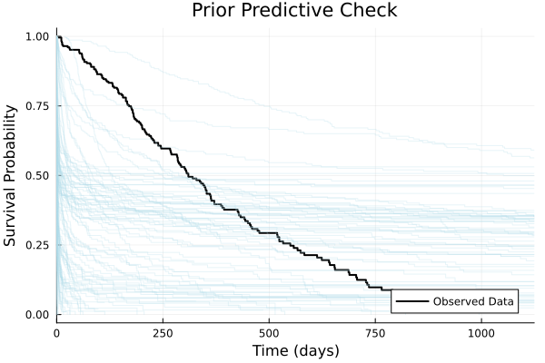
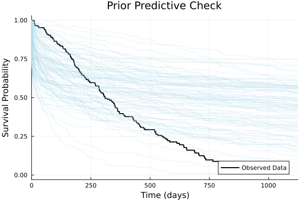

# Bayesian Modeling in Julia with Turing.jl

- [Bayesian Modeling in Julia with Turing.jl](#bayesian-modeling-in-julia-with-turingjl)
  - [Purpose of the Talk](#purpose-of-the-talk)
  - [Primer on Julia](#primer-on-julia)
    - [Functions](#functions)
    - [Type](#type)
    - [Package System](#package-system)
  - [NCCTG Lung Cancer Data](#ncctg-lung-cancer-data)
  - [Primer on Survival Modeling](#primer-on-survival-modeling)
    - [Survival Function](#survival-function)
    - [Hazard Function](#hazard-function)
  - [Kaplan-Meier (KM) Estimator and Plot](#kaplan-meier-km-estimator-and-plot)
  - [The First Model](#the-first-model)
    - [What is this model saying?](#what-is-this-model-saying)
    - [Simulate](#simulate)
  - [Prior Predictive Checks](#prior-predictive-checks)
  - [Adjust Prior](#adjust-prior)
    - [with missing values](#with-missing-values)
  - [Posterior Sampling](#posterior-sampling)
  - [Convergence Diagnostics](#convergence-diagnostics)
    - [Numerical Diagnostics](#numerical-diagnostics)
    - [Trace Plot](#trace-plot)
    - [Rank Plot](#rank-plot)
  - [Posterior Predictive Checks](#posterior-predictive-checks)
  - [Model Checking](#model-checking)
    - [LOO](#loo)
  - [heavier tails (Log‑Normal baseline)](#heavier-tails-lognormal-baseline)
    - [Log‑Normal AFT model](#lognormal-aft-model)
    - [Posterior sampling](#posterior-sampling-1)
    - [Posterior predictive check](#posterior-predictive-check)
    - [LOO and LOO‑PIT ECDF](#loo-and-loopit-ecdf)
  - [Gamma Frailty Model](#gamma-frailty-model)
  - [Other Possible Topic](#other-possible-topic)
    - [Turing Model as Log Density Function](#turing-model-as-log-density-function)
    - [Inference Algorithm Development and Debugging](#inference-algorithm-development-and-debugging)
    - [Use ODE: model hazard as a function of latent state](#use-ode-model-hazard-as-a-function-of-latent-state)

## Purpose of the Talk

* Demonstrate some useful things to do with Julia and Turing.jl
* Not on how to do Bayesian modeling

## Primer on Julia

### Functions

Julia uses multiple dispatch, meaning that a single function name can have many specialized *methods* distinguished by the types of its arguments. This allows highly expressive and fast generic code.

```julia
# Concise one-line definition
square(x) = x^2

# Specialize on complex numbers
square(x::Complex) = abs2(x)

# Broadcasting applies the method element-wise
square.(1:5)                    # → [1, 4, 9, 16, 25]

# A function can be defined with several methods up-front
function logit(p::Real)
    @assert 0 < p < 1 "p must lie in (0,1)"
    return log(p / (1 - p))
end
```

Behind the scenes Julia *specializes* each method on the concrete argument types it first encounters, producing highly-optimized machine code.

### Type

Julia's *type system* enables the definition of new, concrete data structures that can participate in multiple dispatch. A *struct* is immutable by default and should be preferred for performance-critical data.

```julia
struct Patient{T<:Real}
    time   :: T      # observed survival/censoring time
    event  :: Bool   # death (true) or right-censored (false)
end

# Constructing a value automatically infers the parameter T
Patient(120.0, true)

# Mutable variants (rarely needed)
mutable struct RunningStats
    n::Int
    mean::Float64
    var::Float64
end
```

Parametric types such as `Patient{Float64}` behave like *templates* while still being fully concrete at compile time, ensuring type-stable, high-performance code.

### Package System

Julia's package manager *Pkg* is integrated into the language (press `]` in the REPL). Development is most convenient inside a *project-specific environment*:

```julia-repl
(@v1.11) pkg> activate lung-survival    # create/enter new environment
(lung-survival) pkg> add Turing Survival ArviZ ArviZPythonPlots
```

The environment's manifest (`Project.toml`/`Manifest.toml`) is kept *next to your code*, ensuring full reproducibility. From code you can perform the same steps programmatically:

```julia
using Pkg
Pkg.activate("lung-survival")
Pkg.instantiate()                # ensure all dependencies are present
```

## NCCTG Lung Cancer Data

Survival in patients with advanced lung cancer from the North Central Cancer Treatment Group.

```julia
using DataFrames, Statistics, RDatasets

# Load original data
df_lung = dataset("survival", "cancer")
DataFrames.describe(df_lung)

# Define columns of interest
vars_to_check = [:Time, :Status, :Age, :Sex]

# Remove rows with missing values in columns of interest
df = dropmissing(df_lung, vars_to_check)

# Define standardization function
standardise(x) = (x .- mean(x)) ./ std(x)

# Prepare predictors
# 1. Standardize Age
age_std = standardise(df.Age)
# 2. Create boolean indicator for Female (Sex == 2)
female = df.Sex .== 2

# Create design matrix X with intercept, standardized Age, and Female indicator
X = hcat(ones(nrow(df)), age_std, female)

# Extract outcome variable: survival time
y = Float64.(df.Time)

# Create event indicator (true if event/death occurred, false if censored)
# Convention: Status=1 -> censored, Status=2 -> dead (event)
event = df.Status .== 2
```

## Primer on Survival Modeling

### Survival Function

The survival function gives the probability of surviving *beyond* time `t`:

$$ S(t) = \Pr(T > t) = 1 - F(t) $$

For a `Weibull(α, θ)` distribution the closed-form expression is

$$ S(t \mid α, θ) = \exp\!\bigl(-(t/θ)^{α}\bigr). $$

```julia
using Distributions, Plots

α, θ = 1.5, 500.0
t = range(0, 2000; length=200)
plot(t, exp.(-(t ./ θ) .^ α); 
     label="Weibull survival", 
     xlabel="time", 
     ylabel="S(t)")
```

Interpreting survival curves visually is often an easier starting point than working with the density or hazard directly.

### Hazard Function

The (instantaneous) *hazard* is the conditional failure rate at time `t` given survival up to that point:

$$ h(t) = \frac{f(t)}{S(t)} = -\frac{d}{dt}\,\log S(t). $$

For the Weibull example this becomes

$$ h(t \mid α, θ) = \frac{α}{θ} \left(\frac{t}{θ}\right)^{α-1}. $$

```julia
plot(t, (α/θ) .* (t ./ θ).^(α - 1); 
     label="Weibull hazard", 
     xlabel="time", 
     ylabel="h(t)")
```

The complementary perspectives of *survival*, *density*, and *hazard* are all useful when building and checking a survival model.

## Kaplan-Meier (KM) Estimator and Plot

```julia
using Survival
using Plots
using StatsPlots

# Fit overall Kaplan-Meier estimator
# Note: KaplanMeier expects 'true' for an event (death), which matches our 'event' variable
km_overall_fit = fit(KaplanMeier, y, event)

# Plot 1: Overall Kaplan-Meier curve
p1 = plot(
    km_overall_fit.events.time,
    km_overall_fit.survival,
    seriestype = :steppost,
    title = "Overall Survival",
    xlabel = "Time (days)",
    ylabel = "Survival Probability",
    label = "Kaplan-Meier",
    legend = :bottomright
)

# Plot 2: Kaplan-Meier curves stratified by Sex
# Group the original DataFrame `df` by Sex (1=male, 2=female)
km_fits_by_sex = Dict()
for group in groupby(df, :Sex)
    sex_group = first(group.Sex)                 # Get the sex value (1 or 2)
    group_y = Float64.(group.Time)               # Extract time for the group
    # Extract event indicator for the group based on the overall 'event' definition
    group_event = group.Status .== 2
    km_fits_by_sex[sex_group] = fit(KaplanMeier, group_y, group_event)
end

p2 = plot(
    title = "Survival by Sex",
    xlabel = "Time (days)",
    ylabel = "Survival Probability",
    legend = :bottomright
)

# Plot Male curve (Sex=1)
plot!(p2,
    km_fits_by_sex[1].events.time,
    km_fits_by_sex[1].survival,
    seriestype = :steppost,
    label = "Male"
)

# Plot Female curve (Sex=2)
plot!(p2,
    km_fits_by_sex[2].events.time,
    km_fits_by_sex[2].survival,
    seriestype = :steppost,
    label = "Female"
)

# Combine and display the plots
plot(p1, p2, layout=(1, 2), size=(1000, 450))
```

## The First Model

```julia
using Turing, Distributions

@model function aft_weibull_model(X, event, y_obs)
    # Get dimensions from data
    n, p = size(X)
    
    # Initialize survival times vector
    y = Vector{Float64}(undef, n)
    
    # Priors
    α ~ LogNormal(0, 2)             # Weibull shape parameter
    β ~ MvNormal(zeros(p), 10.0I)   # Regression coefficients
    
    # Weibull scale parameter for every individual (θᵢ = exp(xᵢᵀβ))
    θ = exp.(X * β)                 # vector of length n
    
    # Generate survival times from Weibull distribution with censoring
    for i in 1:n
        # Base distribution for this individual
        weibull_dist = Weibull(α, θ[i])
        
        if event[i]
            # Observed event (death) - sample directly from distribution
            y[i] ~ weibull_dist
        else
            # Right-censored observation - use censored distribution
            y[i] ~ censored(weibull_dist; upper = y_obs[i])
        end
    end
    
    return (; α, β, y) 
end
```

### What is this model saying?

`y_obs` only used for censoring

### Simulate

```julia
# Create the generative model using our prepared data
model = aft_weibull_model(X, event, y)

# Sample from the prior to check model specification
prior_sample = model()
```

## Prior Predictive Checks

```julia
prior_samples = sample(model, Prior(), 100)
```

```julia
using DynamicPPL

function plot_prior_pred_check(
    model::DynamicPPL.Model, 
    prior_samples::MCMCChains.Chains, 
    y, 
    event
)    
    returned_values = returned(model, prior_samples)
    p_prior = plot(
        title = "Prior Predictive Check",
        xlabel = "Time (days)",
        ylabel = "Survival Probability",
        legend = :bottomright
    )

    # Plot the observed KM curve
    km_obs = fit(KaplanMeier, y, event)
    plot!(p_prior, 
        km_obs.events.time, 
        km_obs.survival,
        seriestype = :steppost,
        label = "Observed Data",
        color = :black,
        linewidth = 2
    )

    for returned_value in returned_values
        # Extract simulated survival times from prior
        y_sim = returned_value.y

        # Fit KM to the simulated data
        km_sim = fit(KaplanMeier, y_sim, event)

        # Plot the KM curve for this simulation
        plot!(p_prior, 
            km_sim.events.time, 
            km_sim.survival,
            seriestype = :steppost,
            label = "",
            color = :lightblue,
            xlims = (0, maximum(y) * 1.1),  # Cut off x-axis at 1.1 times the maximum observed time
            alpha = 0.3
        )
    end

    # Display the plot
    display(p_prior)
end

plot_prior_pred_check(model, prior_samples, y, event)
```



* The prior can cover the data, but the survival curves plunge way too quickly in general
* Reason is that `beta[0]` is centered at `0`, so `theta = exp(beta[0] + ...)` centered around `1`, $h(t) = \alpha t^{\alpha-1} \theta^{-\alpha}$ is far too large when `alpha` is typically around 1.

## Adjust Prior

```julia
using Turing, Distributions, LinearAlgebra

@model function aft_weibull_model_improved(X, event, y_obs)
    # Get dimensions from data
    n, p = size(X)
    
    # Initialize survival times vector
    y = Vector{Float64}(undef, n)
    
    # prior for Weibull shape parameter (heavier‑tailed; mean ≈ 0.8 on original scale)
    α ~ LogNormal(-0.223143551, 0.5)
    
    # prior for regression coefficients
    μβ = [log(500.0); zeros(p - 1)]                  # prior median survival ≈ 500 days at baseline
    σβ = Diagonal(vcat([1.0^2], fill(5.0^2, p - 1)))
    β ~ MvNormal(μβ, σβ)
    
    # Weibull scale parameter for every individual (θᵢ = exp(xᵢᵀβ))
    θ = exp.(X * β)                                  # vector of length n
    
    # Generate survival times from Weibull distribution with censoring
    for i in 1:n
        # Base distribution for this individual
        weibull_dist = Weibull(α, θ[i])
        
        if event[i]
            # Observed event (death) - sample directly from distribution
            y[i] ~ weibull_dist
        else
            # Right-censored observation - use censored distribution
            y[i] ~ censored(weibull_dist; upper = y_obs[i])
        end
    end
    
    return (; α, β, y) 
end
```

```julia
using DynamicPPL
DynamicPPL.DebugUtils.check_model_and_trace(model)
```

```julia
model = aft_weibull_model_improved(X, event, y)
prior_samples = sample(model, Prior(), 100)
plot_prior_pred_check(model, prior_samples, y, event)
```



### with missing values

```julia
missing_model = model | (; y = similar(y, Missing))
missing_model()
```

## Posterior Sampling

```julia
conditioned_model = model | (; y = y)
```

```julia
using Mooncake

sample_chains = sample(
    conditioned_model, 
    NUTS(; adtype = AutoMooncake(; config = nothing)), 
    MCMCThreads(), 
    1000, 
    6; 
    n_adapt = 500
)
```

```julia
using ReverseDiff

posterior_chains = sample(
    conditioned_model, 
    NUTS(; adtype = AutoReverseDiff(; compile = true)), 
    MCMCThreads(), 
    1000, 
    6; 
    n_adapt = 500
)
```

## Convergence Diagnostics

```
┌ Info: Found initial step size
└   ϵ = 0.025
┌ Info: Found initial step size
└   ϵ = 0.05
┌ Info: Found initial step size
└   ϵ = 0.2
┌ Info: Found initial step size
└   ϵ = 0.003125
┌ Info: Found initial step size
└   ϵ = 0.000390625
┌ Info: Found initial step size
└   ϵ = 9.765625e-5
Chains MCMC chain (1000×16×6 Array{Float64, 3}):

Iterations        = 501:1:1500
Number of chains  = 6
Samples per chain = 1000
Wall duration     = 2.58 seconds
Compute duration  = 14.29 seconds
parameters        = α, β[1], β[2], β[3]
internals         = lp, n_steps, is_accept, acceptance_rate, log_density, hamiltonian_energy, hamiltonian_energy_error, max_hamiltonian_energy_error, tree_depth, numerical_error, step_size, nom_step_size

Summary Statistics
  parameters      mean       std      mcse    ess_bulk    ess_tail      rhat   ess_per_sec 
      Symbol   Float64   Float64   Float64     Float64     Float64   Float64       Float64 

           α    1.2995    0.0807    0.0011   5892.0666   4907.4407    1.0012      412.3787
        β[1]    5.8974    0.0735    0.0011   4201.8177   4574.9750    1.0009      294.0802
        β[2]   -0.1155    0.0643    0.0008   6019.0069   4444.9421    1.0013      421.2631
        β[3]    0.3900    0.1305    0.0020   4179.7216   4285.1129    1.0009      292.5337

Quantiles
  parameters      2.5%     25.0%     50.0%     75.0%     97.5% 
      Symbol   Float64   Float64   Float64   Float64   Float64 

           α    1.1430    1.2456    1.2970    1.3533    1.4585
        β[1]    5.7541    5.8486    5.8961    5.9453    6.0447
        β[2]   -0.2430   -0.1589   -0.1146   -0.0719    0.0065
        β[3]    0.1399    0.3016    0.3864    0.4774    0.6508
```

### Numerical Diagnostics

* `R-hat`
* `ess`

### Trace Plot

```julia
using StatsPlots, Plots

plot(posterior_chains)
```


```julia
using ArviZ, ArviZPythonPlots

use_style("arviz-darkgrid")

idata = ArviZ.from_mcmcchains(posterior_chains)
plot_trace(idata)
gcf()
```

### Rank Plot

```julia
using ArviZ, ArviZPythonPlots

use_style("arviz-darkgrid")

idata = ArviZ.from_mcmcchains(posterior_chains)
plot_rank(idata)
gcf()
```


## Posterior Predictive Checks

```julia
function plot_posterior_pred_check(
    model::DynamicPPL.Model,
    posterior_samples::MCMCChains.Chains, 
    y, 
    event,
)
    p_post = plot(
        title = "Posterior Predictive Check",
        xlabel = "Time (days)",
        ylabel = "Survival Probability",
        legend = :bottomright
    )

    # Plot the observed KM curve
    km_obs = fit(KaplanMeier, y, event)
    plot!(p_post, 
        km_obs.events.time, 
        km_obs.survival,
        seriestype = :steppost,
        label = "Observed Data",
        color = :black,
        linewidth = 2
    )

    # Get parameter samples from the posterior
    params_chain = get(posterior_samples; section = :parameters)
    
    # Generate multiple posterior predictive samples
    n_samples = 100
    for i in 1:n_samples
        # Get a random sample index
        idx = rand(1:length(params_chain.α))
        
        # Fix the model with parameters from posterior
        fixed_model = fix(model, (; 
            α = params_chain.α[idx], 
            β = [params_chain.β[i][idx] for i in 1:p]
        ))
        
        # Generate simulated data
        sim_data = fixed_model()
        y_sim = sim_data.y

        # Fit KM to the simulated data
        km_sim = fit(KaplanMeier, y_sim, event)

        # Plot the KM curve for this simulation
        plot!(p_post, 
            km_sim.events.time, 
            km_sim.survival,
            seriestype = :steppost,
            label = "",
            color = :lightblue,
            xlims = (0, maximum(y) * 1.1),  # Cut off x-axis at 1.1 times the maximum observed time
            alpha = 0.3
        )
    end

    # Display the plot
    display(p_post)
end
```

```julia
plot_posterior_pred_check(model, posterior_chains, y, event)
```


## Model Checking

### LOO

```julia
using ArviZ
using DynamicPPL
using MCMCChains
using DimensionalData # Often needed for ArviZ coords/dims

println("Computing pointwise log likelihoods...")

# Extract parameter samples from the chain
parameter_samples = MCMCChains.get_sections(posterior_chains, :parameters)

# Compute the dictionary of pointwise log likelihoods
log_likelihood_dict = DynamicPPL.pointwise_loglikelihoods(
    conditioned_model,
    parameter_samples
)

# Compute posterior predictive samples
println("Computing posterior predictive samples...")
posterior_predictive_chain = DynamicPPL.predict(
    model, # Use the original model for prediction
    parameter_samples
)

# Reformat the log likelihoods into an array suitable for ArviZ
# Dimensions: (draws, chains, observations)
n_draws, n_params, n_chains = size(posterior_chains)
n_obs = length(y)
log_lik_values = Array{Float64}(undef, n_draws, n_chains, n_obs)
# Reformat posterior predictive samples
post_pred_values = Array{Float64}(undef, n_draws, n_chains, n_obs)

for i in 1:n_obs
    vn_str = "y[$i]"
    @assert haskey(log_likelihood_dict, vn_str) "Log likelihood not found for y[$i]"
    log_lik_values[:, :, i] .= log_likelihood_dict[vn_str]

    # Extract predictive samples for y[i] by creating a sub-chain
    vn_sym = Symbol("y[$i]")
    @assert vn_sym in names(posterior_predictive_chain) "Posterior predictive sample not found for y[$i]"
    sub_chain = posterior_predictive_chain[[vn_sym],] # Create sub-chain for the specific parameter
    # Access the .value field (draws x 1 x chains) and drop the parameter dim (dim 2)
    post_pred_values[:, :, i] .= dropdims(sub_chain.value, dims = 2)
end

log_likelihood_data = (; y = log_lik_values)
posterior_predictive_data = (; y = post_pred_values)

# Create InferenceData object
idata_loo = ArviZ.from_mcmcchains(
    posterior_chains;
    log_likelihood = log_likelihood_data,
    posterior_predictive = posterior_predictive_data, # Add posterior predictive samples
    observed_data = (; y = y), # Observed data must be included for LOO
    coords = (obs_id = 1:n_obs, coef_dim = 1:size(X, 2)),
    dims = (y = [:obs_id], β = [:coef_dim]) # Specify dimensions for y and β
)

println("Computing LOO...")
# Compute LOO
loo_result = ArviZ.loo(idata_loo)
display(loo_result)

# Extract necessary components for loo_pit
log_weights = loo_result.psis_result.log_weights

# Compute LOO-PIT values explicitly
println("Computing LOO-PIT values...")
loo_pit_values = ArviZ.loo_pit(idata_loo, log_weights)
display(loo_pit_values)

println("Plotting LOO-PIT...")
# Plot LOO-PIT (which computes values internally again, but provides the plot)
plot_loo_pit(idata_loo; y = "y", ecdf = true, color = "maroon")
gcf()
```


## heavier tails (Log‑Normal baseline)

### Log‑Normal AFT model

```julia
using Turing, Distributions, LinearAlgebra

@model function aft_lognormal_model(X, event, y_obs)
    # Dimensions
    n, p = size(X)

    # Storage
    y = Vector{Float64}(undef, n)

    # Priors
    σ ~ LogNormal(0, 1)                     # shape (σ > 0), sd on log‑time scale
    μβ = [log(500.0); zeros(p - 1)]         # baseline median ≈ 500 days
    Σβ = Diagonal(vcat([1.0^2], fill(5.0^2, p - 1)))
    β ~ MvNormal(μβ, Σβ)                    # regression coefficients

    # Individual location parameters on the log‑time scale
    μ = X * β                               # vector length n

    # Likelihood with right‑censoring
    for i in 1:n
        d = LogNormal(μ[i], σ)
        if event[i]
            y[i] ~ d                        # observed death
        else
            y[i] ~ censored(d; upper = y_obs[i])  # right‑censored
        end
    end

    return (; σ, β, y)
end
```

### Posterior sampling

```julia
# Build and condition the model
model_ln = aft_lognormal_model(X, event, y)
conditioned_model_ln = model_ln | (; y = y)

# Draw posterior samples (6 chains × 1000 draws, 500 warm‑up)
posterior_chains_ln = sample(
    conditioned_model_ln,
    NUTS(; adtype = AutoReverseDiff(; compile = true)),
    MCMCThreads(),
    1000, 6; 
    n_adapt = 500
)
```

### Posterior predictive check

```julia
function plot_posterior_pred_check_ln(
    model::DynamicPPL.Model, 
    posterior_samples::MCMCChains.Chains, 
    y, 
    event,
)
    p_post = plot(
        title = "Posterior Predictive Check",
        xlabel = "Time (days)",
        ylabel = "Survival Probability",
        legend = :bottomright
    )

    # Plot the observed KM curve
    km_obs = fit(KaplanMeier, y, event)
    plot!(p_post, 
        km_obs.events.time, 
        km_obs.survival,
        seriestype = :steppost,
        label = "Observed Data",
        color = :black,
        linewidth = 2
    )

    # Get parameter samples from the posterior
    params_chain = get(posterior_samples; section = :parameters)
    
    # Generate multiple posterior predictive samples
    n_samples = 100
    for i in 1:n_samples
        # Get a random sample index from the flattened chain
        # Note: MCMCChains stores samples as draws x parameters x chains
        # We need a single index across all draws and chains
        total_samples = length(params_chain) # Total number of posterior samples (draws * chains)
        idx = rand(1:total_samples)
        
        # Extract parameters for the selected sample
        # MCMCChains flattens chains, so direct indexing works for single parameters like σ
        σ_sample = params_chain.σ[idx] 
        # Access β components as in the original selection, assuming β[1], β[2], β[3] exist
        # This assumes params_chain.β is structured such that β[coef_idx][sample_idx] works,
        # or that MCMCChains overloads getindex this way. Check MCMCChains documentation if unsure.
        # Also assumes exactly 3 coefficients.
        β_sample = [params_chain.β[1][idx], params_chain.β[2][idx], params_chain.β[3][idx]]

        # Fix the model with parameters from posterior
        # Using σ based on the aft_lognormal_model definition
        fixed_model = fix(model, (; 
            σ = σ_sample, 
            β = β_sample
        ))
        
        # Generate simulated data (predictive sample)
        sim_data = fixed_model()
        y_sim = sim_data.y # Extract the simulated survival times

        # Fit KM to the simulated data
        # Using original 'event' vector is common for visual checks.
        km_sim = fit(KaplanMeier, y_sim, event)

        # Plot the KM curve for this simulation
        plot!(p_post, 
            km_sim.events.time, 
            km_sim.survival,
            seriestype = :steppost,
            label = "", # No label for individual simulations
            color = :lightblue,
            xlims = (0, maximum(y) * 1.1),  # Consistent x-axis limits
            alpha = 0.3 # Use transparency
        ) 
    end

    # Display the plot
    display(p_post)
end

plot_posterior_pred_check_ln(model_ln, posterior_chains_ln, y, event)
```

### LOO and LOO‑PIT ECDF

```julia
using DynamicPPL, MCMCChains, ArviZ, DimensionalData

# Point‑wise log‑likelihoods
param_samples_ln = MCMCChains.get_sections(posterior_chains_ln, :parameters)
loglik_dict_ln = DynamicPPL.pointwise_loglikelihoods(
    conditioned_model_ln,
    param_samples_ln
)

# Posterior predictive draws
post_pred_chain_ln = DynamicPPL.predict(model_ln, param_samples_ln)

# Reshape for ArviZ
n_draws, _, n_chains = size(posterior_chains_ln)
n_obs = length(y)
loglik_vals_ln = Array{Float64}(undef, n_draws, n_chains, n_obs)
postpred_vals_ln = similar(loglik_vals_ln)

for i in 1:n_obs
    vn_str = "y[$i]"
    vn_sym = Symbol(vn_str)

    loglik_vals_ln[:, :, i] .= loglik_dict_ln[vn_str]
    postpred_vals_ln[:, :, i] .= dropdims(post_pred_chain_ln[[vn_sym],].value, dims = 2)
end

idata_ln = ArviZ.from_mcmcchains(
    posterior_chains_ln;
    log_likelihood = (; y = loglik_vals_ln),
    posterior_predictive = (; y = postpred_vals_ln),
    observed_data = (; y = y),
    coords = (obs_id = 1:n_obs, coef_dim = 1:size(X, 2)),
    dims = (y = [:obs_id], β = [:coef_dim])
)

# LOO
loo_ln = ArviZ.loo(idata_ln)
display(loo_ln)

# LOO‑PIT ECDF
plot_loo_pit(idata_ln; y = "y", ecdf = true, color = "maroon")
gcf()
```

## Gamma Frailty Model

```julia
@model gamma_frailty(i, k) = individual_frailty ~ Gamma(k, k)

@model function aft_weibull_frailty_sub(X, event, y_obs)
    n, p = size(X)

    # population-level parameters
    α ~ LogNormal(0, 1.5)
    β ~ MvNormal(zeros(p), 10I)
    k ~ Gamma(2, 2)                           # frailty precision

    θ = exp.(X * β)                           # individual scales

    # storage
    y = Vector{Float64}(undef, n)
    v = Vector{Float64}(undef, n)

    for i in 1:n
        v[i] ~ DynamicPPL.to_submodel(gamma_frailty(i, k))
        # v[i] ~ Gamma(k, k)

        d = Weibull(α, θ[i] / v[i]^(1/α))     # frailty-adjusted scale
        if event[i]
            y[i] ~ d                          # death observed
        else
            y[i] ~ censored(d; upper = y_obs[i])  # right-censored
        end
    end

    return (; y = y, v = v)
end
```

```julia
model_sub = aft_weibull_frailty_sub(X, event, y)
conditioned_sub = model_sub | (; y = y)

rand(model_sub)
model_sub()
```

```julia
DynamicPPL.DebugUtils.model_warntype(model_sub)
```

```julia
chains_sub = sample(
    conditioned_sub,
    NUTS(; adtype = AutoReverseDiff(; compile = true)),
    MCMCThreads(),
    1000, 
    6; 
    n_adapt = 500
)
```

```julia
function plot_posterior_pred_check_frail(
    model::DynamicPPL.Model, 
    posterior_samples::MCMCChains.Chains, 
    y, 
    event,
)
    p_post = plot(
        title = "Posterior Predictive Check",
        xlabel = "Time (days)",
        ylabel = "Survival Probability",
        legend = :bottomright
    )

    # Plot the observed KM curve
    km_obs = fit(KaplanMeier, y, event)
    plot!(p_post, 
        km_obs.events.time, 
        km_obs.survival,
        seriestype = :steppost,
        label = "Observed Data",
        color = :black,
        linewidth = 2
    )

    # Get parameter samples from the posterior
    params_chain = get(posterior_samples; section = :parameters)
    
    # Generate multiple posterior predictive samples
    n_samples = 100
    for i in 1:n_samples
        # Get a random sample index
        idx = rand(1:length(params_chain.α))
        
        # Fix the model with parameters from posterior
        fixed_model = fix(model, (; 
            α = params_chain.α[idx], 
            β = [params_chain.β[i][idx] for i in 1:size(X, 2)],
            k = params_chain.k[idx],
            v = [params_chain.v[i][idx] for i in 1:size(X, 1)]
        ))
        
        # Generate simulated data
        sim_data = fixed_model()
        y_sim = sim_data.y

        # Fit KM to the simulated data
        km_sim = fit(KaplanMeier, y_sim, event)

        # Plot the KM curve for this simulation
        plot!(p_post, 
            km_sim.events.time, 
            km_sim.survival,
            seriestype = :steppost,
            label = "",
            color = :lightblue,
            xlims = (0, maximum(y) * 1.1),  # Cut off x-axis at 1.1 times the maximum observed time
            alpha = 0.3
        )
    end

    # Display the plot
    display(p_post)
end

plot_posterior_pred_check_frail(model_sub, chains_sub, y, event)
```

## Other Possible Topic

### Turing Model as Log Density Function
* `LogDensityFunction` interface
* `@addlogprob!`

### Inference Algorithm Development and Debugging
* `AbstractMCMC.step`

### Use ODE: model hazard as a function of latent state
